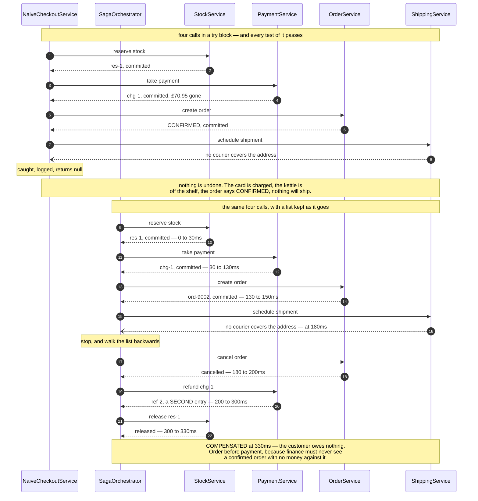

# Saga — Sequence Diagram

The one sequence worth having in your head before the others make sense: the same checkout,
failing at the same step, with and without a saga around it.

[`uml-diagram.md`](uml-diagram.md) holds the full set of five acts, including the failed
refund and the email in the wrong place. This document puts the two runs side by side,
because the pattern is a trade and a trade is only visible as a comparison.

The clock runs in the notes and every figure is one the demo prints. Watch for the moment
the courier refuses, at 180 milliseconds in both halves. What happens in the next
hundred and fifty milliseconds is the entire subject of this project.

Mermaid source

## Reading the timings

**The forward halves are identical.** Same four calls, same order, same commits, same
refusal at 180ms. Nothing in the upper half is written badly. The difference between the
two runs is that one of them has a second half at all.

**Every arrow back in the forward half says committed.** By the time payment is called, the
reservation is already final and nothing is holding it open. There is no instant at which
the five services are jointly pending, which is exactly why compensation rather than
rollback is the only available tool.

**The unwinding is the exact reverse of the forward run.** Order, then payment, then stock.
That is dependency order, not tidiness: cancelling the order first means finance is never
looking at a confirmed order with no money against it.

**The refund is the slowest step in the diagram, at a hundred milliseconds.** Undoing is
generally more expensive than doing, and it happens when the customer is already unhappy.
It is also the step most likely to fail, which is why the project has a third outcome.

**Nothing here sleeps.** `SimulatedClock` advances only when a call is made, so every
figure above is exact and free. `RemoteCall.failNext` scripts an outage, and
`refuseEveryPostcode` scripts a refusal — a different thing, and one that must never be
retried.

## What changes in the other acts

**The refund fails too.** Payments does not answer at 300ms, the run records it, and the
stock is still released at 330ms. The outcome is `NEEDS_HUMAN_HELP`, naming `take payment`
as the step it could not undo, which in a real shop is a row in a queue a person works
through.

**The email is moved up one place.** There is no compensation for a sent email, so the
order is cancelled, the money comes back, and the confirmation stays in the customer's
inbox. Nothing in the code is broken; the sequence is. Steps that cannot be undone go last,
after everything that might fail.

**A declined card, early.** Payment sits before the order exists, so a refusal costs nothing
but a released reservation. That is the general rule the step order encodes: the steps most
likely to fail go early, while there is least to undo.
