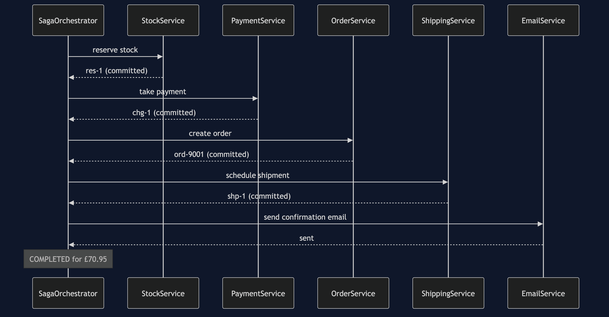
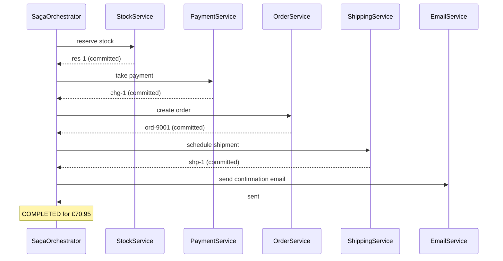
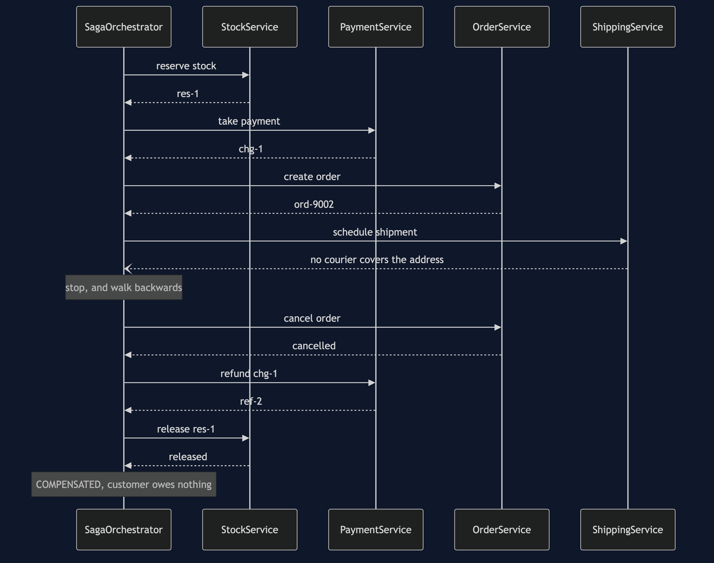
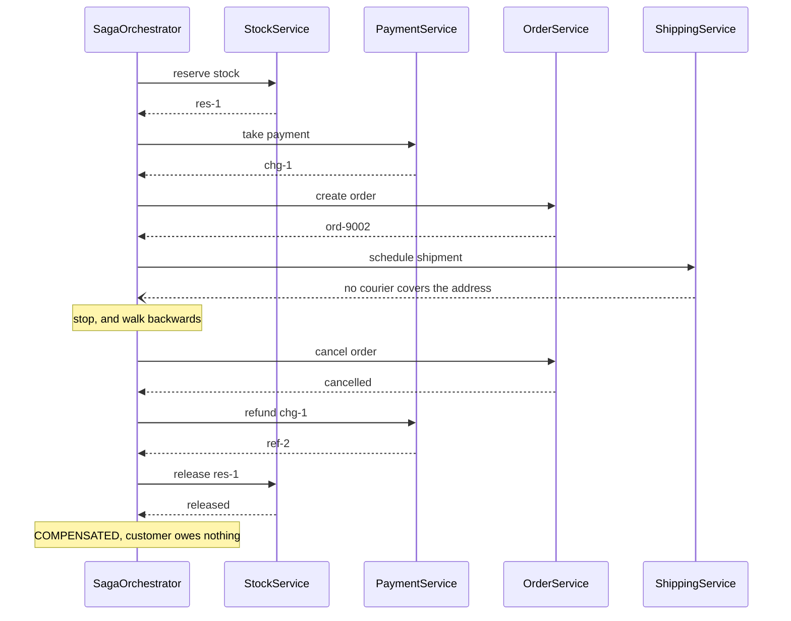
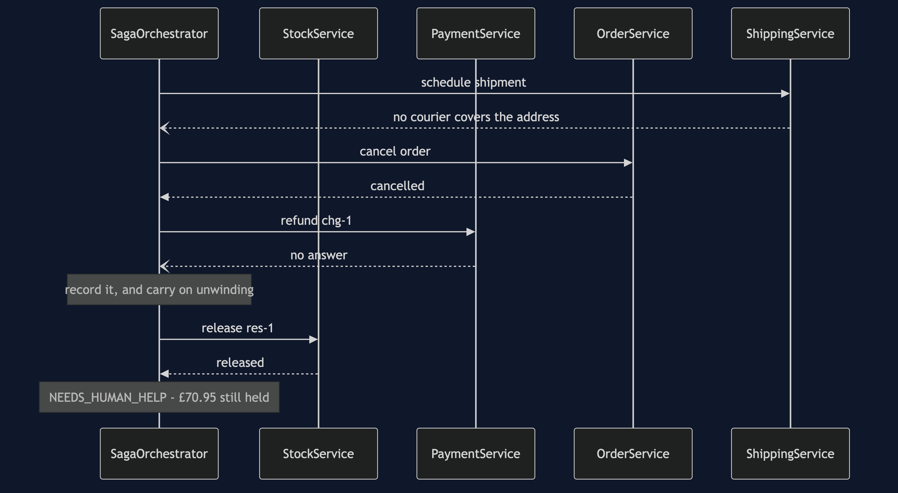
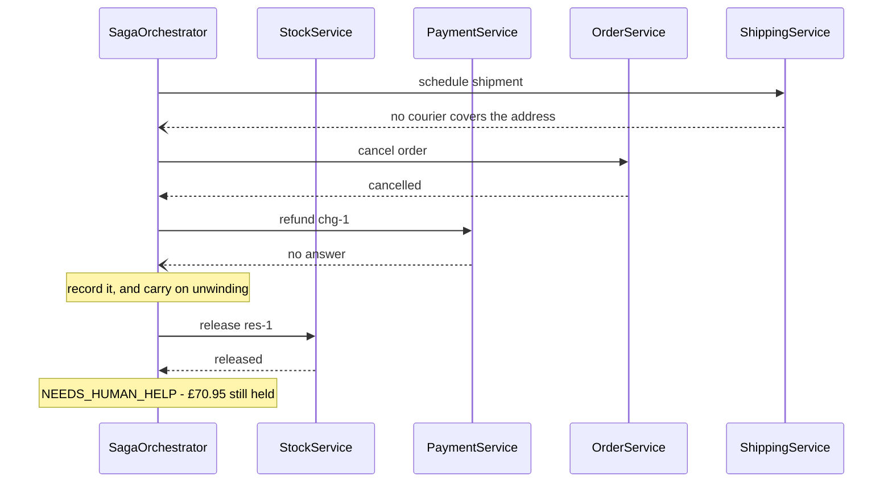
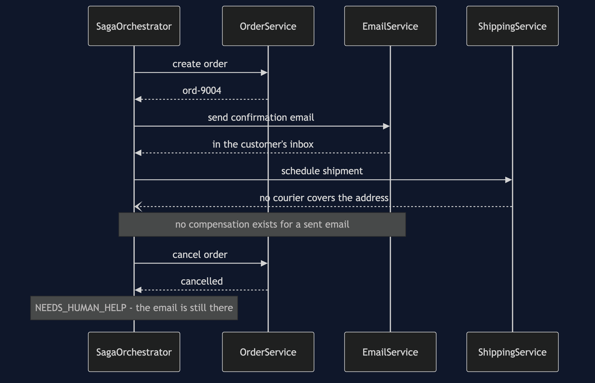
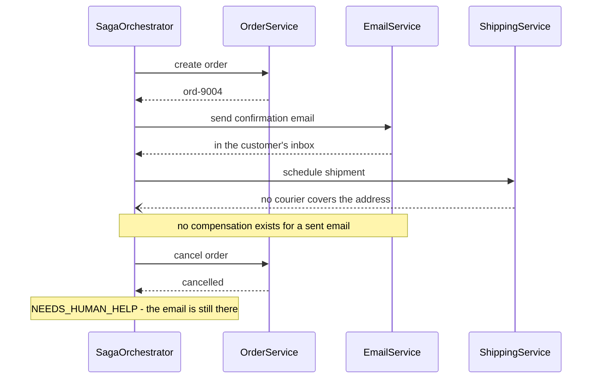
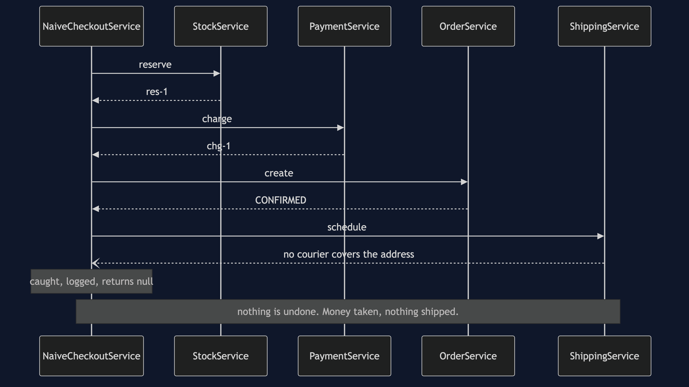
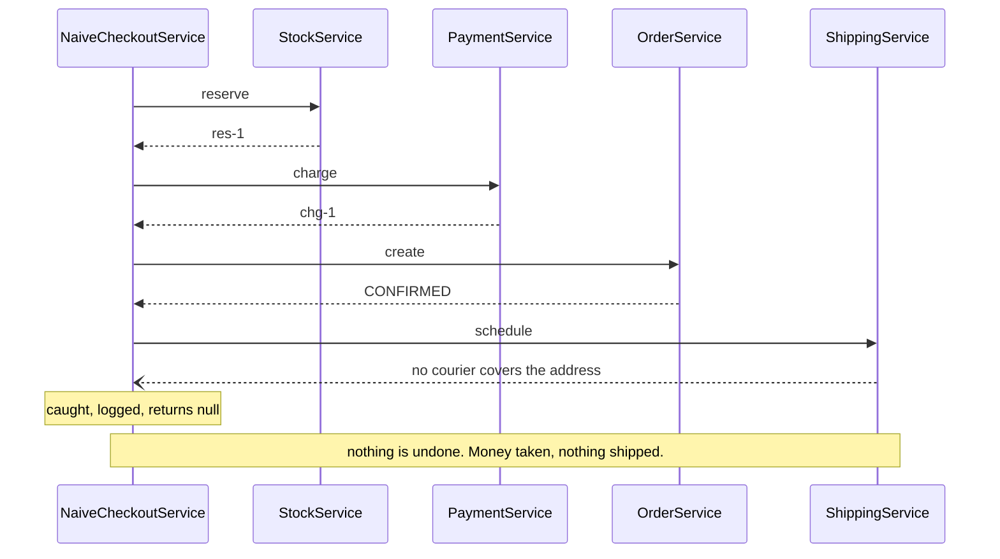

# Saga — Sequence Diagrams

Five acts, five sequences. What makes them different is the words on the arrows rather than
the shapes, so read the notes rather than the outlines.

## Act One — Five Steps, No Transaction

Mermaid source

Every arrow back says committed, and that is the point of the diagram. By the time payment
is called, the reservation is already final and nothing is holding it open.

## Act Two — The Courier Refuses, And Everything Unwinds

Mermaid source

Read the bottom half in the order it happens: order, then payment, then stock — the exact
reverse of the top half. The order is cancelled before the money is refunded so that finance
is never looking at a confirmed order with no money against it.

## Act Three — The Refund Fails Too

Mermaid source

Two things to see. The refund failing does not stop the stock being released. And the saga
still returns, with an outcome naming the step it could not undo.

## Act Four — The Email In The Wrong Place

Mermaid source

The order is cancelled, the money comes back, and the email stays in the inbox. Nothing in
the code is broken; the sequence is.

## Act Five — The Same Failure, Without A Saga

Mermaid source

There is no second half to this diagram, and that is the whole comparison.

## Notes On Reading These

**Dashed arrows back are failures.** Solid ones are a service doing what it was asked.

**Nothing in these diagrams is a lock.** No participant is holding anything open while it
waits for another. Every call completes and commits before the next one starts, which is
what makes compensation the only available tool.

**The timings are exact.** `SimulatedClock` advances by fixed amounts per service, so the
timeline in the demo output matches these sequences step for step on any machine.
