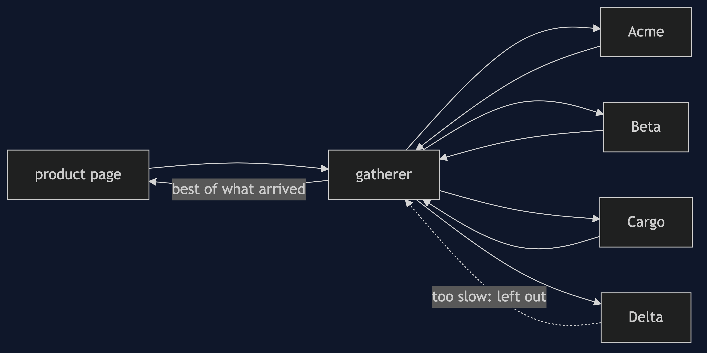
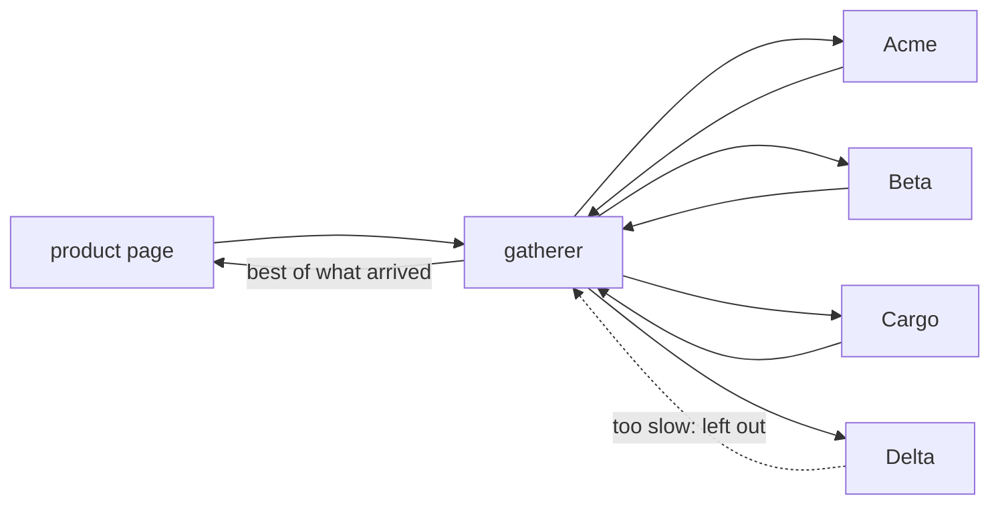

# Scatter-Gather Pattern — Architecture Diagram

One request fans out to every supplier, and comes back as one answer.

Mermaid source

```mermaid
flowchart LR
    P["product page"] --> G["gatherer"]
    G --> A["Acme"]
    G --> B["Beta"]
    G --> C["Cargo"]
    G --> D["Delta"]
    A --> G
    B --> G
    C --> G
    D -.->|too slow: left out| G
    G -->|best of what arrived| P
```

