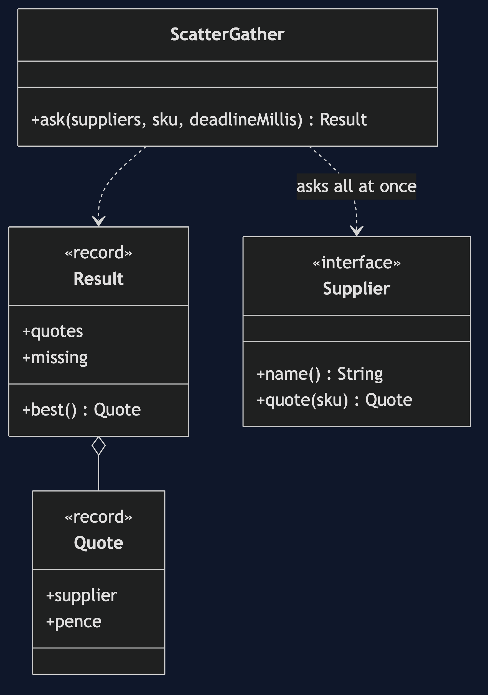
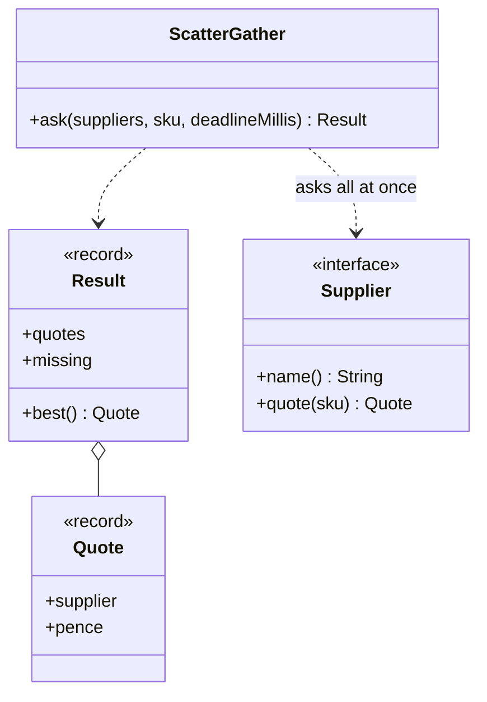

# Scatter-Gather Pattern — Class Diagram

The gatherer asks every supplier and reports quotes and what is missing.

Mermaid source

```mermaid
classDiagram
    class ScatterGather {
        +ask(suppliers, sku, deadlineMillis) Result
    }
    class Result {
        <<record>>
        +quotes
        +missing
        +best() Quote
    }
    class Supplier {
        <<interface>>
        +name() String
        +quote(sku) Quote
    }
    class Quote {
        <<record>>
        +supplier
        +pence
    }
    ScatterGather ..> Supplier : asks all at once
    ScatterGather ..> Result
    Result o-- Quote
```

