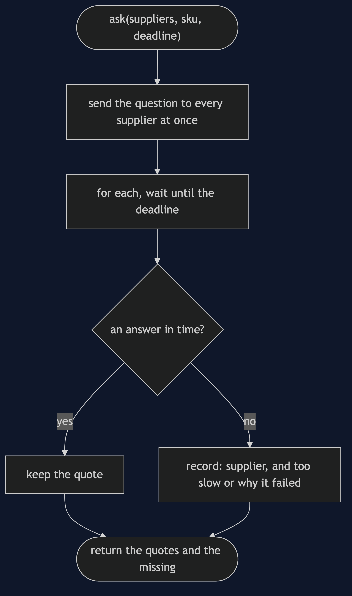
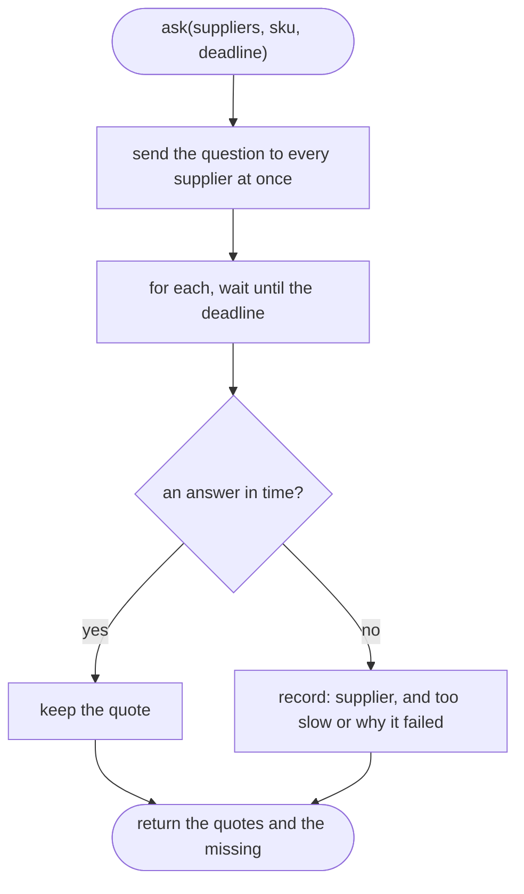

# Scatter-Gather Pattern — Data Flow Diagram

What the gatherer does.

Mermaid source

```mermaid
flowchart TD
    Ask(["ask(suppliers, sku, deadline)"])
    All["send the question to every supplier at once"]
    Wait["for each, wait until the deadline"]
    Got{"an answer in time?"}
    Keep["keep the quote"]
    Miss["record: supplier, and too slow or why it failed"]
    Done(["return the quotes and the missing"])
    Ask --> All --> Wait --> Got
    Got -- yes --> Keep --> Done
    Got -- no --> Miss --> Done
```

