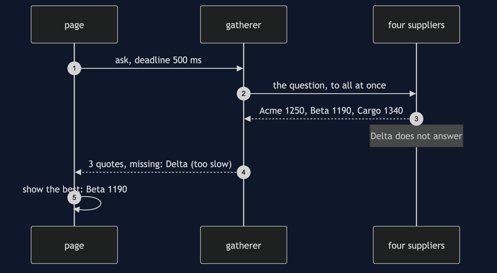
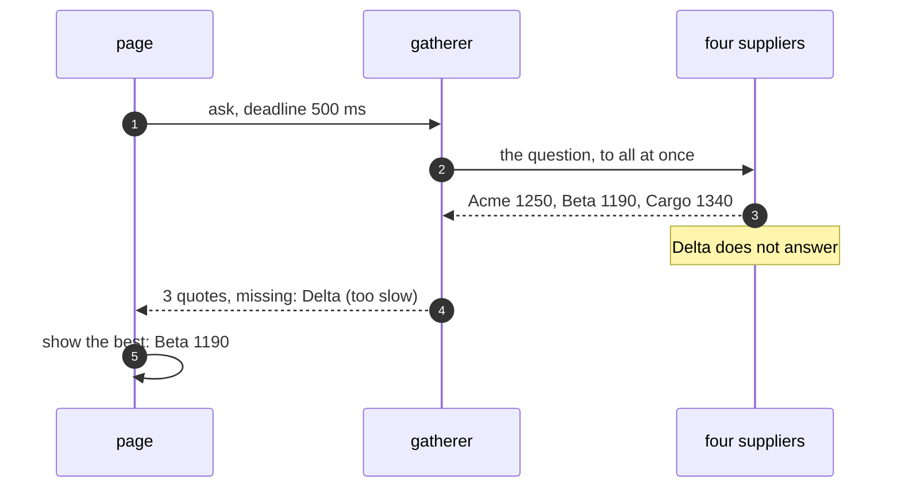

# Scatter-Gather Pattern — Sequence Diagram

Written for a listener with the screen off.

Say it in words. The page asks the gatherer for the best price, with a deadline of five hundred milliseconds. The gatherer sends the question to Acme, Beta, Cargo and Delta at the same moment. Acme, Beta and Cargo answer straight away. Delta does not. When the deadline arrives, the gatherer stops waiting for Delta, records it as too slow, and returns three quotes and one missing supplier. The page shows the best of the three.

Mermaid source

The load-bearing sentence: **the gatherer decides when to stop waiting, not the slowest supplier.**
