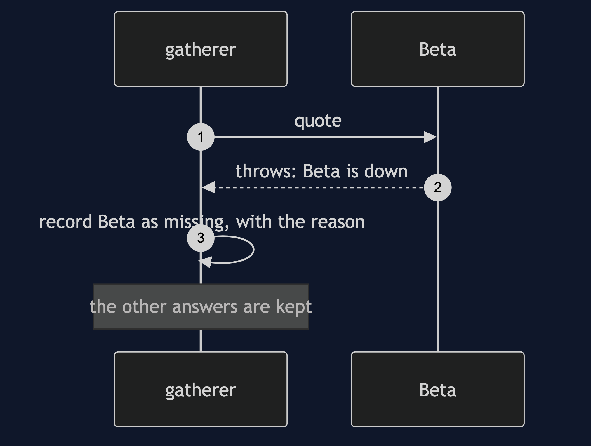
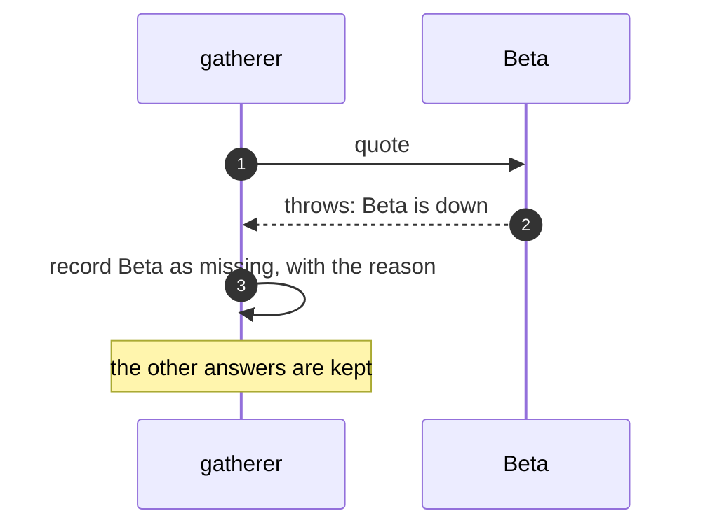

# Scatter-Gather Pattern — UML Sequence Diagrams

Four sequences.

## 1. A Failure

Mermaid source

```mermaid
sequenceDiagram
    autonumber
    participant G as gatherer
    participant B as Beta
    G->>B: quote
    B-->>G: throws: Beta is down
    G->>G: record Beta as missing, with the reason
    Note over G: the other answers are kept
```

