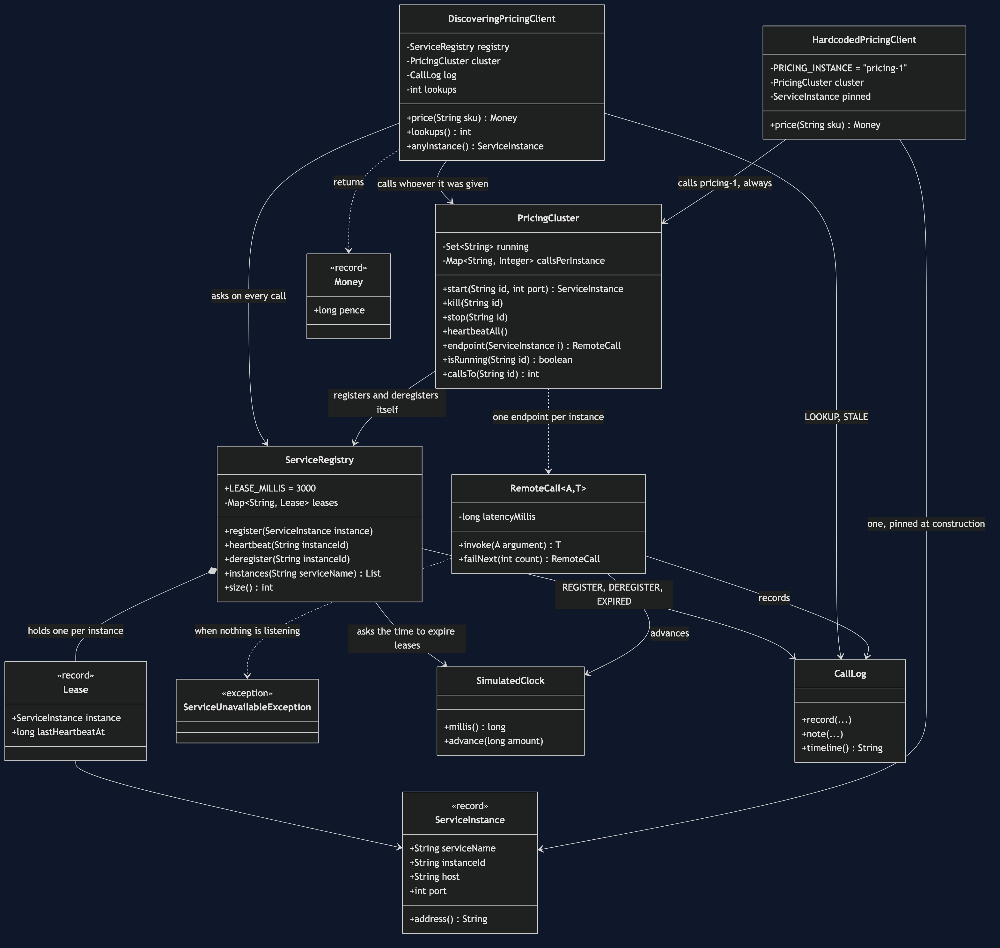
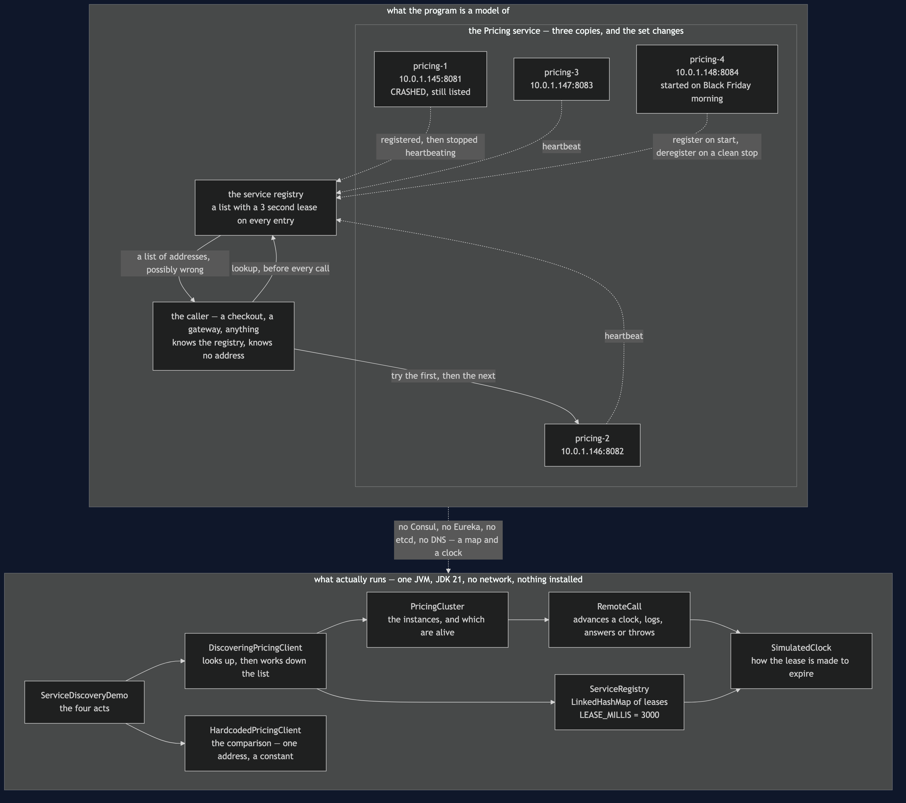
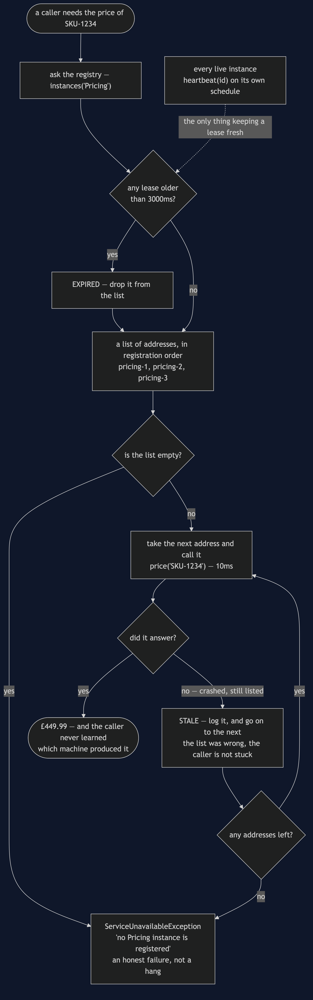
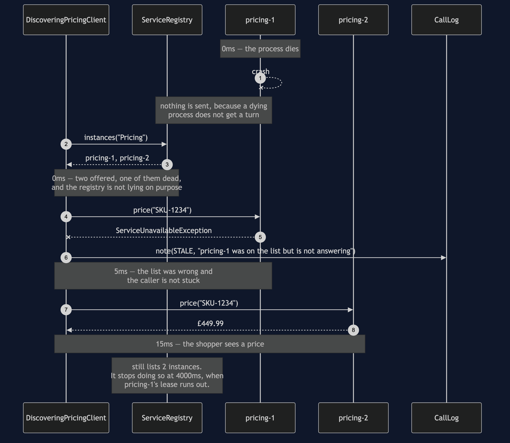
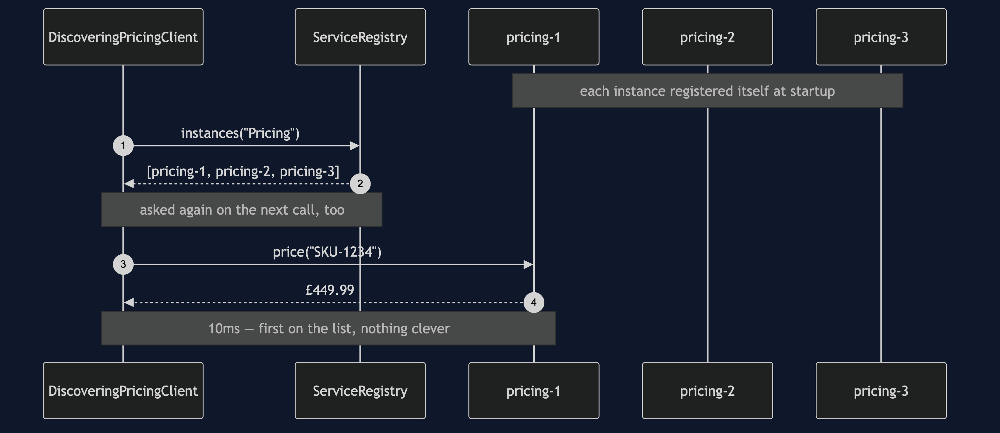
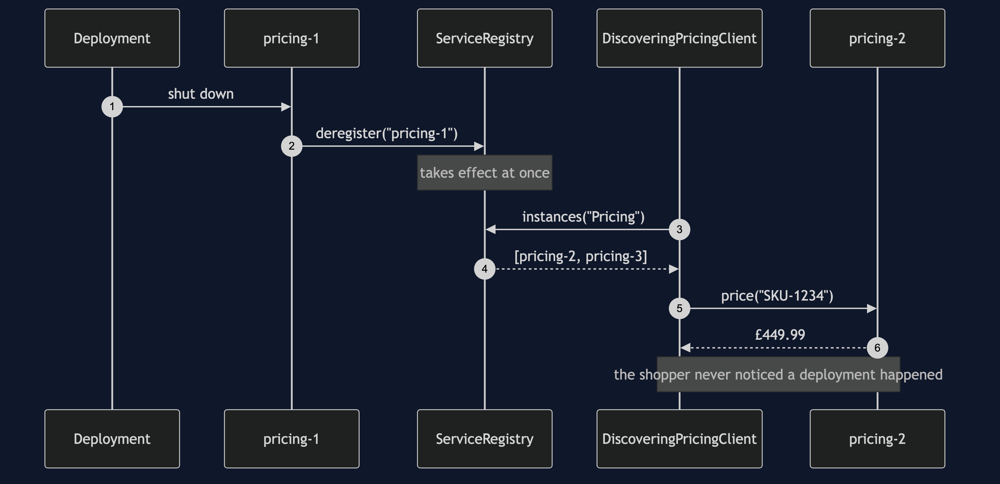
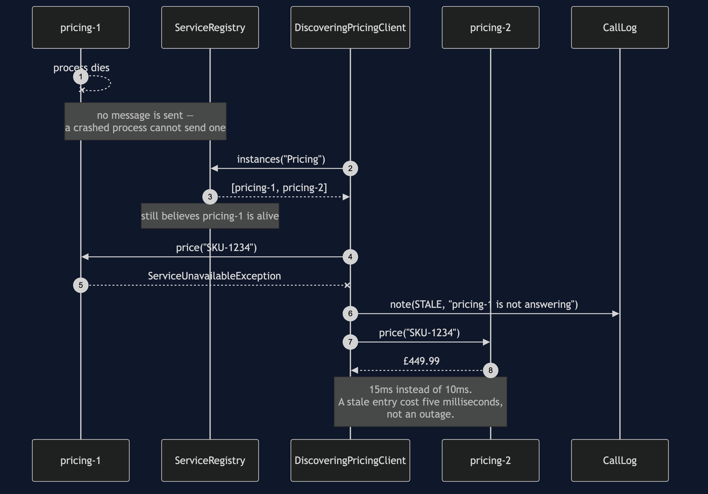
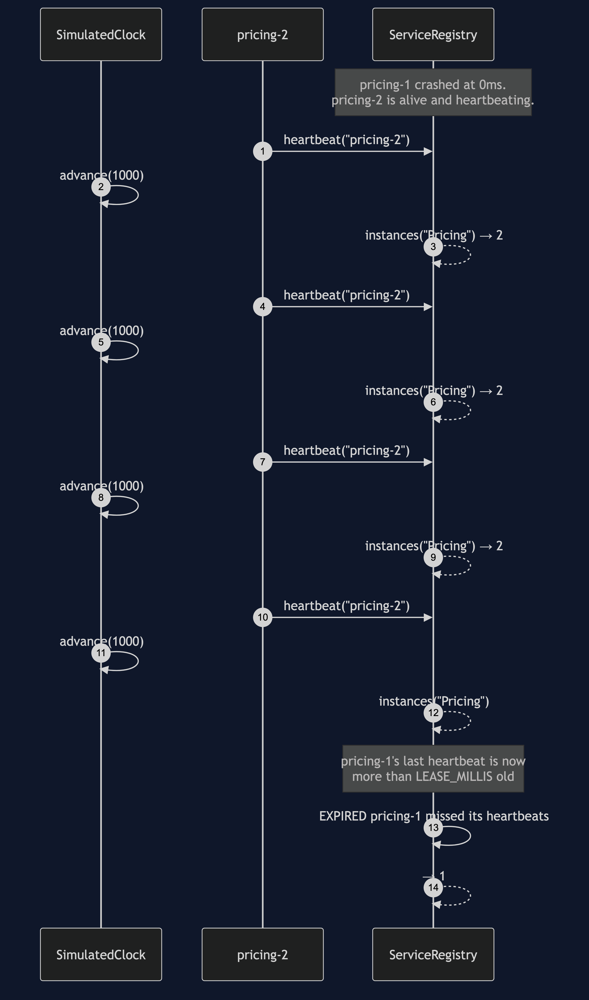
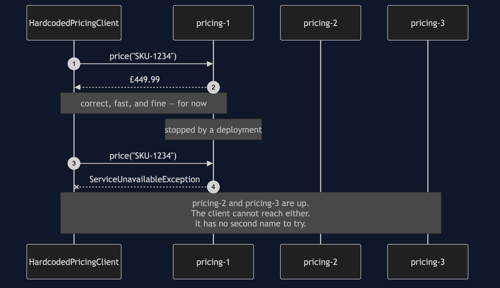

# Service Registry and Discovery Pattern

**Instead of writing down where a service lives, let each copy of it announce
itself to a shared list when it starts, and ask that list for an address every
time you need one.**

Think of a taxi rank instead of one driver's personal phone number. If you saved a
driver's number, you are stuck when they are asleep or have changed jobs. If you
ring the rank, you get whoever is on duty right now. And the catch in that analogy
is the catch in the pattern: the rank's list is only as good as its last update, so
a driver who went home five minutes ago may still be on it.

The shop's **Pricing** service runs as three instances. One is restarted during
every deployment. Another is added on Black Friday morning. One crashes at some
point, because processes do. Any caller with `PRICING_URL` written into it has an
outage every time that set changes — while healthy instances sit idle, paid for and
unreachable.

## Run

```bash
./gradlew run
```

Act one is the hardcoded address meeting an ordinary deployment:

```
==================================================================
1. A hardcoded address, and a routine deployment
==================================================================
  before the deploy: £449.99
      0ms ->     0ms  Registry         REGISTER  pricing-1 (10.0.1.145:8081)
      0ms ->     0ms  Registry         REGISTER  pricing-2 (10.0.1.146:8082)
      0ms ->     0ms  Registry         REGISTER  pricing-3 (10.0.1.147:8083)
      0ms ->    10ms  pricing-1        OK        £449.99
     10ms ->    10ms  Registry         DEREGISTER pricing-1 left cleanly
  after the deploy:  pricing-1 did not answer
  two healthy instances are sitting idle. The client cannot use them,
  because it was told about one machine and has no way to learn about another.
```

Act two is the same deployment, plus a scale-up, with discovery:

```
==================================================================
2. The same deployment, with a registry
==================================================================
  before the deploy: £449.99
  after the deploy:  £449.99
  after scaling up:  £449.99
      0ms ->     0ms  Client           LOOKUP    3 Pricing instance(s) offered
      0ms ->    10ms  pricing-1        OK        £449.99
     10ms ->    10ms  Registry         DEREGISTER pricing-1 left cleanly
     10ms ->    10ms  Client           LOOKUP    2 Pricing instance(s) offered
     10ms ->    20ms  pricing-2        OK        £449.99
     20ms ->    20ms  Registry         REGISTER  pricing-4 (10.0.1.148:8084)
     20ms ->    20ms  Client           LOOKUP    3 Pricing instance(s) offered
     20ms ->    30ms  pricing-2        OK        £449.99
  no code changed, no restart, no configuration edit.
```

Notice the registry is consulted **before every call**. Caching the answer is how
you accidentally reinvent the hardcoded address.

## The part that is easy to skip

A registry can be wrong, and the project spends more time on that than on
registration. Act three: an instance crashes, so it never gets the chance to tell
anybody.

```
==================================================================
3. A crash: the registry is wrong for a few seconds
==================================================================
  price still answered: £449.99
      0ms ->     0ms  Pricing          CRASHED   pricing-1 died without deregistering
      0ms ->     0ms  Client           LOOKUP    2 Pricing instance(s) offered
      5ms ->     5ms  Client           STALE     pricing-1 was on the list but is not answering
      5ms ->    15ms  pricing-2        OK        £449.99
  the registry still lists 2 instances, one of which is dead.
```

The registry hands out a dead address with complete confidence. A caller that
trusts the first address it is given fails here — which is exactly the failure
discovery was supposed to prevent. So the client works down the list, and gives up
only when it runs out.

Act four is the lease expiring. Every instance renews its registration by
heartbeating; a dead one cannot, so after three seconds it drops off:

```
  immediately after the crash: 2 listed
  1s later: 2 listed
  2s later: 2 listed
  3s later: 2 listed
  4s later: 1 listed
   4000ms ->  4000ms  Registry         EXPIRED   pricing-1 missed its heartbeats
  the lease is 3000ms, so the wrong answer lasted a few seconds and then stopped.
  that window is the price of the pattern. It is not a bug in it, and there is
  no setting that removes it — a shorter lease just trades it for more traffic.
```

That window is the honest cost. A stale entry is in some ways worse than no
registry at all, because callers *trust* it. The pattern does not remove the
problem; it bounds it, and it makes the bound a number you choose.

## Test

```bash
./gradlew test
```

19 tests, in about a second, with no `Thread.sleep`. The lease expiry is tested by
advancing a `SimulatedClock` by hand — including one test that checks the exact
boundary millisecond, so the expiry rule is pinned rather than approximately
believed.

A hardcoded address returns the right price too, so no test asserts that a price is
correct. They assert who the caller was able to reach: that a new instance is found
without a code change, that a polite shutdown takes effect immediately, that a
crashed instance stays on the list, that the client works down the list past a
stale entry, that ten seconds of heartbeats keep an instance alive through three
leases, and that with nothing registered the caller gets an honest failure rather
than a hang.

`HardcodedPricingClientTest` passes too, and records the cost: an ordinary
deployment takes the client down while two healthy instances sit idle, and the
class cannot even be constructed pointing at a different instance — because the
address is a constant, and changing a constant is a code change, a build and a
deployment.

## One JVM, no infrastructure

No Consul, no Eureka, no etcd, no DNS, no Docker, no HTTP. `ServiceRegistry` is a
map with leases, an instance is an entry in a set, and a network call is
`RemoteCall` against a simulated clock.

That gives you the pattern's shape honestly — registration, heartbeat, lease
expiry, stale reads, and a client that must be prepared for the list to be wrong.
It is the same shape whether the registry underneath is a `HashMap` or a
five-node Consul cluster. What it does not give you is the operational reality: no
network partitions splitting the registry from the instances, no consensus, no
registry that is itself down. Finish this and you will understand what a service
registry does. You will not have run one.

## Technologies and versions

Nothing here is a range and nothing is `latest`: a course that worked last year and does
not work today is worse than one that never took the dependency.

| What | Version | Why it is here |
| --- | --- | --- |
| Java | 21 | The repository standard, requested through the Gradle toolchain block |
| Gradle | 9.2.1 | The wrapper in this directory; no separate install needed |
| JUnit 5 | 5.10.2 | The 19 tests, through `junit-bom` so the Jupiter artefacts cannot disagree |

That is the entire list, and the short version of it is the point. **This project has no
runtime dependency at all** — the `dependencies` block in `build.gradle` names nothing but
JUnit, and JUnit is `testImplementation`. There is no Consul client, no Eureka, no HTTP
library and no container. Every one of the twelve projects in this category is built the
same way, so a reader who can run one can run all of them, offline, with a JDK and nothing
else.

## Learning Material

| Document | What it covers |
| --- | --- |
| [`docs/problem-statement.md`](docs/problem-statement.md) | Why `PRICING_URL` is an outage waiting for a deployment |
| [`docs/service-discovery-pattern-explained.md`](docs/service-discovery-pattern-explained.md) | The pattern from a taxi rank, the lease, stale reads, and registry vs Simple Factory |
| [`docs/class-diagram.md`](docs/class-diagram.md) | The types, and why the client depends on the registry rather than an address |
| [`docs/architecture-diagram.md`](docs/architecture-diagram.md) | What would be running, which of it can vanish without warning, and the dead instance still on the list |
| [`docs/data-flow-diagram.md`](docs/data-flow-diagram.md) | One price lookup end to end: the expiry check, the loop down the list, and the two ways out |
| [`docs/sequence-diagram.md`](docs/sequence-diagram.md) | The crash in call order, with the clock — five milliseconds is the whole cost of a wrong list |
| [`docs/uml-diagram.md`](docs/uml-diagram.md) | Registration, lookup, the stale read, and lease expiry |
| [`docs/animation.html`](docs/animation.html) | The registry, the leases and the clock, one step at a time, in a browser |
| [`docs/prerequisites.md`](docs/prerequisites.md) | What you need to know, what you explicitly do not, and how to get a JDK |
| [`docs/session.md`](docs/session.md) | A one-hour taught session with exercises |
| [`docs/spec.md`](docs/spec.md) | The generated specification, with measured test counts and timings |
| [`docs/youtube.md`](docs/youtube.md) | Title, description and chapters for the video |
| [`video/README.md`](video/README.md) | The video pipeline, the scene list, and how to rebuild it |

### The pattern in one picture

The class diagram, and the thing to look for is what the client holds. It holds a
registry. It does not hold an address, and it has no field it could put one in.



### What runs where

The lower half is the literal truth: one JVM, a map with timestamps, no network. The upper
half is what it models — a registry, three or four copies of Pricing, and one of them dead
and still on the list.



### How the data moves

One price lookup from beginning to end. A product code goes out and a price comes back;
the interesting traffic is the address in the middle, which is a claim rather than a fact.



### Who calls whom, in order

The crash, in call order, with the clock down the side. The registry offers a dead address
at 0ms, the client discovers that at 5ms, and the shopper has a price at 15ms.



### All five sequences

The full set from [`docs/uml-diagram.md`](docs/uml-diagram.md), in the order that document
argues them.

**One. The happy path.** Ask, then call. Two steps where the hardcoded client had one, and
the extra step is the entire pattern.



**Two. A polite deployment.** `pricing-1` deregisters on its way out, so the list is true
before the first call that would have hit it. Nobody notices a deployment happened.



**Three. A crash.** The same event with one message missing, because a dying process does
not get a turn. The registry is confidently wrong and the client works past it.



**Four. The lease expiring.** No client in this one at all. Time passes, heartbeats do not
arrive, and at 4000ms the registry stops lying.



**Five. No registry at all.** One constant address, no second name to try, and two healthy
instances the caller cannot reach.



### Video

The narrated walkthrough is built from [`video/scenes.py`](video/scenes.py) by
[`video/build_video.sh`](video/build_video.sh). It runs about seventeen and a half
minutes across sixteen scenes, and the rendered file is not committed — see the
repository README for why — so producing it takes about ten minutes on macOS.

## Where this sits

Second of twelve in [`micro-services-design-patterns`](..). It follows
[API Gateway](../api-gateway-pattern), which assumed it could reach the services it
needed; this project is how that assumption is met.

It also invites a comparison with two creational patterns.
[Simple Factory](../../creational/simple-factory-pattern) and
[Singleton](../../creational/singleton-pattern) both answer "give me an instance",
and so does a registry. The difference is that a factory's answer is decided by
code and cannot be wrong, while a registry's answer changes minute to minute
without a code change **and can be out of date**. That last clause is why a
registry needs a lease, a heartbeat and a caller prepared to try the next name on
the list, and a factory needs none of those things.

Next in the learning order, [Load Balancing](../load-balancing-pattern) takes the
list this project produces and asks a question this one dodged: given three live
instances, which one should you actually call?
