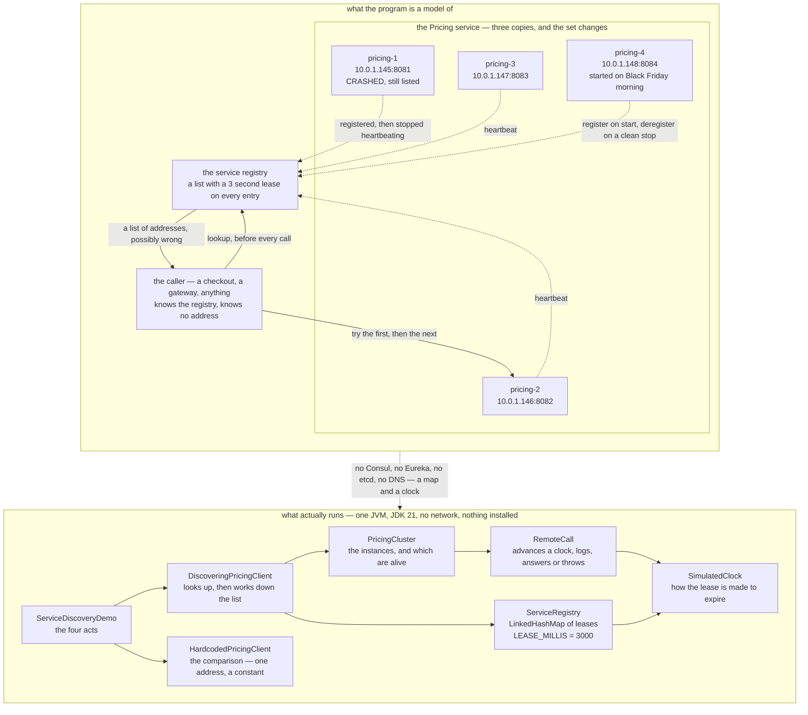

# Service Registry and Discovery Pattern — Architecture Diagram

Where each piece of this project sits, and — because this project starts nothing — what
each piece *stands for*. The class diagram shows the types and the sequence diagrams show
the order of events; this one answers the question those two cannot, which is **what would
be running, and which of those things can disappear without warning**.

Read the picture as two halves stacked. The upper half is what the program is a model of:
a registry somewhere, three or four copies of the Pricing service, and a caller that knows
about the registry and about no address at all. The lower half is the literal truth — one
Java program, one process, a `LinkedHashMap` with timestamps in it, and no network.

The two arrow kinds in the upper half are the whole pattern. Solid arrows are calls that
fetch something. Dotted arrows are **announcements**: an instance telling the registry it
exists, and then telling it again every so often that it still does. Nothing in the
picture pushes that information to the caller — the caller asks, every single time,
because an answer it kept would be an address it wrote down, which is the thing this
pattern exists to stop.

The box drawn with a broken edge is the one that matters most. `pricing-1` is dead, and it
is still on the registry's list, because a process that crashes does not get the chance to
say goodbye. That box is not an error in the diagram. It is the pattern's honest cost,
drawn.

Mermaid source

## What the diagram is telling you to count

**One arrow leaves the caller, and it goes to the registry.** Not to Pricing. The caller
has no line to a machine, which is why a deployment that replaces every instance is not an
event in the caller's life. In the hardcoded version that arrow points straight at
`pricing-1`, and the whole outage in act one is that one arrow.

**Four boxes in the cluster, and the count is deliberately wrong at every moment.** Three
at the start, two after the deploy, three again after the scale-up, and one of the three
is dead. There is no moment in the picture when the list and reality agree, and a design
that requires them to agree cannot be built.

**The heartbeat arrows are the only thing keeping entries alive.** `LEASE_MILLIS = 3000`
is on the registry box because it is a constant in the code, not a figure chosen for the
drawing. Nothing sweeps the list on a timer — an entry is judged expired when somebody
looks, which is why act four shows the wrong answer lasting three seconds and then
stopping.

**`SimulatedClock` has two arrows into it.** Both the registry and the network calls read
the same clock, which is what lets a test advance time by hand and assert on the exact
boundary millisecond of a lease. That is not scenery: it is why the expiry rule is pinned
rather than approximately believed.

## What it deliberately leaves out

The registry is one box. A real one is a cluster with consensus, and it can be
partitioned away from the instances it is tracking — so that healthy machines vanish from
the list while remaining perfectly able to serve. There is no such partition here, and
this diagram would be a different shape if there were.

The caller picks the first address that answers, and this picture shows nothing about
*which* it should prefer. Three live instances and no opinion about choosing between them
is precisely where [Load Balancing](../load-balancing-pattern) starts.

There is also no health check. The registry here believes an instance is alive because it
heard from it recently, which is a weaker claim than "I asked it and it said yes". Real
registries do both, and both are wrong in the same direction — a few seconds late.
