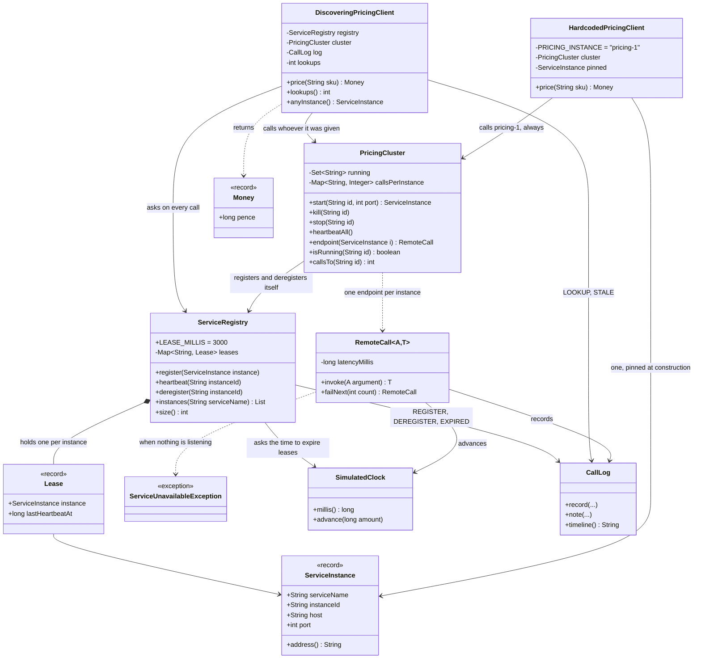

# Service Discovery Pattern — Class Diagram

Shows the static structure: the registry that holds the leases, the cluster whose
instances register themselves, the discovering client that asks before every call,
and — kept deliberately outside the pattern — the hardcoded client that was told
one address and can never be told another.

Mermaid source

## Notes

**Look at what `HardcodedPricingClient` is missing.** It has no arrow to
`ServiceRegistry`. That single absence is the whole bug. Everything else about the
class is fine — it is shorter than the discovering client, it has fewer
dependencies, and every line of it is correct. It simply has no way to ask a
question it was never designed to ask, and no amount of care inside it can add
one.

**`DiscoveringPricingClient` points at the registry, not at an instance.** The
arrow is the pattern. The client holds a *source of addresses* where the naive one
holds an *address*, and that is the difference between a fact it can refresh and a
fact frozen at construction time.

**The instances register themselves.** `PricingCluster.start` calls
`registry.register`, so the arrow from cluster to registry runs the same direction
as the arrow from client to registry — both are outbound. Nothing in this diagram
ever calls *in* to a service to ask if it is alive. That is deliberate: a registry
that polled everybody would need to know who everybody is, which is the problem
again, one level up.

**`Lease` is a private record inside the registry, and it is the only class here
that stores a timestamp.** Registration is a map and would be dull. The
`lastHeartbeatAt` field is what turns the map into something that forgets, and
forgetting is the only defence against an instance that dies without saying
goodbye.

**`ServiceUnavailableException` comes out of `RemoteCall`, not out of the
registry.** The registry never fails; it happily hands back the address of a dead
process. The failure surfaces one layer later, when somebody actually tries to
use it. Read that as the shape of the honest limitation rather than as an
awkwardness in the design — it is exactly what happens with a real DNS entry or a
real Consul lookup.

**`PricingCluster` has both `kill` and `stop`.** Two methods that both take an
instance out of service, differing only in whether the registry is told. That pair
exists so the demo can show a clean deployment and a crash side by side, because
the pattern behaves completely differently in the two cases and a learner who only
ever sees the polite one will think discovery is simpler than it is.

**The harness is four small classes.** `SimulatedClock`, `RemoteCall`, `CallLog`
and `Money`. Every project in this category carries its own copy rather than
sharing a module, so one directory can be read start to finish without a library
in the way.
