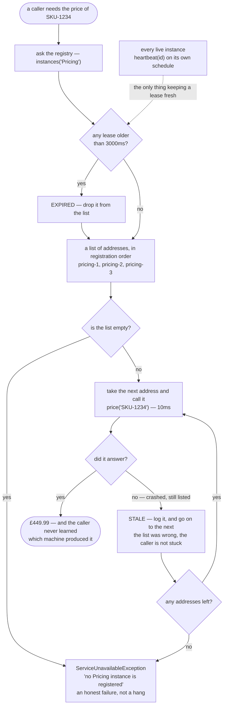

# Service Registry and Discovery Pattern — Data Flow Diagram

One price lookup, followed from the moment the caller wants a number to the moment it
has one. The architecture diagram says what exists; this one says **what travels, and
what each step is allowed to assume about it**.

Two kinds of thing move through this picture, and keeping them apart is most of
understanding the pattern.

The first is a **product code going out and a price coming back**. That is the work, and
it is the same work the hardcoded client did. Nothing about it changes.

The second is **an address**, and an address here is not a fact — it is a claim, made by
a list, about a machine the list has not spoken to for up to three seconds. The whole
diagram below is arranged around what happens when that claim turns out to be false.

Notice there is no arrow from the registry to the caller's memory. The lookup happens
once per call and the answer is used once. A cached list is a hardcoded address with
extra steps, and it fails in exactly the same way, just later and more confusingly.

Mermaid source

## What the picture is telling you

**The lookup is at the top of every call, not at the top of the program.** That is the
single structural difference from the hardcoded client, and it is why act two of the demo
survives a deployment *and* a scale-up with no code change: the third call asks a fresh
question and gets a three-item answer where the second got two.

**The expiry check is inside the lookup.** Nothing sweeps the list on a timer. An entry is
judged stale at the moment somebody looks at it, which is why act four shows the count
dropping from 2 to 1 only when the demo asks at 4000ms. A dead entry costs nothing until
it is read, and the honest way to model that without a background thread is to check on
read.

**There are two ways out of this diagram and both are endings.** Either an address
answers, or the list is exhausted and the caller is told plainly. There is no third path
where the caller waits, retries forever, or silently returns a wrong price. `price` either
produces a number or throws, and the tests pin the throw as carefully as the number.

**The loop is the part people skip.** "Ask a registry" is the famous half of the pattern
and it is the easy half. The loop — take the next address, and the next — is what makes a
stale entry cost five milliseconds instead of an outage. A client that trusts the first
address it is handed has adopted all the machinery of discovery and none of the safety.

## The same lookup without a registry

Delete the registry and the diagram collapses to three boxes: a caller, one constant
address, and a call. There is no lookup, no expiry check and no loop, which looks like a
simplification and reads like one in the code.

What it costs is visible the moment that address stops answering. There is no list, so
there is no next address. Act one of the demo is this exact shape: two healthy instances
running, paid for, and unreachable, because the caller was told about one machine and has
no way to learn about another. The extra boxes above are not complexity for its own sake —
each of them is one of those two idle machines becoming usable.
