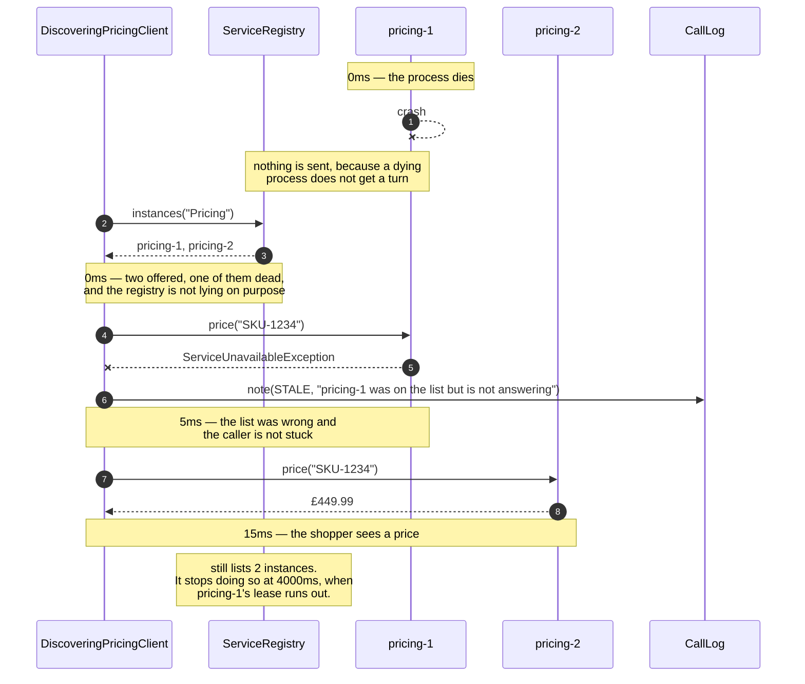

# Service Registry and Discovery Pattern — Sequence Diagram

The one sequence worth having in your head before any of the others make sense: an
instance crashes, the registry does not notice, and the caller gets a price anyway.

[`uml-diagram.md`](uml-diagram.md) holds the full set of five — the happy path, a polite
deployment, this crash, the lease expiring, and the comparison with no registry at all.
This document takes the third of those, because it is the one that contains the pattern's
real subject. Registration is bookkeeping. **Being handed a wrong answer and surviving it**
is the design.

The clock runs down the left in the notes, and the figures are the ones the demo prints:
the crash at 0ms, the stale read at 5ms, the successful call finishing at 15ms. Five
milliseconds is the entire cost of the registry being wrong, and it is worth saying that
number out loud because the instinct is to fear a much larger one.

Mermaid source

## Reading the timings

**0ms to 15ms, and one wasted call inside it.** The successful path is 10ms. The stale
entry added five. That is the measured penalty for the registry being wrong, and the
reason it is small is that a dead process refuses a connection quickly — it does not sit
there thinking about it. A machine that is *slow* rather than dead is a different and much
worse problem, and it is the subject of [Circuit Breaker](../circuit-breaker-pattern).

**The registry is never told about the failure.** Look for an arrow from the client back
to the registry after the stale read; there isn't one. The client could report it, and
some real systems do, but that turns every caller into a source of truth about every
instance's health, and a single confused caller can then evict a healthy machine. Here the
only thing that removes an entry is the instance's own silence.

**The `STALE` note goes to the log, not to the shopper.** The shopper got a price in
fifteen milliseconds. Nothing happened that they need to know about. But the shop does need
to know, because a stale entry appearing once is physics and appearing constantly is a
crash loop, and you cannot tell those apart without the line.

**The last note is the one to take away.** At the end of this sequence the registry is
*still wrong*. The caller worked around it; nothing corrected it. Correction comes later,
from the absence of heartbeats, at 4000ms — and between 0ms and 4000ms every caller pays
the same five milliseconds. The pattern does not remove the wrong answer. It bounds how
long it lasts and makes that bound a number you choose.

## What changes when something else breaks

If `pricing-2` had also been dead, the client would have worked further down the list and
found nothing, and the caller would have been told plainly — `no Pricing instance is
registered` rather than a hang or a silently wrong price. There is a test for that, because
an empty list is the case people forget.

If the crash had instead been a **polite shutdown**, the whole middle of this diagram
disappears. `pricing-1` sends `deregister` on its way out, the lookup returns one address,
and the first call succeeds at 10ms. That single extra message is the difference between a
list that is true and a list that is confidently wrong — and there is no way to make a
dying process send it reliably, which is precisely why the loop above has to exist.
