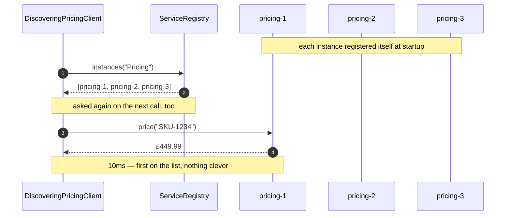
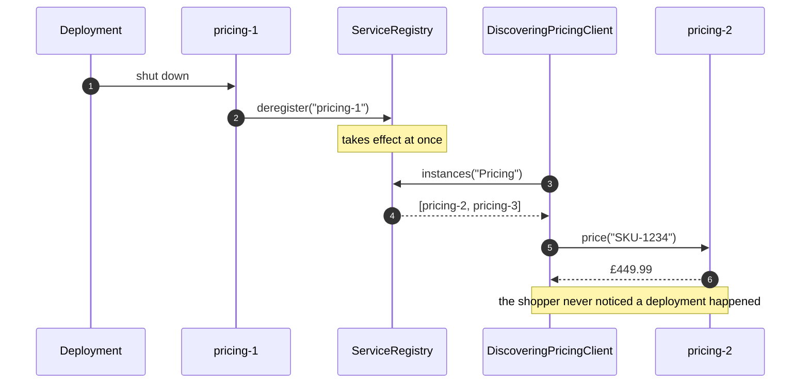
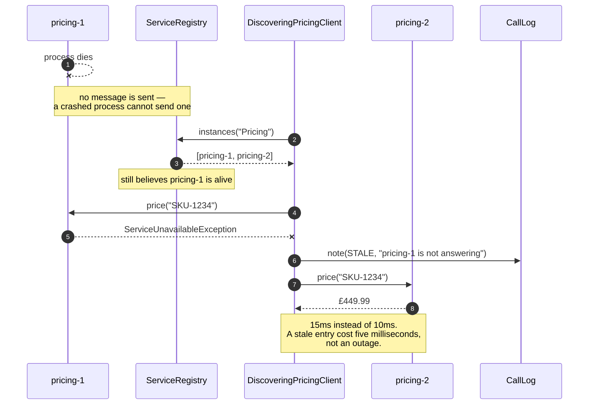
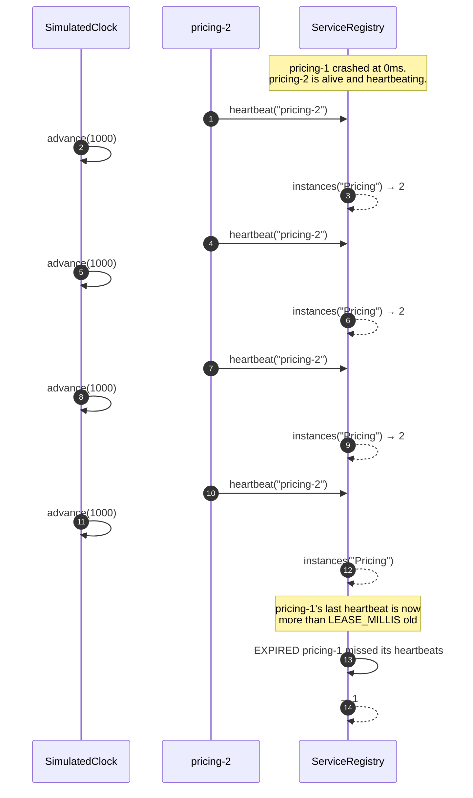
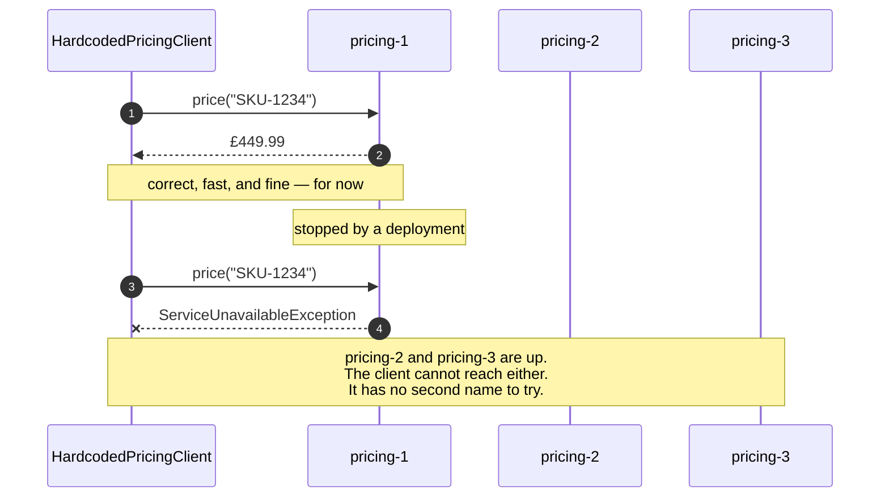

# Service Discovery Pattern — UML Sequence Diagram

## The Happy Path: Ask, Then Call

Two steps where the naive client had one. The extra step is the point.

Mermaid source

## The Deployment: An Instance Leaves Politely

`pricing-1` is taken out of service by a rolling deployment. It deregisters on the
way out, so the list is true before the first call that would have hit it.

## The Crash: A Stale Entry, And What Saves It

`pricing-1` dies without deregistering. The registry does not know, and says so
confidently. The client survives anyway.

## The Lease Expiring

Nobody calls anything here. Time simply passes, and the registry stops lying.

## The Comparison: No Registry At All

## Notes

**Compare the first diagram with the last.** The pattern adds exactly one message:
`instances("Pricing")`. Everything else — the call, the answer, the latency — is
identical. One extra question, asked before every call, is the entire mechanical
cost.

**The second and third diagrams are the same event with one line removed.** In the
deployment, `pricing-1` sends `deregister`. In the crash, it does not. That single
missing message is the difference between a list that is true and a list that is
confidently wrong, and there is no way to make a dying process send it reliably.
Which is why the third diagram needs a client that keeps going.

**Count the messages in the crash diagram.** The client talks to a dead instance,
catches the failure, writes a note, and calls the next one. Four steps to survive
something that took `HardcodedPricingClient` off the air completely. There is a
test that pins each of them, including the note, because a silent recovery is a
recovery nobody can measure.

**The fourth diagram has no client in it at all.** That is not an oversight. Lease
expiry is something the registry does on its own schedule, in response to the
absence of messages rather than the arrival of one. In the code it happens
opportunistically inside `instances(...)`, which is the honest way to model it
without a background thread — and it means a dead entry costs nothing until
somebody actually asks.

**Nothing in any diagram asks an instance whether it is alive.** All the arrows
about liveness point *from* the instance *to* the registry. A registry that polled
would need a list of who to poll, and building that list is the original problem
wearing a hat.
