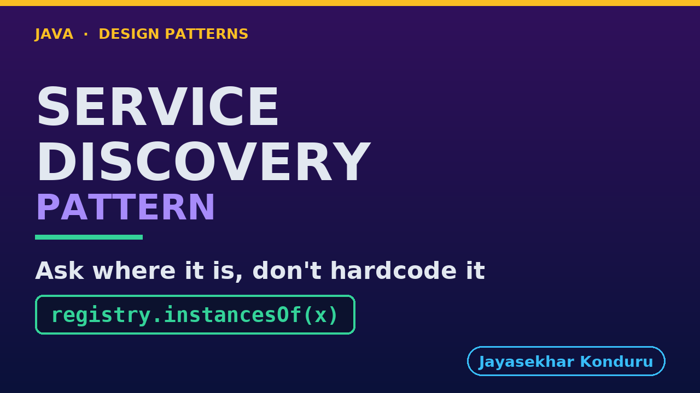

# YouTube — Service Discovery Pattern

Everything needed to publish `video/service-discovery-pattern-explained.mp4`. Copy the fields straight out of this file.

Chapter timings are generated from the video's `.srt`. Re-run `python3 docs/make_youtube_docs.py service-discovery` after any change to the narration, or they will be wrong.

## Title

```
Service Discovery in Java - Finding a Live Instance
```

51 characters — under the 60 YouTube shows before truncating in search results.

## Description

The first two lines are what a viewer sees above the fold, so they carry the hook rather than the boilerplate.

```
Learn service discovery in Java 21, starting from four correct lines of code that hold one machine's address. Pricing runs as three interchangeable copies, and a routine rolling deploy takes the checkout down while two healthy copies sit idle — because a constant is not a question you can ask again. We build the registry instead: instances put themselves on a shared list with a lease, and the caller asks that list on every call. Then we spend the second half on the part that gets skipped. A crash leaves the registry briefly lying, the client is handed the name of a dead machine, and what saves it is not the registry but the caller's willingness to try the next one. We watch the lease expire with no client involved at all, and we close on the costs: one more thing to run, a list that is sometimes wrong, and a retry loop every caller now has to carry.

CHAPTERS
00:00 Introduction
01:03 The Scenario
01:46 The Obvious Answer — Write It Down
02:34 Then Somebody Deploys Pricing
03:21 Why That Really Hurts
04:26 The Service Discovery Pattern
05:31 An Analogy
06:36 The Roles
07:56 The Registry — and the One Line That Matters
09:17 The Caller — Ask, Then Try The Next One
10:22 A Deployment, and a Scale-Up, With a Registry
11:22 The Half That Gets Skipped: A Crash
12:30 The Lease Expires, and the List Corrects Itself
13:52 What the Tests Pin Down
15:04 The Costs, Honestly
16:31 Thanks for Watching

SOURCE CODE, WRITTEN NOTES AND AN INTERACTIVE ANIMATION
https://github.com/jk-boot-up/java-design-patterns/tree/main/gradle-java/micro-services-design-patterns/service-discovery-pattern

WHAT YOU NEED FIRST
Java 21 and a working knowledge of classes and interfaces. No prior design-pattern knowledge is assumed. The full prerequisites are in docs/prerequisites.md in the repository.
```

## Chapters

YouTube renders these as chapters only if there are at least three and the first is at `00:00`.

```
00:00 Introduction
01:03 The Scenario
01:46 The Obvious Answer — Write It Down
02:34 Then Somebody Deploys Pricing
03:21 Why That Really Hurts
04:26 The Service Discovery Pattern
05:31 An Analogy
06:36 The Roles
07:56 The Registry — and the One Line That Matters
09:17 The Caller — Ask, Then Try The Next One
10:22 A Deployment, and a Scale-Up, With a Registry
11:22 The Half That Gets Skipped: A Crash
12:30 The Lease Expires, and the List Corrects Itself
13:52 What the Tests Pin Down
15:04 The Costs, Honestly
16:31 Thanks for Watching
```

## Tags

```
service discovery, service registry, microservices java, design patterns, java design patterns, gang of four, java 21, software design, clean code, object oriented design, java tutorial, ecommerce, programming tutorial
```

218 characters, under YouTube's 500 limit.

## Thumbnail



**Upload `docs/thumbnail.png`** — 1280×720, the size YouTube recommends, generated by `docs/make_thumbnails.py`. It is deliberately not the same image as the video's opening frame: a thumbnail is judged at about 360 pixels wide in a search result, so this one carries only the pattern name, one line of promise and one short piece of code, each set large enough to survive the shrink.

`video/poster.png` is the 1920×1080 opening frame, produced by the video build. It stays in the repository as the title card; it is not what gets uploaded.

YouTube will not pick the thumbnail up on its own — upload it under **Details → Thumbnail → Upload file**. A custom thumbnail requires a verified channel.

## Upload checklist

- [ ] Upload `video/service-discovery-pattern-explained.mp4` (1080p, H.264, 30 fps, AAC 48 kHz — already YouTube's recommended settings, no re-encode needed)
- [ ] Set the video language to **English** first, or the subtitle option may not appear
- [ ] Add subtitles: *Video elements → Add subtitles → Upload file → With timing* → `video/service-discovery-pattern-explained.srt`
- [ ] Upload `docs/thumbnail.png` as the thumbnail — do not let YouTube auto-pick a frame
- [ ] Paste the title, description and tags from above
- [ ] Add to the **Java Design Patterns** playlist, in learning order
- [ ] Wait for 1080p processing before sharing the link — code slides are unreadable at 360p

## Cards and end screen

End screen links to whichever pattern video goes up next — set it at upload time rather than assuming an order.

Add a card partway through pointing at the playlist, so a viewer who arrives at this pattern from search can find the rest of the series.

## Runtime

Approximately 17:38, narrated at 145 words per minute.
