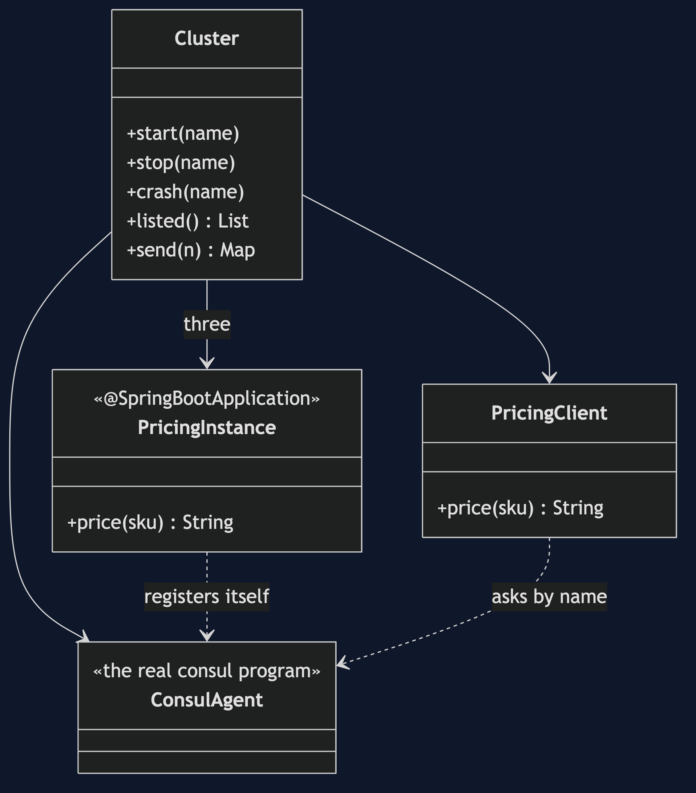
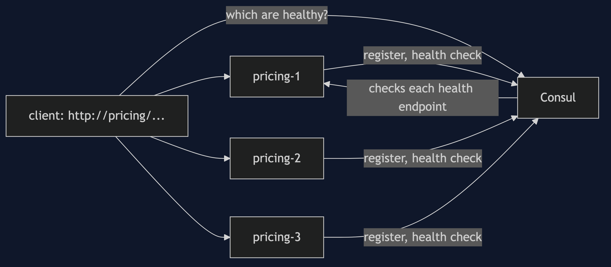
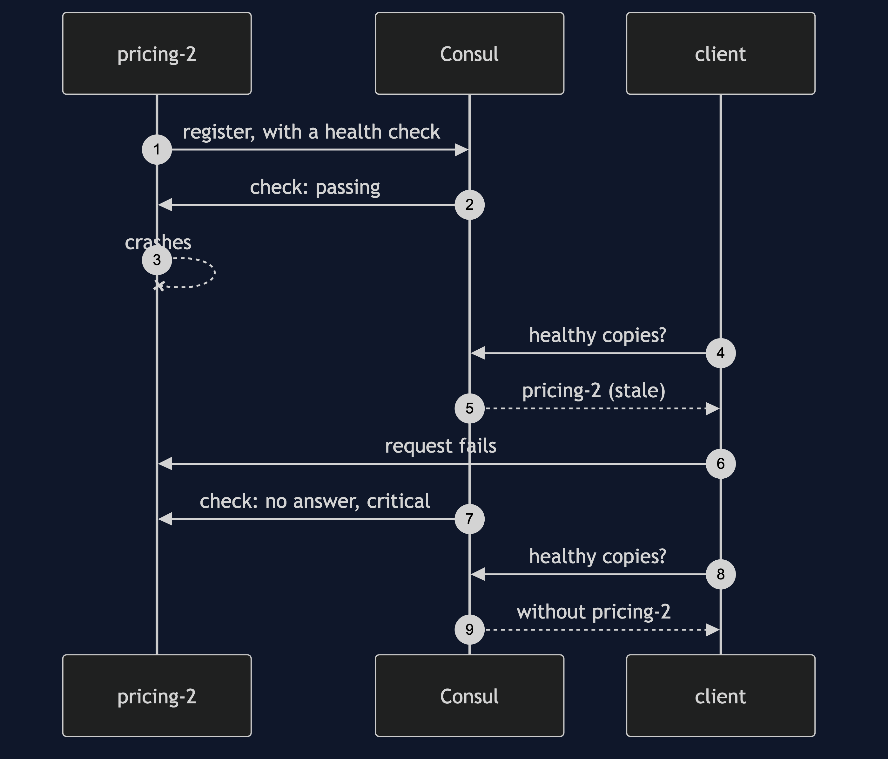
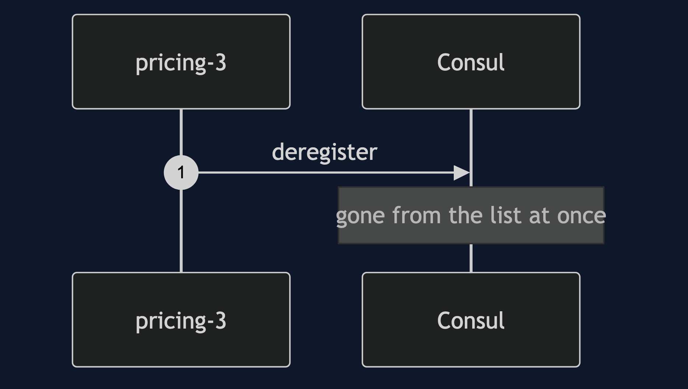

# Service Discovery with Spring Cloud Consul Pattern

```
src/main/java/com/jk/explore/discoveryconsul/
├── DiscoveryApplication.java   the six acts
├── Cluster.java                a Consul agent, three copies of Pricing, and a client
├── ConsulAgent.java            starts the real consul program on free ports
├── instance/PricingInstance.java   one copy of Pricing
└── client/                     the client, and a client that asks by name
```

**With Spring Cloud Consul a service registers itself and the client asks by name. The list is only as fresh as Consul's last health check.**

This project is the framework version of [Service Registry and Discovery](../service-discovery-pattern). That project built the mechanism by hand. This one shows the same idea inside Spring Cloud Consul. It does not re-teach the pattern. It shows what Spring Cloud Consul adds, the failures that are its own, and what it costs.

## Run

```bash
./gradlew run
```

Six acts. The partner project, Service Registry and Discovery, built the mechanism by hand. Here the same idea runs through Spring Cloud Consul, and every count comes from real output.

```
ONE. Three copies announce themselves.
  the client was given the name pricing and no address.
  Consul lists: [pricing-1, pricing-2, pricing-3].
  nobody told Consul. each copy registered itself when it started.
TWO. Requests find them.
  six requests to http://pricing/...: {pricing-1=2, pricing-2=2, pricing-3=2}.
THREE. A deployment moves a copy.
  pricing-1 restarted on a new port.
  a hardcoded address to pricing-1 now fails: ResourceAccessException.
  by name, six requests: {pricing-1=2, pricing-2=2, pricing-3=2}.
FOUR. A graceful stop is noticed at once.
  pricing-3 stopped. Consul lists, immediately: [pricing-1, pricing-2].
  six requests: {pricing-1=3, pricing-2=3}.
FIVE. A crash is not.
  pricing-2 crashed without a word. Consul lists, straight away: [pricing-1, pricing-2].
  six requests while the entry is stale: {failed=3, pricing-1=3}.
  after its health check fails, Consul lists: [pricing-1] (removed: true).
  six requests: {pricing-1=6}.
  the list is only as good as its last check. that is the taxi rank's catch.
SIX. The registry itself goes away.
  Consul stopped. asking it for pricing: ResourceAccessException.
  the client remembered nothing. a last-known-good list is the client's job.
```

## Test

```bash
./gradlew test
```

2 test classes, 5 test methods, offline, with each Spring context started inside the test, and no server.

## Technologies and versions

| What | Version | Why it is here |
| --- | --- | --- |
| Java | 21 | The repository standard, via the Gradle toolchain block |
| Gradle | 9.2.1 | The wrapper in this directory; no separate install needed |
| Spring Boot | 4.1.1 | The container, the web server and the actuator |
| Spring Cloud | 2025.1.3 | The BOM that manages the Consul starter |
| spring-cloud-starter-consul-discovery | 5.0.3 | Registration and discovery |
| Consul | 1.16+ | The registry, run as a local process |
| JUnit 5 | 5.10.2 | Test runner; the tests are skipped when Consul is missing |

See [`docs/dependencies.md`](docs/dependencies.md).

## Learning Material

| Document | What it covers |
| --- | --- |
| [`docs/problem-statement.md`](docs/problem-statement.md) | The partner's registry, and what is new |
| [`docs/service-discovery-with-spring-cloud-consul-pattern-explained.md`](docs/service-discovery-with-spring-cloud-consul-pattern-explained.md) | A real registry, and its real delays |
| [`docs/class-diagram.md`](docs/class-diagram.md) | The types |
| [`docs/architecture-diagram.md`](docs/architecture-diagram.md) | Client, Consul and three copies |
| [`docs/data-flow-diagram.md`](docs/data-flow-diagram.md) | What Consul lists, and when |
| [`docs/sequence-diagram.md`](docs/sequence-diagram.md) | Written for a listener with the screen off |
| [`docs/uml-diagram.md`](docs/uml-diagram.md) | Four sequences |
| [`docs/animation.html`](docs/animation.html) | The six acts in a browser |
| [`docs/prerequisites.md`](docs/prerequisites.md) | What you need to know |
| [`docs/session.md`](docs/session.md) | A one-hour taught session |
| [`docs/spec.md`](docs/spec.md) | The generated specification |
| [`docs/youtube.md`](docs/youtube.md) | Title, description and chapters |
| [`docs/dependencies.md`](docs/dependencies.md) | What Spring Cloud Consul is, what it costs, and that skipping this project loses none of the pattern |

### The pattern in one picture



### Where each piece sits



### How one request moves


### Who calls whom, in order



### All four sequences




### Video

Built from [`video/scenes.py`](video/scenes.py) by
[`video/build_video.sh`](video/build_video.sh). The rendered file is not
committed; see the repository README for why.

## Where you have already met this

Platforms that run many small services and need them to find each other.

## When this is too much

With three services on fixed hosts that rarely change, a configuration file is simpler than a registry.

## Where this sits

This project pairs with [Service Registry and Discovery](../service-discovery-pattern), and is a framework version in [`micro-services-design-patterns`](..).
