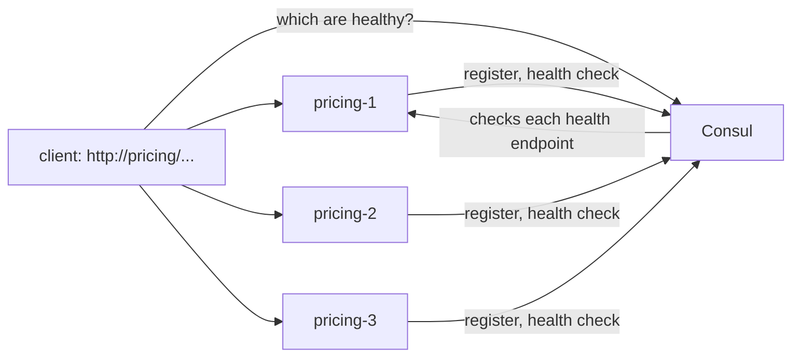

# Service Discovery with Spring Cloud Consul Pattern — Architecture Diagram

Copies register themselves. The client asks by name.

Mermaid source

```mermaid
flowchart LR
    P1["pricing-1"] -->|register, health check| C["Consul"]
    P2["pricing-2"] -->|register, health check| C
    P3["pricing-3"] -->|register, health check| C
    C -->|checks each health endpoint| P1
    K["client: http://pricing/..."] -->|which are healthy?| C
    K --> P1
    K --> P2
    K --> P3
```

