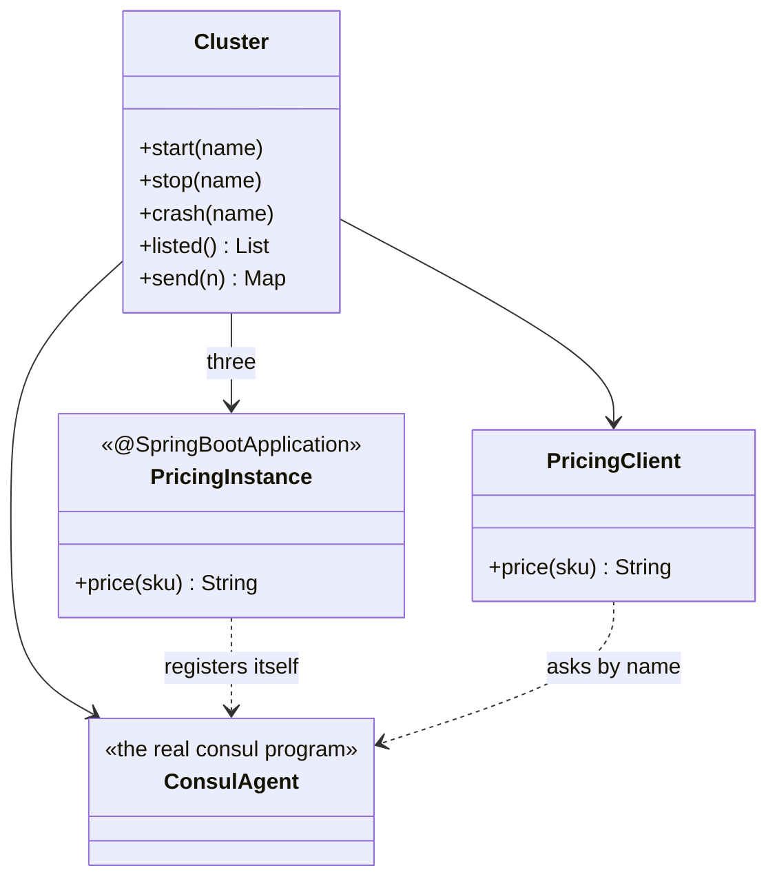

# Service Discovery with Spring Cloud Consul Pattern — Class Diagram

A cluster owns the agent, the copies and the client. Spring Cloud does the registering.

Mermaid source

```mermaid
classDiagram
    class Cluster {
        +start(name)
        +stop(name)
        +crash(name)
        +listed() List
        +send(n) Map
    }
    class ConsulAgent {
        <<the real consul program>>
    }
    class PricingInstance {
        <<@SpringBootApplication>>
        +price(sku) String
    }
    class PricingClient {
        +price(sku) String
    }
    Cluster --> ConsulAgent
    Cluster --> PricingInstance : three
    Cluster --> PricingClient
    PricingInstance ..> ConsulAgent : registers itself
    PricingClient ..> ConsulAgent : asks by name
```

