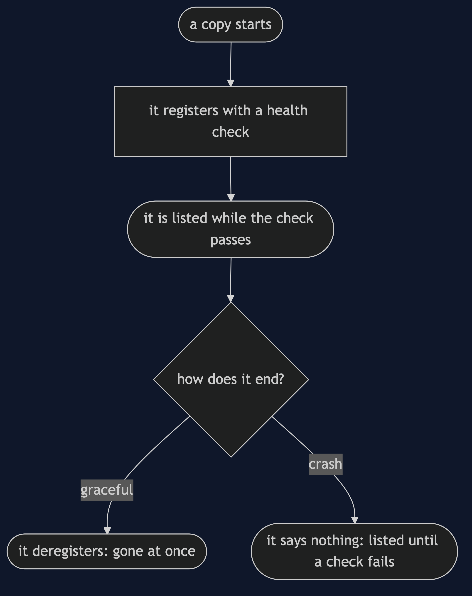
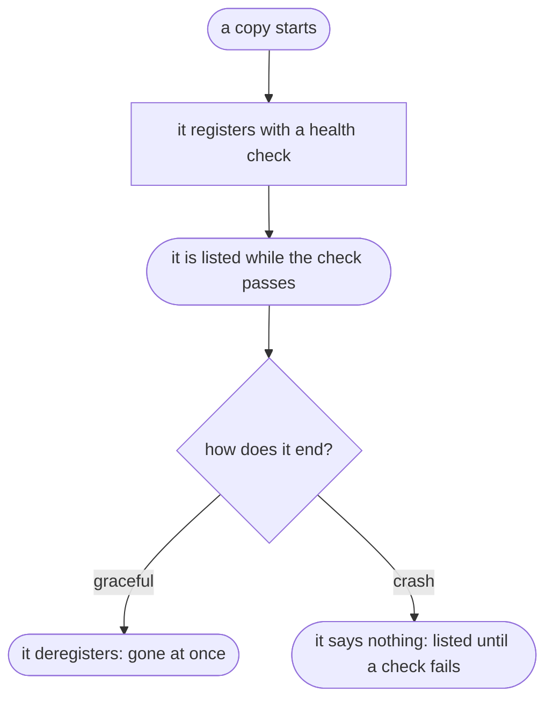

# Service Discovery with Spring Cloud Consul Pattern — Data Flow Diagram

What happens to a copy's entry.

Mermaid source

```mermaid
flowchart TD
    Start(["a copy starts"])
    Reg["it registers with a health check"]
    Run(["it is listed while the check passes"])
    Stop{"how does it end?"}
    Grace(["it deregisters: gone at once"])
    Crash(["it says nothing: listed until a check fails"])
    Start --> Reg --> Run --> Stop
    Stop -- graceful --> Grace
    Stop -- crash --> Crash
```

