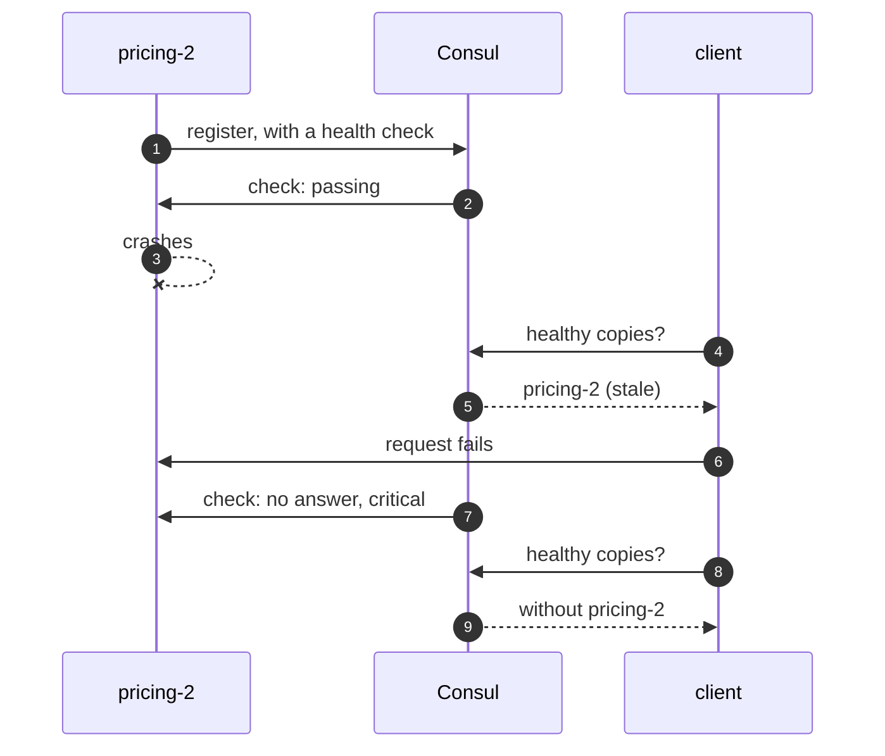

# Service Discovery with Spring Cloud Consul Pattern — Sequence Diagram

Written for a listener with the screen off.

Say it in words. A copy of Pricing starts and registers with Consul, with a health check. Consul calls the health endpoint every interval and records passing. The copy crashes. The client asks Consul for healthy copies, and Consul still lists it, because the last check passed. The client sends a request to it and fails. On the next check Consul calls the endpoint, gets no answer, marks it critical, and stops listing it.

Mermaid source

The load-bearing sentence: **the list is only as fresh as the last check.**
