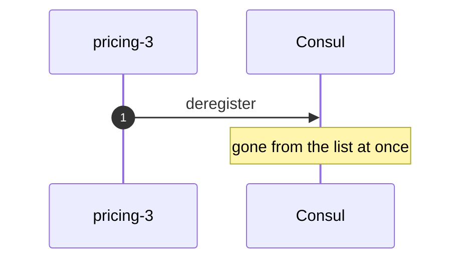

# Service Discovery with Spring Cloud Consul Pattern — UML Sequence Diagrams

Four sequences.

## 1. A Graceful Stop

Mermaid source

```mermaid
sequenceDiagram
    autonumber
    participant P as pricing-3
    participant C as Consul
    P->>C: deregister
    Note over C: gone from the list at once
```

