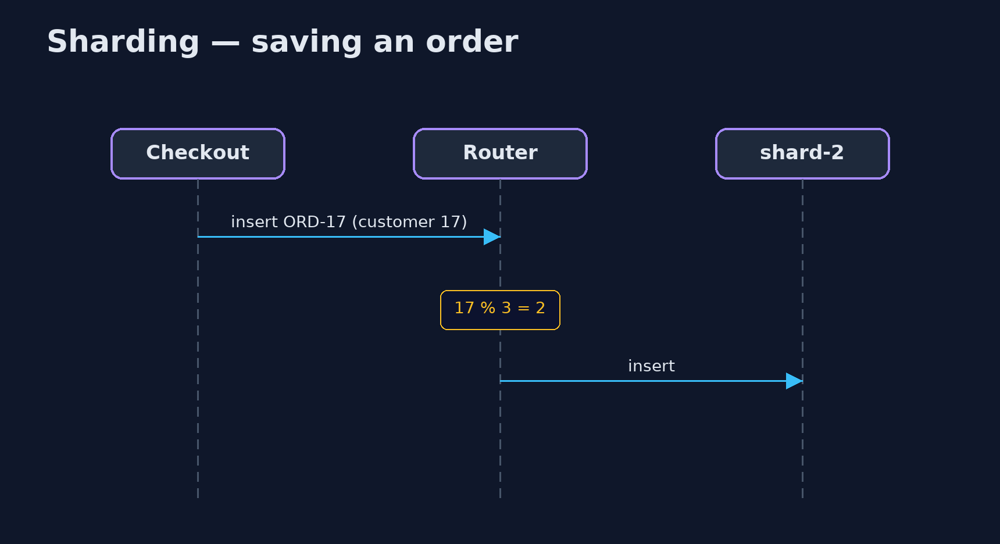

# Sharding Pattern

```
src/main/java/com/jk/explore/sharding/
├── Order.java          An order, belonging to one customer
├── OrderDatabase.java  One database server
├── ShardedOrders.java  The pattern: orders are split across several databases by a shard key, the customer number, so each holds only its share
└── ShardingDemo.java   The five acts: one database at its limit, shards by customer, one-shard questions, all-shard questions, and the bill
```

**Split one large table across several databases by a key, such as the customer number, so each database holds and serves only its share.**

Sharding splits one large set of data across several databases, called
shards. Each row is placed on a shard chosen from a shard key, such as the
customer number, so every shard holds only its share and handles only its
share of the traffic. A router works out the shard from the key.

A question about one customer goes to one shard. A question about everyone
must ask every shard and merge the answers. And changing the number of shards
means moving data, so the way keys are mapped to shards matters a great deal.

## The idea in everyday terms

Think of a doctor's surgery that has outgrown one filing cabinet. The records
are split into three cabinets: surnames A to H, I to P, Q to Z. Finding one
patient's file means opening one cabinet. Counting every patient over eighty
means going through all three. And buying a fourth cabinet means refiling a
great many folders.

## The scenario

The online store keeps every order in one database, which can take a thousand
new orders a minute. On Black Friday, two and a half thousand arrive every
minute, and fifteen hundred are left waiting, minute after minute.

## Run

```bash
./gradlew run
```

The demo tells the story in 5 acts, each printing exact numbers that the tests check:

| Act | What it shows |
| --- | --- |
| 1. One database | 2,500 orders a minute on Black Friday; one database takes 1,000: 1,500 left waiting every minute. |
| 2. Three shards | Split by customer number modulo 3: 833, 834 and 833 orders, each within its limit. |
| 3. One customer, one shard | Customer 17's orders are found by asking shard 2 only: 1 shard asked. |
| 4. Everyone, every shard | Orders over £500 this minute: 25 found by asking all 3 shards and merging. |
| 5. The bill | Adding a fourth shard with modulo 4 moves 1,874 of 2,500 customers; a very busy customer still overloads one shard. |

## Test

```bash
./gradlew test
```

7 tests in `DemoRunsTest`, `ShardedOrdersTest`. Every number the demo prints is asserted, and nothing depends on the clock, so every run gives the same result.

## Technologies and versions

| Technology | Version | Used for |
| --- | --- | --- |
| Java | 21 | the code (toolchain set in `build.gradle`) |
| Gradle | 9.2.1 (wrapper) | build and run, nothing to install |
| JUnit | 5.10.2 | the tests |
| videokit | repository tool | the narrated video and animation: Piper `en_US-amy-medium`, speed 0.8, longer pauses (the approved `amy-slow` voice) |

## Learning Material

| Document | What it is for |
| --- | --- |
| [Problem statement](docs/problem-statement.md) | the situation and what the project must show |
| [Prerequisites](docs/prerequisites.md) | what you need to know first |
| [Sharding, explained](docs/sharding-pattern-explained.md) | the acts in prose |
| [Session guide](docs/session.md) | a one-hour lesson with exercises |
| [Animated walkthrough](docs/animation.html) | the acts step by step, narrated |
| [Spec](docs/spec.md) | what this project must be true of |

### The pattern in one picture

The router picks a shard from the customer number.


### Where each piece sits

A router over several identical databases.


### How the data moves

By key: one shard. About everyone: all shards.


### Who calls whom, in order

The key decides the database.



### Video

`video/sharding-pattern-explained.mp4` (with `.m4a` audio and `.srt` subtitles) is built by `video/build_video.sh`. Rendered media is not committed.

## What it costs

- **Changing the shard count moves data.** Going from three shards to four with simple modulo moved 1,874 of 2,500 customers.
- **Questions about everyone ask every shard.** Their answers must be merged, and the slowest shard sets the pace.
- **Hot keys.** One very busy customer still overloads their one shard.
- **No easy joins or transactions across shards.**

## When this is too much

Before sharding, try a bigger server, read replicas, caching and better
indexes: sharding is hard to undo. Shard when one database genuinely cannot
hold the data or take the writes.

## Where you have already met this

- MongoDB and Elasticsearch shards, and Cassandra partitions.
- Vitess and Citus, which shard MySQL and PostgreSQL.
- DynamoDB partition keys.
- Consistent hashing, which limits how much moves when shards are added.

## Where this sits

This project is in [micro-services-design-patterns](..), next to
[Database per Service](../database-per-service-pattern), which
splits data by service rather than by key, and
[Cell-Based Architecture](../../architectural-design-patterns/cell-based-pattern),
which splits whole systems.
