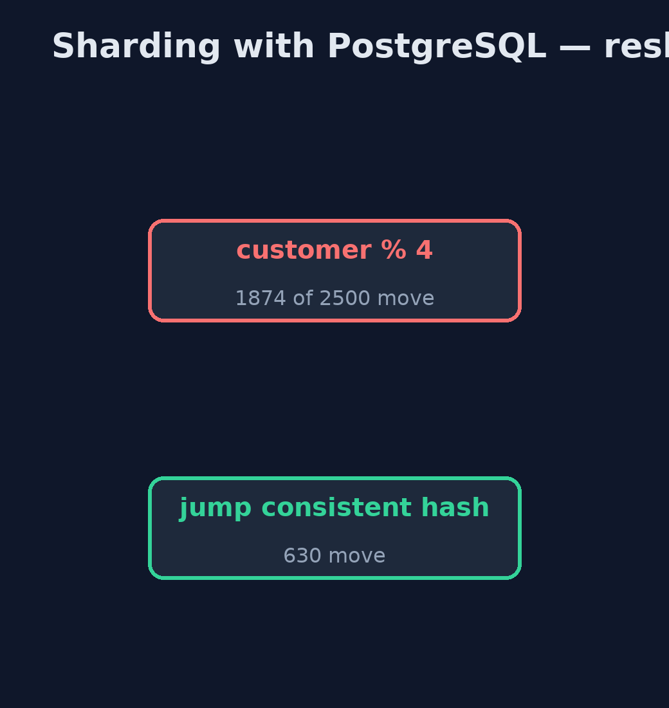

# Sharding with PostgreSQL Pattern

```
src/main/java/com/jk/explore/shardingpostgres/
├── PostgresShardingDemo.java  The five acts, against real PostgreSQL databases started and stopped by this program
├── ShardRouter.java           The pattern: decides which database holds each customer, and sends every query there
└── Shards.java                Real PostgreSQL databases, one container each, started and stopped by this demo
```

**Split the shop's orders across three real PostgreSQL databases by customer number, route every query to the right one, and see what no single database can do for you any more.**

This is the real-infrastructure version of the Sharding pattern. The plain
Java version, a separate project in this category, keeps each shard as a list
in one program. Here each shard is a real PostgreSQL database in its own
container, started by the demo itself, and a small router in the application
decides which database holds each customer and sends every query there.

Real databases make the costs concrete. A question about everyone must be
asked of every database and the answers added up by the application. A rule
that PostgreSQL enforces perfectly inside one database, such as a unique
coupon, no longer holds across shards. And adding a shard means moving data,
far less of it with consistent hashing than with a simple modulo.

## The idea in everyday terms

Think of a large library that splits its members across three branches by
membership number. Each branch keeps only its own members' records, so no
branch is overwhelmed. Asking about one member means phoning one branch;
asking how many books are overdue across the city means phoning all three and
adding up. And each branch can only stop its own members borrowing the same
book twice.

## The scenario

On Black Friday the online store takes about 2,500 orders a minute, more than
one database can handle. Every read and every write of every order landed on
that one database.

## Run

This project needs a running container runtime, such as Docker Desktop: the
demo starts real PostgreSQL 18.6 databases in containers and removes them
again. Without one, it prints a sentence saying what to start, rather than
failing.

```bash
./gradlew run
```

The demo tells the story in 5 acts, each printing exact numbers that the tests check:

| Act | What it shows |
| --- | --- |
| 1. One database | One PostgreSQL holds all 2,500 orders; every read and write of Black Friday lands on it. |
| 2. Three shards | Three PostgreSQL databases, split by customer modulo 3: 833, 834 and 833 orders; customer 17 on shard-2, 42 on shard-0. |
| 3. One customer, one shard | Customer 17's orders come from one database: [ORD-17], 1 shard asked. |
| 4. Everyone, every shard | Orders over £500: 1,250, from 3 databases added up in code; a UNIQUE coupon is accepted on two shards. |
| 5. The bill: resharding | A fourth shard by modulo moves 1,874 of 2,500 customers; jump consistent hashing moves 630. |

## Test

```bash
./gradlew test
```

2 tests in `DemoRunsTest`. Every number the demo prints is asserted against real PostgreSQL databases. Without a container runtime, the database test is skipped rather than failed.

## What the simulation got right, and what it left out

The plain Java version got the idea right: split by a key, send one-customer
questions to one shard, ask every shard for questions about everyone, and pay
for resharding by moving customers. What it left out is what real databases
make visible. Each shard is its own server with its own connection and
tables. Cross-shard questions are merged by application code, not SQL. A
UNIQUE constraint only holds inside one database, so a one-use coupon was
accepted twice. No transaction spans two shards. And consistent hashing moves
630 customers where a modulo moves 1,874.

## Technologies and versions

| Technology | Version | Used for |
| --- | --- | --- |
| Java | 21 | the code (toolchain set in `build.gradle`) |
| Gradle | 9.2.1 (wrapper) | build and run, nothing to install |
| JUnit | 5.10.2 | the tests |
| PostgreSQL | 18.6 (container image) | three separate databases, one per shard |
| PostgreSQL JDBC driver | 42.7.13 | talking to each database |
| Testcontainers | 2.0.5 | starts and stops the database containers |
| Docker | 24 or later | runs the containers |
| videokit | repository tool | the narrated video and animation: Piper `en_US-amy-medium`, speed 0.8, longer pauses (the approved `amy-slow` voice) |

## Learning Material

| Document | What it is for |
| --- | --- |
| [Dependencies](docs/dependencies.md) | what the framework and infrastructure are, and why they are here |
| [Problem statement](docs/problem-statement.md) | the situation and what the project must show |
| [Prerequisites](docs/prerequisites.md) | what you need to know first |
| [Sharding with PostgreSQL, explained](docs/sharding-with-postgresql-pattern-explained.md) | the acts in prose |
| [Session guide](docs/session.md) | a one-hour lesson with exercises |
| [Animated walkthrough](docs/animation.html) | the acts step by step, narrated |
| [Spec](docs/spec.md) | what this project must be true of |

### The pattern in one picture

One router, three real databases.


### Where each piece sits

The router owns every decision.


### How the data moves

How many customers move when a fourth shard is added.



### Who calls whom, in order

Ask every shard, add up in code.


### Video

`video/sharding-with-postgresql-pattern-explained.mp4` (with `.m4a` audio and `.srt` subtitles) is built by `video/build_video.sh`. Rendered media is not committed.

## What it costs

- **Rules stop at the shard's edge.** A UNIQUE coupon was accepted on two shards; cross-shard rules are the application's job.
- **Questions about everyone ask everyone.** Every shard is queried and the answers merged in code.
- **Resharding moves data.** A fourth shard by modulo moved 1,874 of 2,500 customers; consistent hashing 630.

## When this is too much

While one database, perhaps with read replicas, keeps up, sharding only adds
work. Shard when writes outgrow the largest single database you can run.

## Where you have already met this

- Citus, Vitess and other sharding layers for PostgreSQL and MySQL.
- MongoDB and Cassandra, which shard by a key built in.
- Consistent hashing in caches such as Memcached clients.

## Where this sits

This project is in [micro-services-design-patterns](..). It is the
real-infrastructure version of the plain Java Sharding project in the same
category, which is left unchanged.
