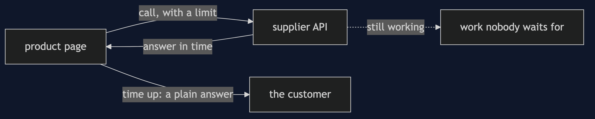
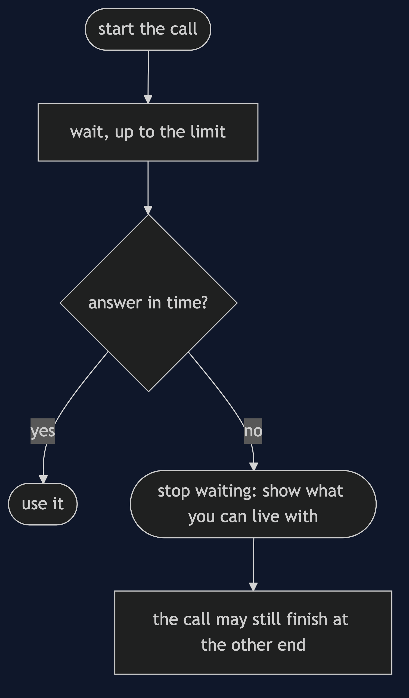
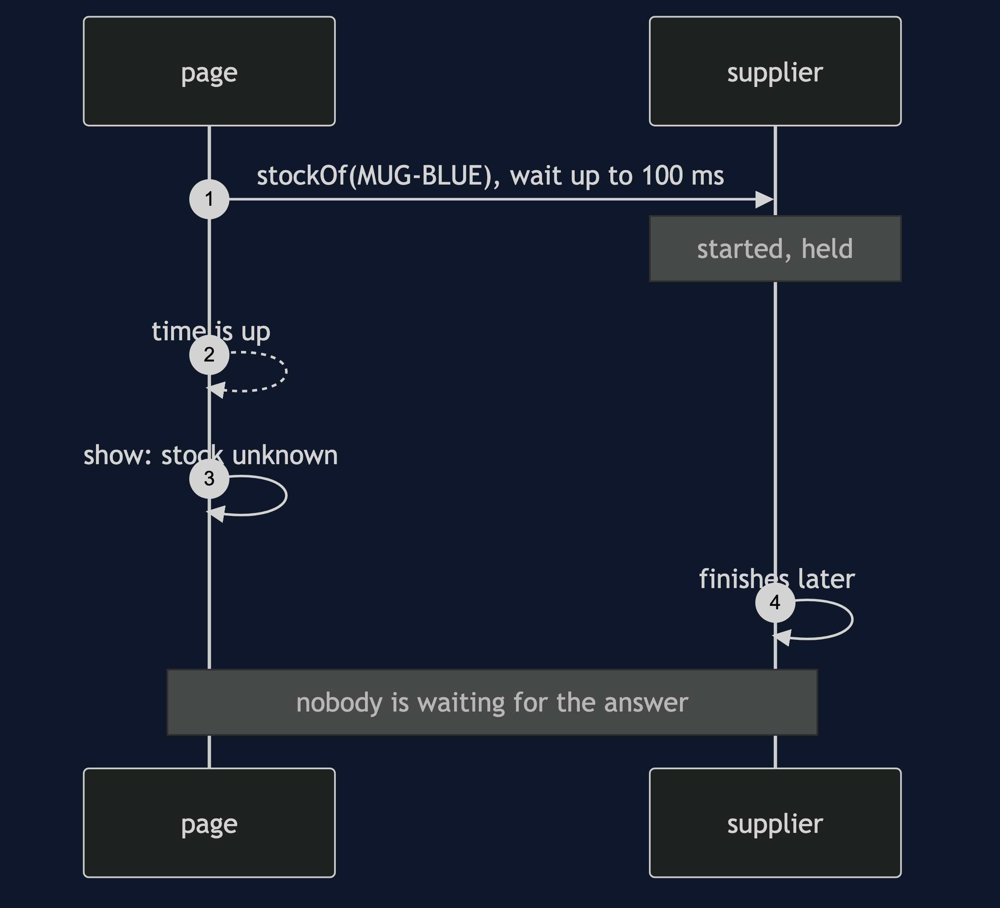

# Timeout Pattern

```
src/main/java/com/jk/explore/timeoutpattern/
├── TimeoutDemo.java                 the six acts
├── Callers.java                     wait for the answer, or give up after a limit
├── SupplierApi.java                 held at a gate; counts started and finished
├── Gate.java                        makes silence exact
├── Latency.java                     a typical hundred calls, as numbers
└── Budget.java                      one time budget shared by several calls
```

**A timeout is a limit on the wait. It tells you that you stopped waiting, and nothing about what happened.**

This project is in [micro-services-design-patterns](..). It is the simplest resilience pattern, and every other one, [Retry](../retry-pattern), [Circuit Breaker](../circuit-breaker-pattern) and [Bulkhead](../bulkhead-pattern), assumes it.

## Run

```bash
./gradlew run
```

Six acts. Every number quoted below comes from this program's own output.

```
ONE. No timeout.
  the supplier never answers. the product page's thread is: WAITING, with no limit on for how long.
  nothing in the code says it will ever come back, and the customer is looking at a spinner.
TWO. A limit on the wait.
  the same call, with a limit of 100 milliseconds: the page shows "stock unknown, try again shortly".
  the page loaded, without the number it could not get.
THREE. Giving up does not stop the work.
  the caller gave up. calls started at the supplier: 1, finished: 0.
  later the supplier finishes anyway: finished 1. nobody was waiting for the answer, and the work was done.
FOUR. Choosing the number.
  a limit of   50 ms: 54 of 100 calls succeed.
  a limit of  100 ms: 90 of 100 calls succeed.
  a limit of  250 ms: 98 of 100 calls succeed.
  a limit of 1000 ms: 98 of 100 calls succeed.
  a limit of 3000 ms: 100 of 100 calls succeed.
  too tight and healthy calls fail. too loose and a slow supplier holds a thread for seconds.
FIVE. One budget for the whole page.
  a page makes 3 supplier calls in a row, each allowed 1000 ms. the worst case for the page is 3000 ms.
  with one budget of 1000 ms shared by all three: call 1: answered at 400 ms. call 2: cut off at 600 ms. call 3: skipped, no budget left. total 1000 ms.
SIX. The bill: you do not know what happened.
  the payment call timed out. the customer is told: we could not take your payment.
  the payment provider then completed the charge: charges taken 1. the customer thinks nothing was taken.
  a timeout says only that you stopped waiting. retrying a payment without an idempotency key would charge again.
```

## Test

```bash
./gradlew test
```

2 test classes, 8 test methods, offline, with nothing installed and no framework.

## Technologies and versions

| What | Version | Why it is here |
| --- | --- | --- |
| Java | 21 | The repository standard, via the Gradle toolchain block |
| Gradle | 9.2.1 | The wrapper in this directory; no separate install needed |
| JUnit 5 | 5.10.2 | Test runner |

No framework. A hand-built project stays plain Java so the mechanism is the whole lesson.

## Learning Material

| Document | What it covers |
| --- | --- |
| [`docs/problem-statement.md`](docs/problem-statement.md) | A supplier that may never answer |
| [`docs/timeout-pattern-explained.md`](docs/timeout-pattern-explained.md) | The pattern, and six acts |
| [`docs/class-diagram.md`](docs/class-diagram.md) | The types |
| [`docs/architecture-diagram.md`](docs/architecture-diagram.md) | A page, a limit and a supplier |
| [`docs/data-flow-diagram.md`](docs/data-flow-diagram.md) | What happens when the time is up |
| [`docs/sequence-diagram.md`](docs/sequence-diagram.md) | Written for a listener with the screen off |
| [`docs/uml-diagram.md`](docs/uml-diagram.md) | Four sequences |
| [`docs/animation.html`](docs/animation.html) | The six acts in a browser |
| [`docs/prerequisites.md`](docs/prerequisites.md) | What you need to know |
| [`docs/session.md`](docs/session.md) | A one-hour taught session |
| [`docs/spec.md`](docs/spec.md) | The generated specification |
| [`docs/youtube.md`](docs/youtube.md) | Title, description and chapters |

### The pattern in one picture


### Where each piece sits



### How one request moves



### Who calls whom, in order



### All four sequences


### Video

Built from [`video/scenes.py`](video/scenes.py) by
[`video/build_video.sh`](video/build_video.sh). The rendered file is not
committed; see the repository README for why.

## Where you have already met this

Every HTTP client and database driver has a timeout setting, and the default is often none.

## When this is too much

A timeout is never too much. The cost is choosing it well, and handling the case where it fires.

## Where this sits

This project is in [`micro-services-design-patterns`](..), and is meant to be read with its neighbours there.
