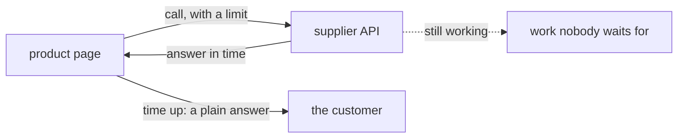

# Timeout Pattern — Architecture Diagram

The caller sets the limit. The supplier does not know about it.

Mermaid source

```mermaid
flowchart LR
    P["product page"] -->|call, with a limit| S["supplier API"]
    S -->|answer in time| P
    P -->|time up: a plain answer| U["the customer"]
    S -.->|still working| W["work nobody waits for"]
```

