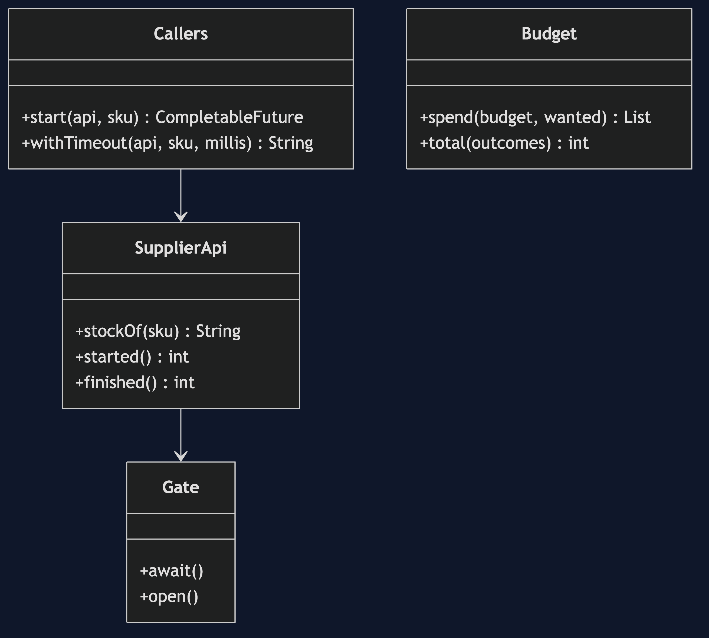
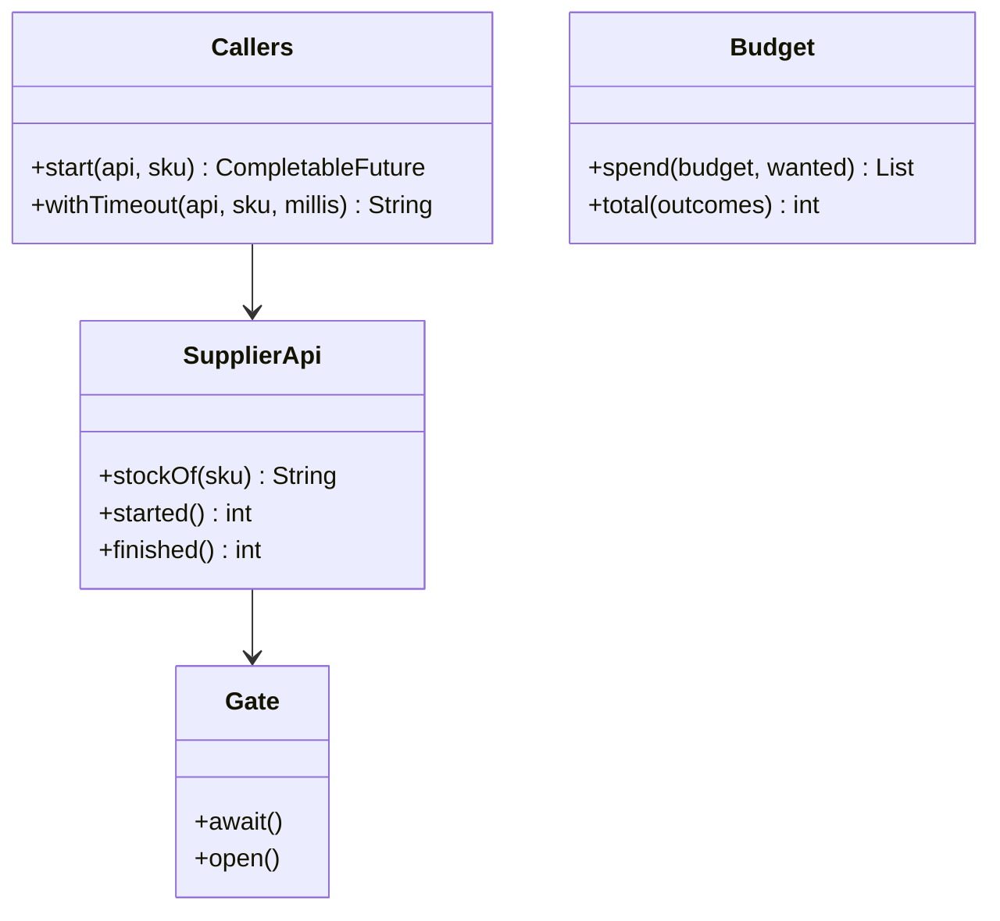

# Timeout Pattern — Class Diagram

A caller starts a call and either waits for it or gives up.

Mermaid source

```mermaid
classDiagram
    class Callers {
        +start(api, sku) CompletableFuture
        +withTimeout(api, sku, millis) String
    }
    class SupplierApi {
        +stockOf(sku) String
        +started() int
        +finished() int
    }
    class Gate {
        +await()
        +open()
    }
    class Budget {
        +spend(budget, wanted) List
        +total(outcomes) int
    }
    Callers --> SupplierApi
    SupplierApi --> Gate
```

