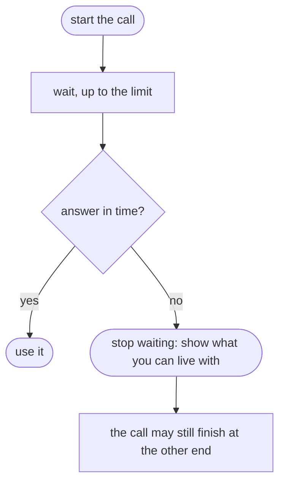

# Timeout Pattern — Data Flow Diagram

What happens to a call with a limit.

Mermaid source

```mermaid
flowchart TD
    Start(["start the call"])
    Wait["wait, up to the limit"]
    In{"answer in time?"}
    Use(["use it"])
    Up(["stop waiting: show what you can live with"])
    Still["the call may still finish at the other end"]
    Start --> Wait --> In
    In -- yes --> Use
    In -- no --> Up --> Still
```

