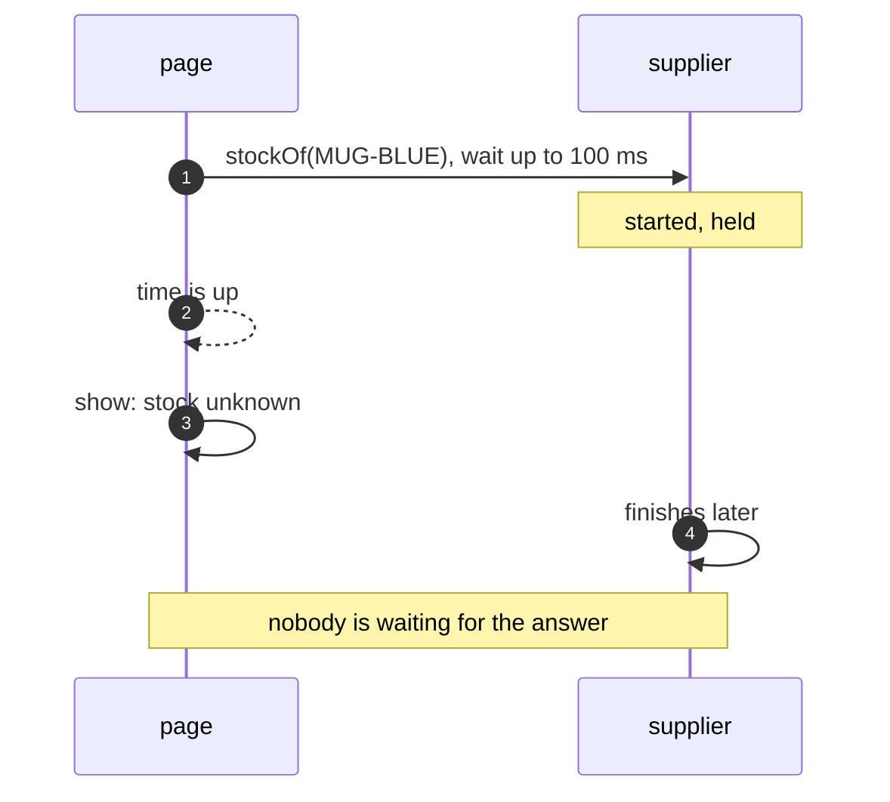

# Timeout Pattern — Sequence Diagram

Written for a listener with the screen off.

Say it in words. The page starts a call to the supplier and waits up to a hundred milliseconds. The supplier has started, and is held. The time is up. The page stops waiting and shows stock unknown. Later the supplier finishes the work. Nobody is waiting for it, and the answer goes nowhere.

Mermaid source

The load-bearing sentence: **the caller stops waiting, and the supplier carries on.**
