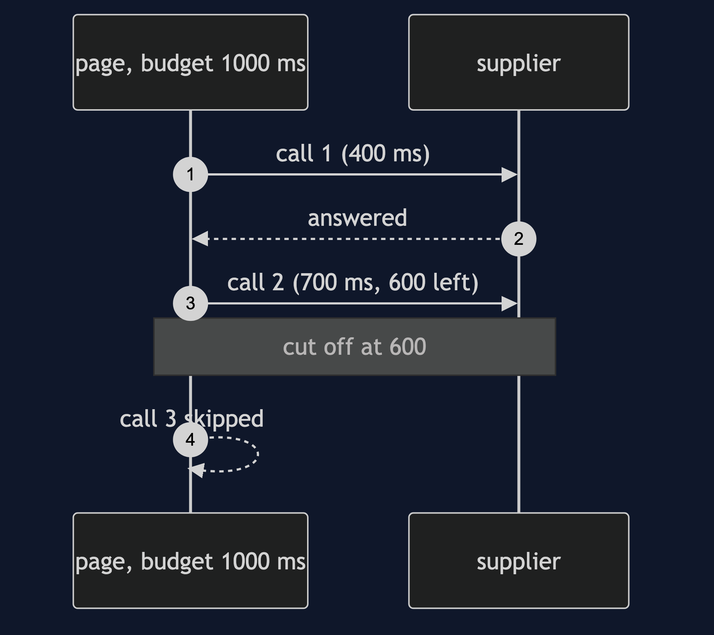
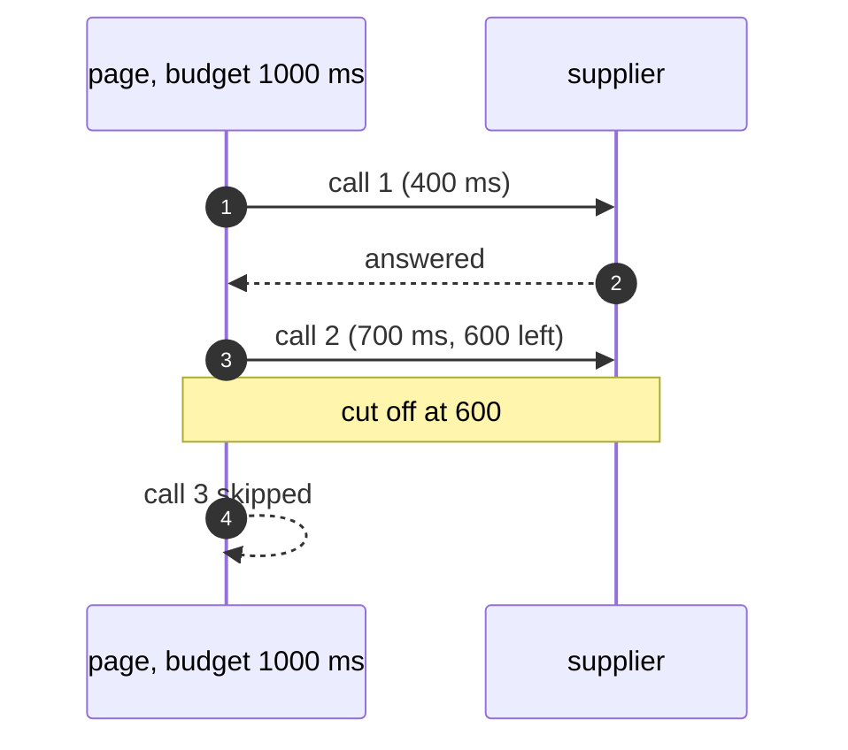

# Timeout Pattern — UML Sequence Diagrams

Four sequences.

## 1. A Shared Budget

Mermaid source

```mermaid
sequenceDiagram
    autonumber
    participant P as page, budget 1000 ms
    participant S as supplier
    P->>S: call 1 (400 ms)
    S-->>P: answered
    P->>S: call 2 (700 ms, 600 left)
    Note over P,S: cut off at 600
    P-->>P: call 3 skipped
```

