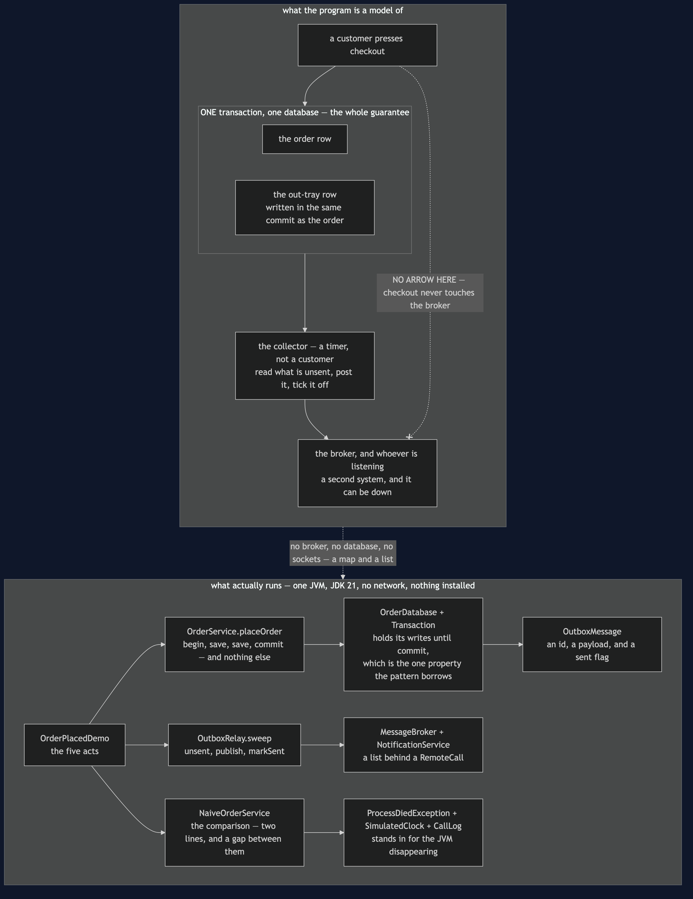
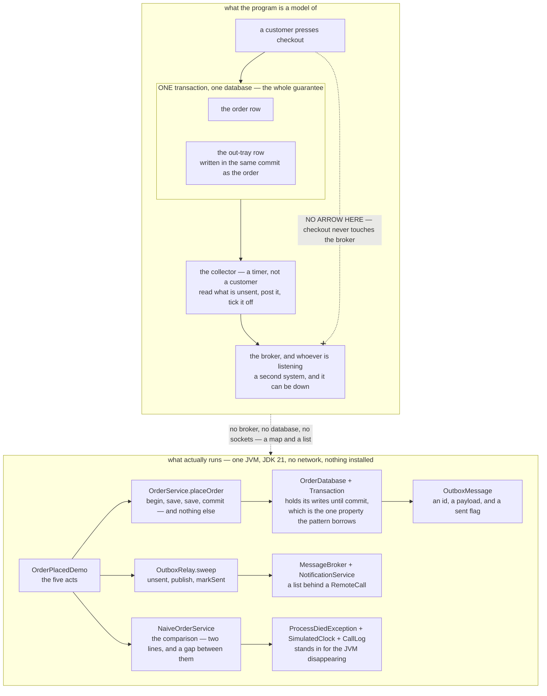

# Transactional Outbox — Architecture Diagram

Where each piece of this project sits, and — because this project starts nothing — what
each piece *stands for*. The class diagram shows the types and the sequences show the order
of the calls; this one answers the question those two cannot, which is **which boundaries
the checkout crosses, and which one it deliberately no longer crosses at all**.

Read the picture as two halves stacked. The upper half is what the program is a model of:
a shop that must save an order *and* tell somebody about it, with a database on one side, a
broker on the other, and no transaction covering both. The lower half is the literal truth:
one Java program, a map that pretends to be a table, a list that pretends to be a broker,
and a clock that only moves when a call is made.

The single most important thing in the upper half is a line that is not there. **The
checkout has no arrow to the broker.** `OrderService.placeOrder` opens a transaction, saves
the order, saves an `OutboxMessage` beside it, and commits. That is all it does. Everything
that touches the broker happens later, in a different process, triggered by a timer rather
than by a customer.

The second thing to find is the dotted box around the table and the relay. They are the two
halves of the out-tray: the checkout writes into it in the same breath as the order, and the
collector empties it afterwards. Because one commit created both rows, the only way for the
order to exist is for the message to exist beside it.

Mermaid source

## What the diagram is telling you to count

**Two systems, one transaction, and the message is moved to the side that has one.** The
naive version does two separate things that can half-happen: `saveOnItsOwn(order)` and then
`publish(event)`. A deploy rolling the pod between those two lines leaves an order that is
real, a customer who will be charged, and nobody who will ever be told — and **nothing will
retry**, because nothing is left that knows a message was owed.

**Swapping the two lines does not help.** Publish first, crash before the save, and you have
announced an order that does not exist. Neither order is right, because the problem is not
the order. It is that there are two of them.

**One commit, two rows, and the guarantee falls out of the arrangement.** There is no
cleverness in `OrderService` to admire. The order and the message are in the same database,
so the same transaction covers both, so a crash before the commit leaves nothing at all and
the customer simply retries checkout, and a crash after it leaves a message the next sweep
will find. Two tests hold those two halves.

**The relay's retry is not retry logic.** When the broker is down, the sweep publishes
nothing and marks nothing, so the rows are still unsent and the next sweep picks them up
again. Nobody wrote that loop; it is a consequence of where the message is kept. In the
demo two customers check out during an outage, the first sweep publishes zero, and the
second publishes two.

**Checkout stops depending on the broker being up.** That is the benefit people notice
second and value most: customers keep buying through a broker outage, because the thing
they are waiting on is one commit to one database.

## What it deliberately leaves out

**The gap has not gone, it has moved — and the new one cannot be closed.** Between the
broker accepting a message and `markSent` recording it, there are two systems again, and
this time nothing can be done about it, because the second system is the broker. If the
relay dies in that window the table still says unsent and the next sweep publishes the
message a second time. That is **at-least-once delivery**, and it is not a flaw in
`OutboxRelay` to be apologised for; it is the deal. The only two guarantees on offer are
*possibly twice* and *possibly never*, and this pattern chooses the first.

**The relay is another moving part** to deploy, monitor and alert on — and a relay that is
quietly not running looks exactly like a quiet Tuesday. **The table needs housekeeping**, or
it grows forever. Neither cost is modelled here, and both are real.

**There is no deduplication on the receiving side.** `NotificationService` keeps no record
of what it has handled, so a duplicate becomes two identical emails. Two emails is
embarrassing; had the subscriber been Payments it would have been two charges. The one thing
that makes it fixable is in the demo's last line — **the message id was the same both
times** — and a receiver that writes down the ids it has seen can throw the second copy
away. That is [Idempotent Consumer](../idempotent-consumer-pattern), the next and last
project in this category, and it is what makes at-least-once delivery liveable.

**And the shape of the bug is older than microservices.** Two steps that must both happen,
with no single mechanism covering them, is double-checked locking's bug in a bigger coat.
There the fix is `volatile` and a lock; here it is one commit. Once you can spot that shape,
you can spot this bug in code you have never seen.
