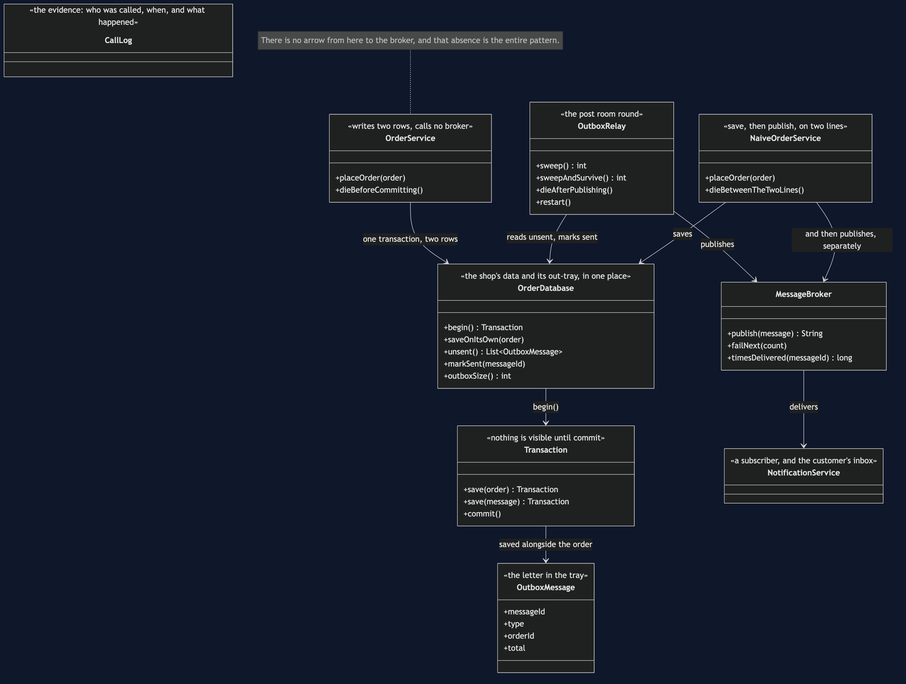
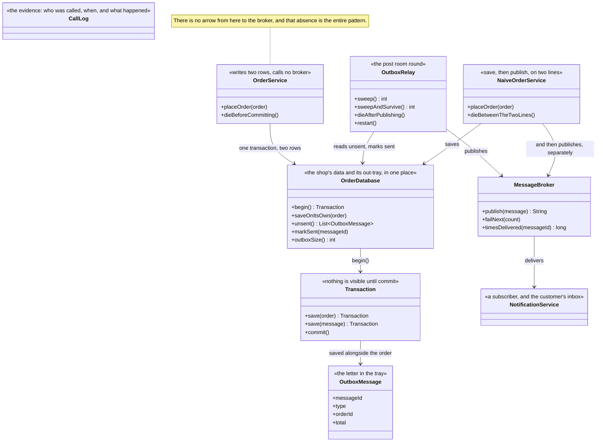

# Transactional Outbox — Class Diagram

## The Shape Of It

The diagram is worth reading for what is missing rather than what is there.

`OrderService` has one arrow, and it goes to the database. It has no reference to
`MessageBroker` at all — not a failed one, not an optional one, none. That absence is the
pattern. `theServiceNeverTalksToTheBroker` is the test that keeps it absent.

Compare `NaiveOrderService` at the bottom, which has two arrows: one to the database and one
to the broker. Those two arrows are two separate acts, and the gap between them is where the
order is lost.

## `Transaction`

An inner class on `OrderDatabase`, and deliberately a small one. It collects an order and a
message, and neither is visible to anybody until `commit()` runs.

That is the only guarantee the pattern actually relies on, and it is a guarantee an ordinary
relational database has been giving you for forty years. Nothing exotic is required — which
is most of why this pattern is worth knowing.

`writesAreHeldUntilTheCommit` and `bothOrNeither` are the two tests that pin it down.

## `OutboxRelay`

Three lines of work: read the unsent rows, publish each one, mark each one sent.

`sweep()` is the honest version and `sweepAndSurvive()` is the one used by acts that need
the relay to keep going after a failure. `dieAfterPublishing()` and `restart()` exist so
that act five can produce a real duplicate rather than describe one.

Notice there is no retry method, no backoff, and no scheduler. A row that was not published
is still an unsent row, so the next sweep tries it again. That is the whole of "retry" here.

## `OutboxMessage`

A record with a message id on it, and that id is the most important field in the project.

It is stable across redeliveries — the same message published twice carries the same id
both times — which is the only thing a receiver needs in order to notice it has seen this
before. `theDuplicateIsRecognisable` asserts it, and everything the receiving side does with
it belongs to the pattern after this one.

## `NaiveOrderService`

Kept because the comparison has to be fair, and because it is what everybody writes first.
Two lines, in the obvious order, with `dieBetweenTheTwoLines()` to put a crash exactly where
a deploy would land.

## `CallLog` And `SimulatedClock`

Both designs touch the same database and the same broker, so the only way to compare them is
to watch who was called, in what order, and what happened. `CallLog` records that, and
`SimulatedClock` advances by fixed amounts — fifteen milliseconds for a broker publish,
seven for a notification.

Nothing sleeps. Every timing in the demo is exact and repeatable, and the single combined
commit is something you can see in the timeline rather than something you are told.
