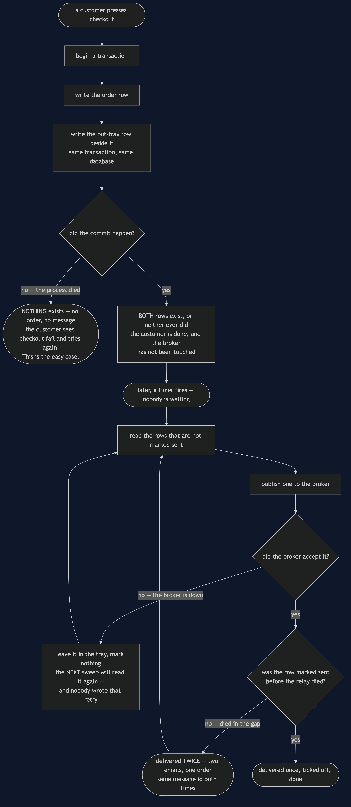
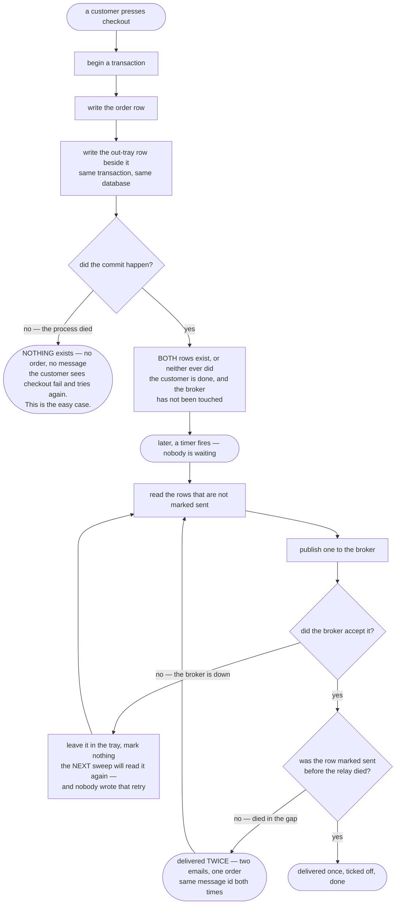

# Transactional Outbox — Data Flow Diagram

One order, followed from the customer pressing checkout to an email arriving — and then the
same order followed along the naive route, where the two things that must both happen can
half-happen. The architecture diagram says which boundaries are crossed; this one says
**where the process is allowed to die, and what is left behind each time**.

The thing to follow is the crash markers. There are three of them, and each one is a
different story. Crash before the commit and there is nothing at all, which is the easy
case: the customer sees the checkout fail and tries again. Crash after the commit and the
message is sitting in the table waiting for the next sweep. Crash between the broker
accepting a message and the row being marked sent — and you get a duplicate, which is the
one place in this diagram where the pattern has no answer.



<details>
<summary>Mermaid source</summary>



</details>

## What the picture is telling you

**Only one box writes, and it writes twice in one motion.** `OrderService.placeOrder` opens
a transaction, saves the order, saves the message, commits. Read it and notice what is
absent: there is no call to the broker anywhere in the checkout path. The guarantee is not
in the code, it is in the arrangement — one commit created both rows, so the only way for
the order to exist is for the message to exist beside it.

**The "nothing exists" ending is a success.** It is worth saying out loud, because it looks
like a failure on the chart. A checkout that fails cleanly costs a retry. A checkout that
half-succeeds costs a customer who was charged and never told, discovered three weeks later
from their side of the conversation.

**The loop back from "leave it in the tray" is the whole availability story.** The broker
being down does not fail a checkout, does not lose a message, and does not require anybody
to write a retry. The rows are still unsent, so the next sweep reads them again. The demo
runs exactly this: two customers check out during an outage, the first sweep publishes zero,
the broker comes back, and the second sweep publishes two.

**The `was it marked sent` fork is the bill.** Between the broker accepting and the row
being ticked off there are two systems again, and this time nothing can be done about it,
because the second system is the broker. That is at-least-once delivery. The only two
guarantees on offer are *possibly twice* and *possibly never*, and this pattern chooses the
first on purpose.

**The duplicate loops back into the sweep rather than ending the diagram.** It is not an
error state and nothing throws. The relay is behaving correctly; the table genuinely said
unsent.

## The same order without the out-tray

The naive route is two boxes and one arrow off the side:

```
database.saveOnItsOwn(order);
broker.publish(event);
```

On a good day it is fine, and most days are good days. That is the problem. A deploy rolls
the pod between the two lines and the order is real, the customer will be charged, and
nobody will ever be told. Three properties make this one of the worst bugs in distributed
systems: it is **rare**, so it survives testing; it is **silent**, so nothing alerts; and it
is **invisible from the order**, which looks perfect.

Swapping the lines does not help — publish first, crash before the save, and Notifications
emails a customer about an order the Orders service has never heard of. The problem is not
the order of the two operations. It is that there are two of them.

## Where the remaining duplicate goes

`NotificationService` keeps no record of what it has handled, so the second delivery becomes
a second identical email. Two emails is embarrassing; had the subscriber been Payments it
would have been two charges.

The fix is in the diagram already, in the last note: **the message id is the same both
times**. A receiver that writes down the ids it has handled can throw the second copy away,
which is [Idempotent Consumer](../idempotent-consumer-pattern) — the next project, and the
thing that makes at-least-once delivery liveable rather than merely honest.
