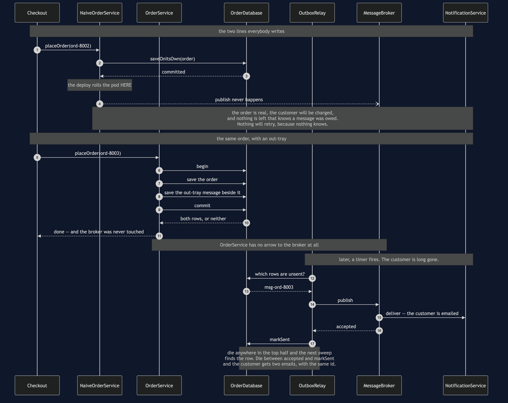
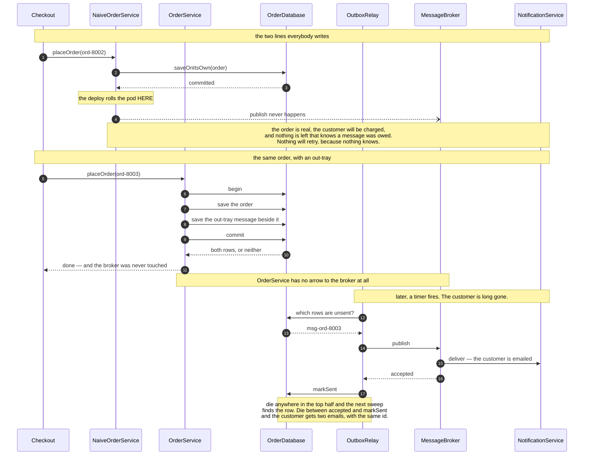

# Transactional Outbox — Sequence Diagram

The one sequence worth having in your head before the others make sense: the same order
placed twice, with the process dying at the same instant both times, and only one of the two
versions surviving it.

[`uml-diagram.md`](uml-diagram.md) holds the full set of five acts, including the broker
outage and the duplicate. This document puts the naive version and the outbox version side
by side, because the pattern is a trade and a trade is only visible as a comparison.

Watch where the process dies. In the upper half it dies *between* two operations, and there
is no arrangement of those two lines that makes the gap safe. In the lower half it dies
after a commit, and there is nothing left to go wrong, because the commit was the only
thing that had to happen.

Mermaid source

## Reading the two halves

**The crash is in the same place in both.** After a successful database commit, before
anybody has told the broker anything. That is the fair comparison: same failure, same
instant, and the only difference is whether a row was written that remembers the message
was owed.

**The naive half has no second act.** Nothing retries, nothing sweeps, nothing alerts. The
order looks perfect in the database, which is why the investigation starts three weeks later
from the customer's side — "I was charged and never got a confirmation."

**The lower half's checkout ends at the commit.** That is worth pausing on, because it is
also a latency and availability win that nobody asked for: the customer waits on one commit
to one database, not on a broker being up. Customers keep buying through a broker outage.

**The relay half runs for a different reason entirely.** The checkout ran because somebody
pressed a button; the sweep runs because a timer fired. They share nothing but a table, and
they can be deployed, scaled and restarted independently.

**Nothing here sleeps.** `SimulatedClock` advances by fixed amounts — fifteen milliseconds
for a broker publish, seven for a notification — so every timeline in the demo matches this
sequence step for step on any machine, and `ProcessDiedException` stands in for the JVM
disappearing. In real life that catch block never runs, and the tests say so in a comment
where they catch it.

## What the other acts add

**The broker is down.** The sweep publishes nothing and marks nothing, so the rows are still
unsent and the next sweep reads them again. Nobody wrote that retry — it is a consequence of
where the message is kept. Two customers check out during the outage, the first sweep
publishes zero, and the second publishes two.

**The duplicate.** The relay dies between the broker accepting a message and `markSent`
recording it. The table still says unsent, the next sweep publishes again, and two identical
emails arrive. This is at-least-once delivery, and it is the deal rather than a defect: the
only two guarantees on offer are *possibly twice* and *possibly never*.

**The happy path of the naive version.** It is in the set for completeness, because it is
what every test written against that code will see. On a good day it is fine, and most days
are good days. That is precisely the problem.

The one thing that makes the duplicate fixable is on the last line of the demo: the message
id was the same both times. A receiver that writes down the ids it has handled can discard
the second copy — [Idempotent Consumer](../idempotent-consumer-pattern), which is what makes
this pattern liveable.
