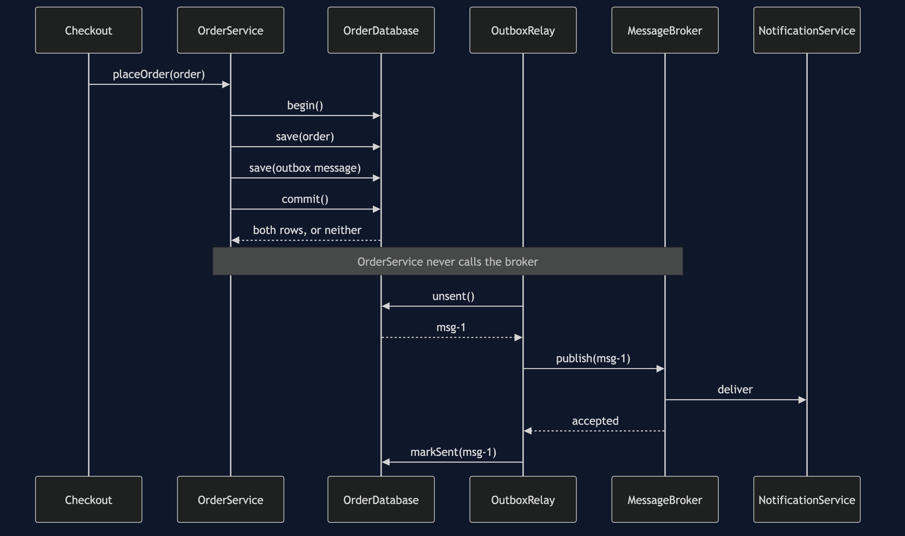
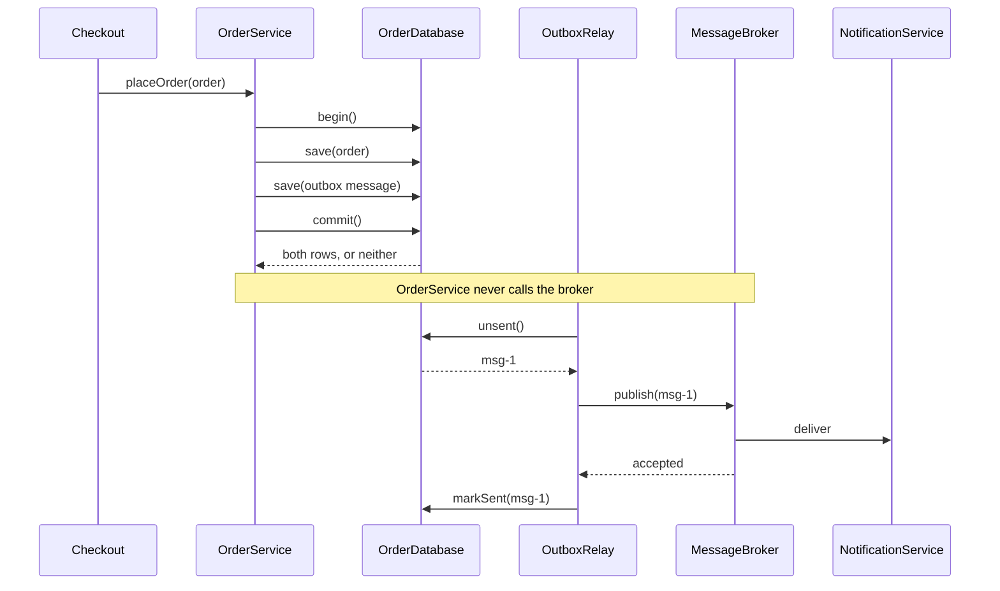
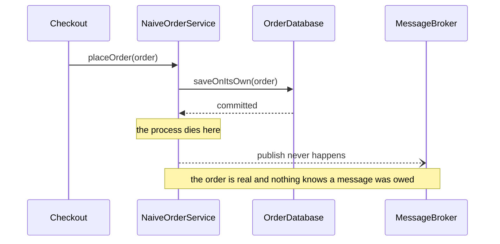
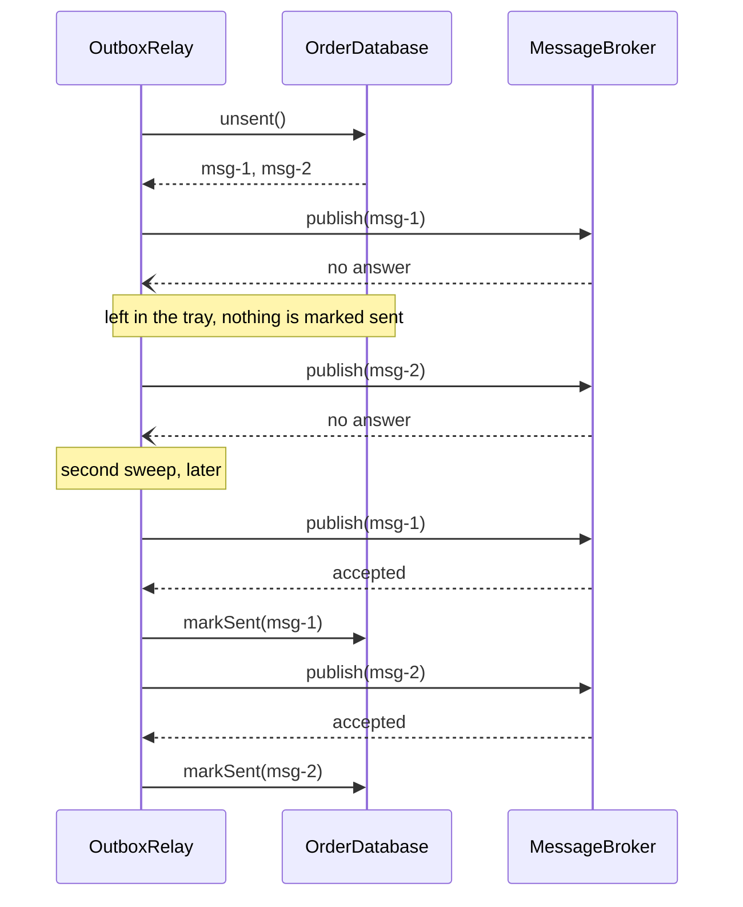
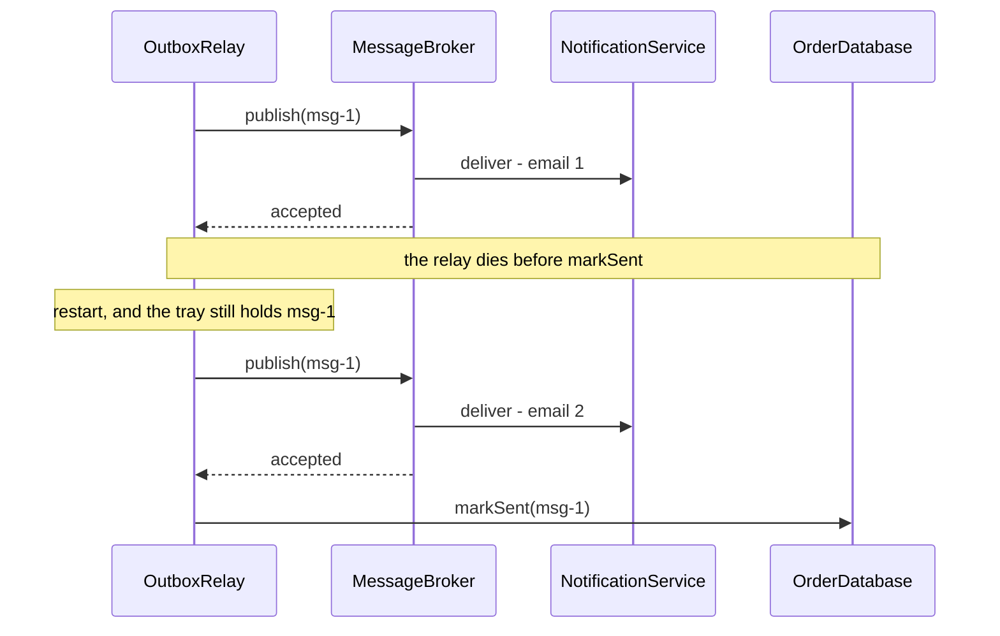
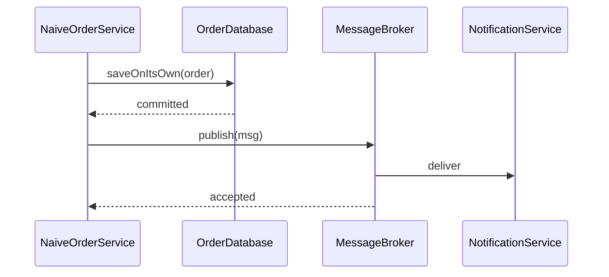

# Transactional Outbox — Sequence Diagrams

Five acts, five sequences. The third one is rendered; the rest are here to read.

## Act Three — One Commit, Then A Sweep

The top half is the checkout and it ends at the commit. The bottom half happens later, in a
different process, and the customer is long gone by then.

## Act Two — The Naive Version, And The Gap

There is no second half to this diagram, and that is the whole comparison.

## Act Four — The Broker Is Down

Nothing in this diagram is retry logic. The second sweep reads the same unsent rows because
nobody marked them sent.

## Act Five — The Duplicate

Two emails, one order, and the same message id on both. That id is the only thing the
receiving side has to work with, and it is enough.

## Act One — For Completeness

The happy path, which is what every test written for the naive version will see.

## Notes On Reading These

**Dashed arrows are failures or things that never happened.** Solid ones completed.

**Nothing here is a distributed transaction.** No participant holds a lock while waiting for
another. The only transaction anywhere is an ordinary database one, and it covers two rows
in the same database.

**The two halves of act three run at different times, and possibly for different reasons.**
The checkout half runs because a customer pressed a button. The relay half runs because a
timer fired. They share nothing but a table.

**The timings are exact.** `SimulatedClock` advances by fixed amounts — fifteen milliseconds
for a broker publish, seven for a notification — so the timelines in the demo output match
these sequences step for step on any machine.
