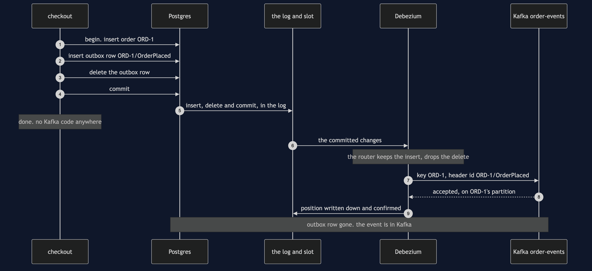

# Transactional Outbox with Debezium Pattern

```
src/main/java/com/jk/explore/transactionaloutboxdebezium/
├── OutboxWithDebeziumDemo.java   the six acts
├── OrdersDatabase.java           starts and stops a real Postgres with wal_level=logical; the orders and outbox tables; the replication slot
├── Broker.java                   starts and stops a real Kafka broker; the order-events topic, 3 partitions; reads it back
├── DualWriteCheckout.java        the two lines everybody writes: save in Postgres, send to Kafka
├── OutboxCheckout.java           the pattern: the order and its outbox row in one transaction, and no Kafka code at all
├── ChangeDataCapture.java        Debezium's Postgres connector in its embedded engine, forwarding to Kafka
├── Order.java                    one order, its total in pence
├── OrderEvent.java               one message as it sits in Kafka: partition, place, key, type, event id
├── ProcessDied.java              a process disappearing at an exact line
└── Poll.java                     every wait is a question asked until the answer is yes
```

**Debezium reads Postgres's log, not the outbox table. In this project the checkout writes each outbox row and deletes it again inside the same transaction, the table ends the run holding 0 rows, and Kafka still receives all 3 events — something no relay that polls a table can do. The same log explains the rest: while Debezium is stopped, Postgres keeps every part of the log it has not confirmed, with no limit, and hands it all over when Debezium comes back; and a Debezium that dies after sending but before writing down how far it has read is handed the same changes again, so each event arrives twice with the same id.**

**This project needs a container runtime.** Docker Desktop, or anything Docker-compatible, must be running before you start, with about 1 GB of memory to spare. The demo brings up a Postgres database and a Kafka broker in two containers and takes both down again at the end; Debezium runs inside the demo's own Java program. Nothing is installed and nothing is left behind. With no runtime, the demo prints two sentences saying what to do, and stops, rather than a stack trace.

This project is the real-infrastructure version of the plain-Java Transactional Outbox project in this course. That project kept its database in a map whose transaction held writes until commit, its broker in a list, and its relay in a loop that read unsent rows and marked them sent. This one keeps the orders and the outbox in Postgres, the events in Kafka, and replaces the hand-written relay with change data capture: Debezium reading Postgres's own log.

## The idea, before any of the tools' words

Think of the out-tray on a desk. You do not stop half-way through filing a sale to run to the post box, because then a crash leaves the paperwork done and the letter still in your hand. You file the paperwork and drop the letter in the tray in one movement, and somebody collects the tray later.

Now picture an office where every piece of paper that touches any desk is first photocopied into a journal, by the building, automatically. The collector does not need to look in the tray at all. They read the journal. You can drop the letter in the tray and throw it straight in the bin, and it still goes out, because it is in the journal. The building also keeps every page of the journal the collector has not yet read — however long the collector is away.

In the shop, the Orders service saves each order in Postgres and has to tell the rest of the shop through Kafka. The out-tray is a table called `outbox`. The journal is Postgres's write-ahead log. The collector is Debezium.

## Run

```bash
./gradlew run
```

Six acts, against a real database, a real broker and a real Debezium. Every number quoted below, and in every document and slide in this project, comes from this program's own output. Two runs back to back print exactly the same thing.

```
ONE. Two writes, one crash.
  Postgres and Kafka are running in containers. no Debezium yet: the checkout talks to both itself.
  save, then send. the process dies in between. ORD-1 in Postgres: yes. events in Kafka: 0. the customer is charged and nobody is told.
  swap the lines: send, then save, and die in between. events in Kafka: 1. ORD-2 in Postgres: no. the shop announced an order that does not exist.
  two systems, two steps, and no transaction that covers both.
TWO. One transaction, and Debezium sends.
  Postgres runs with wal_level logical. Debezium 3.6.3.Final runs inside this program and holds replication slot orders_outbox. slot active: yes.
  the checkout writes each order and an outbox row in one transaction, and has no Kafka code at all. orders: 3, outbox rows: 3.
  Debezium reads the 3 commits from Postgres's log and sends them. events in Kafka: 3.
  ORD-4 writes both rows, the card is declined, and the transaction rolls back. then ORD-5 commits.
  events in Kafka: 4. events for ORD-4: 0. the log only hands over committed work, so the order and its event live or die together.
THREE. The log, not the table.
  this time each transaction writes the outbox row and deletes it again before committing.
  orders: 3. outbox rows: 0. events in Kafka: 3.
  a relay that reads the table would find nothing to send. Debezium read the insert from the log.
FOUR. Debezium is down.
  Debezium is stopped. slot active: no. the checkout still takes 3 orders. orders: 3. events in Kafka: 0.
  the slot makes Postgres keep every part of the log Debezium has not confirmed. log kept for the slot: grew while it was down. limit: -1, which means none.
  Debezium starts again, carries on from its slot, and sends 3: ORD-1, ORD-2, ORD-3. nothing was lost and nobody wrote a retry.
FIVE. Sent, but not written down.
  Debezium sends ORD-1 and ORD-2 to Kafka, then dies before writing down how far it has read. events in Kafka: 2. slot active: no.
  it starts again from the last place it wrote down, and sends both again. events in Kafka: 4 for 2 orders.
  ORD-1/OrderPlaced arrived 2 times, ORD-2/OrderPlaced arrived 2 times, with the same event id each time. delivery is at least once.
SIX. Order per key, and the bill.
  3 orders are placed, paid and shipped, each step its own transaction: 9 commits, the orders taking turns. order-events has 3 partitions.
  ORD-1: partition 1, OrderPlaced, OrderPaid, OrderShipped.
  ORD-2: partition 2, OrderPlaced, OrderPaid, OrderShipped.
  ORD-3: partition 2, OrderPlaced, OrderPaid, OrderShipped.
  partition 0 holds none, partition 1 holds only ORD-1, partition 2 holds ORD-2 and ORD-3 taking turns. the order id is the key, and the key picks the partition.
  each order's own events stay in the order they were committed. across orders, nothing is promised.
  the bill: 2 containers, Postgres started with wal_level logical, and 1 replication slot.
  a slot whose reader has gone keeps log for ever: limit -1. retiring Debezium means dropping its slot. slot exists now: no.
  and delivery is at least once, so every reader of order-events has to recognise an event id it has already seen.
```

The first run pulls two images, Postgres at about 298 MB and Kafka at about 446 MB once unpacked, and downloads Debezium's libraries, and takes longer. After that a run takes about fifteen seconds, most of it the two containers starting.

**Every count in the output is exact, and none depends on timing.** Every wait is a poll on something the tools can be asked: whether the replication slot has a reader connected, how many messages each Kafka partition holds, whether the Debezium engine has finished. The one figure that is not a count is the size of the log Postgres keeps for the slot in act four. It is a number of bytes that depends on what else Postgres happened to write, so the demo says only that it grew, and the test asserts that it did. The partitions in act six are not luck either: Kafka picks a partition from a hash of the key, so ORD-1 lands on partition 1 on every machine.

Both containers listen on their usual ports inside — 5432 for Postgres, 9092 for Kafka — and Testcontainers maps each to a free port on this machine picked at random, so the demo never collides with a Postgres or a Kafka you already run.

## Test

```bash
./gradlew test
```

3 test classes, 16 test methods. `PlainPartsTest` needs nothing installed. `RealInfrastructureTest` starts one database, one broker and one Debezium engine for the whole class and asks them directly: Postgres runs with logical decoding and Debezium holds its slot; a dual write that dies after the save leaves an order and no event, and one that dies after the send leaves an event and no order; every committed outbox row reaches Kafka keyed by its order; a rolled-back checkout publishes nothing; a row deleted in its own transaction is still published; while Debezium is down the slot keeps the log and nothing is lost; a crash after sending and before writing down sends the same events again with the same ids; and an order's events share one partition in commit order. `DemoRunsTest` runs the demo and asserts every figure the documents quote.

There is no `Thread.sleep` anywhere under `src/test`. Every wait is a bounded poll with a sixty-second limit that fails the test rather than hanging it. The tests that need the containers are skipped when no container runtime is there; the rest still run.

## What the simulation got right, and what it left out

This is the reason this project exists, so it comes before anything else.

**What the plain-Java Transactional Outbox project got right.** All of the pattern. Saving the order and sending the event are two systems, and a crash between them leaves one without the other, whichever way round you write them. Writing the event as a row beside the order, in the same transaction, means the order cannot exist without its message. A separate collector sends the rows later, so checkout keeps working while the broker is away, and nobody writes retry logic. A collector that dies after sending and before recording it sends the message again, so delivery is at least once, and the unchanging message id is what lets the receiver notice. Every one of those lessons holds on Postgres, Debezium and Kafka, and acts one, two, four and five reproduce them.

**What it left out, first, and the headline find: the collector reads the log, not the table.** The simulation's relay read the outbox table and marked rows sent. Debezium never reads the table. Postgres writes every change to its write-ahead log before it touches a table, and Debezium is sent the changes from that log. In act three the checkout writes each outbox row and deletes it again before committing: outbox rows: 0, events in Kafka: 3. A polling relay would have found nothing. This is Debezium's own recommended way to run an outbox, because it means the table never needs cleaning — and it is a behaviour that only exists when the database has a log someone else can read.

**Second: the database keeps the log for its reader, and keeps it without limit.** Debezium connects through a replication slot, a bookmark Postgres keeps for one reader. In act four Debezium is stopped: slot active: no. The checkout takes 3 orders anyway, and the log Postgres keeps for the slot grows. When Debezium starts again it is handed all 3 from where it left off. The simulation's broker outage showed the same good news. What it could not show is the cost on the other side: the setting that caps this, `max_slot_wal_keep_size`, is -1, which means no limit. A Debezium that is switched off and forgotten makes Postgres keep its log until the disk is full. Retiring it means dropping its slot, which act six does.

**Third: only committed work is in the log.** The simulation's transaction held its writes in a map until commit. Here a real transaction writes both rows and then rolls back when the card is declined, and Postgres's log decoder never hands a rolled-back transaction to anyone: events for ORD-4: 0. Debezium does not need to check anything; it cannot see work that did not commit.

**Fourth: the at-least-once gap moved, but it is still there.** The simulation's relay died between publishing and marking a row sent. Debezium has the same gap in a new place: between Kafka accepting a message and Debezium writing down its position in the log, which it keeps in an offsets file and reports to Postgres through the slot. In act five it dies in that gap after sending ORD-1 and ORD-2. It starts again from the last position it wrote down, and sends both again: 4 events for 2 orders, each pair with the same event id. The id comes from the outbox row and travels as a Kafka header, which is what lets a reader throw the second copy away.

**Fifth: order is kept per key, and only per key.** The simulation had one list and one relay, so everything arrived in the order it was written. Kafka splits a topic into partitions that are read side by side, and keeps order only within one. Debezium's outbox router makes the order id the message key, and the key picks the partition. In act six, three orders are placed, paid and shipped, taking turns; each order's three events land on one partition, in commit order, while ORD-2 and ORD-3 share partition 2 and interleave, and ORD-1 sits on partition 1 alone.

**One honest simplification.** Debezium's crash in act five is a thrown exception at an exact line, marked by `ProcessDied`, because a Java program cannot kill itself at a chosen line and go on to show what happens next. Everything after it is real: the engine really stops, the connection to the slot really drops, and the next engine really reads the same changes again from Postgres.

**Why the embedded engine, and not a Kafka Connect or Debezium Server container.** Debezium ships three ways to run the same Postgres connector: inside Kafka Connect, as a standalone Debezium Server, or as a library inside your own Java program, the embedded engine. The first two are each a third container with a Java runtime of its own, on top of the two this project already needs; the embedded engine adds no container at all and shares the demo's memory. It is still real change data capture: the same connector, the same replication slot, the same `pgoutput` decoder built into Postgres, and the same outbox event router, reading the same write-ahead log. What the engine does not do for you is forward to Kafka, so `ChangeDataCapture` does it in two short methods — the job Kafka Connect would otherwise do. In production most teams run Kafka Connect, because it spreads connectors across machines and stores positions in Kafka; the lesson is the same either way.

## Technologies and versions

| What | Version | Why it is here |
| --- | --- | --- |
| Java | 21 | The repository standard, via the Gradle toolchain block |
| Gradle | 9.2.1 | The wrapper in this directory; no separate install needed |
| Postgres | 18.6 | The Orders database, as the official `postgres:18.6-alpine` image in its smaller Alpine build, started with `wal_level=logical`; the newest release |
| Debezium | 3.6.3.Final | `io.debezium:debezium-embedded` and `debezium-connector-postgres`: the Postgres connector and its outbox event router, run by the embedded engine inside the demo; the newest generally available release |
| Kafka | 4.3.1 | The broker, as the Apache project's own `apache/kafka:4.3.1` image, in KRaft mode on a single node with a 256 MB heap; the newest release |
| Kafka Java client | 4.3.1 | `org.apache.kafka:kafka-clients`, matching the broker. Debezium 3.6.3 is built against Kafka 4.3.0, and Gradle settles both on 4.3.1 |
| Postgres JDBC driver | 42.7.13 | `org.postgresql:postgresql`, the newest release, and the one Debezium 3.6.3 is built with |
| Testcontainers | 2.0.5 | `testcontainers-postgresql` and `testcontainers-kafka`; start and stop both containers from inside the demo, on random free ports |
| slf4j-simple | 2.0.17 | Logging for the libraries above, turned off so the demo's own output is the only output |
| JUnit 5 | 5.10.2 | Test runner |
| A container runtime | Docker 24 or later, or compatible | Runs the database and the broker. Must be running before you start |

Nothing is held back: every version is the newest generally available release. Debezium 3.7 exists only as a release candidate at the time of writing, so 3.6.3.Final is used. See [`docs/dependencies.md`](docs/dependencies.md) and [`docs/prerequisites.md`](docs/prerequisites.md).

## Learning Material

| Document | What it covers |
| --- | --- |
| [`docs/problem-statement.md`](docs/problem-statement.md) | The plain-Java version, and what is new |
| [`docs/transactional-outbox-with-debezium-pattern-explained.md`](docs/transactional-outbox-with-debezium-pattern-explained.md) | The tools' words in plain language, and six acts |
| [`docs/class-diagram.md`](docs/class-diagram.md) | The types |
| [`docs/architecture-diagram.md`](docs/architecture-diagram.md) | Two containers, one engine, and the one arrow the checkout no longer has |
| [`docs/data-flow-diagram.md`](docs/data-flow-diagram.md) | One order from checkout to Kafka, and where a crash can land |
| [`docs/sequence-diagram.md`](docs/sequence-diagram.md) | Written for a listener with the screen off |
| [`docs/uml-diagram.md`](docs/uml-diagram.md) | Four sequences |
| [`docs/animation.html`](docs/animation.html) | The six acts in a browser |
| [`docs/prerequisites.md`](docs/prerequisites.md) | What you need installed, and what you need to know |
| [`docs/session.md`](docs/session.md) | A one-hour taught session |
| [`docs/dependencies.md`](docs/dependencies.md) | What Postgres's log, Debezium, Kafka and Testcontainers are, what they cost, and that skipping this project loses none of the pattern |
| [`docs/spec.md`](docs/spec.md) | The generated specification |
| [`docs/youtube.md`](docs/youtube.md) | Title, description and chapters |

### The pattern in one picture


### Where each piece sits


### How one order moves


### Who calls whom, in order



### All four sequences


### Video

Built from [`video/scenes.py`](video/scenes.py) by
[`video/build_video.sh`](video/build_video.sh). The rendered file is not
committed; see [`video/README.md`](video/README.md) for how it is made.

## Where you have already met this

Any service that owns a database and has to announce its changes: an order placed, a payment taken, a parcel shipped, a price changed. Debezium's outbox event router exists for exactly this, and the same shape runs with MySQL's binary log, SQL Server's change tables or MongoDB's change streams in place of Postgres's write-ahead log. Search indexes, caches and data warehouses kept in step with a database are usually fed the same way, by change data capture rather than by the application sending twice.

## When this is too much

If a lost event would cost nothing — a view counter, a recommendation refresh — send it directly and accept the rare gap. If you cannot restart the database with `wal_level=logical`, or your hosted database does not allow replication slots, a relay that polls the outbox table gives the same guarantee with a timer and a `sent` column; it needs no Debezium, at the price of a table that must be cleaned. And change data capture is one more running program with a slot to watch: somebody has to alert when the slot stops moving, and drop it when Debezium is retired.

## Where this sits

This project pairs with the plain-Java Transactional Outbox project in this course, and is the real-infrastructure version in [`micro-services-design-patterns`](..).
