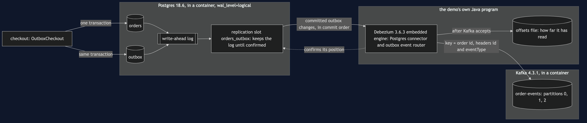
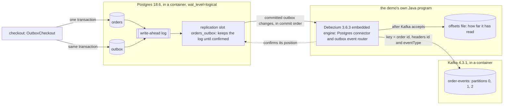

# Transactional Outbox with Debezium Pattern — Architecture Diagram

Two containers and one program. The checkout writes only to Postgres. Postgres writes every change to its log first; Debezium, inside the demo's program, is sent the outbox changes from that log through a replication slot and forwards each one to Kafka. There is no arrow from the checkout to Kafka, and that missing arrow is the pattern.

Mermaid source

