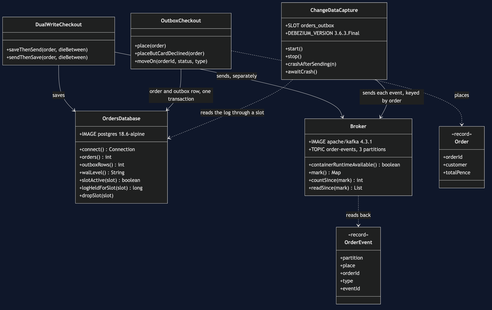
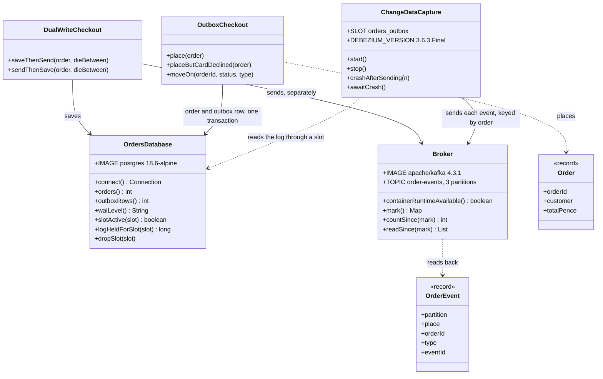

# Transactional Outbox with Debezium Pattern — Class Diagram

The pattern is one class with something missing: `OutboxCheckout` writes the order and an outbox row in one Postgres transaction and has no Kafka code at all. `ChangeDataCapture` is Debezium's embedded engine, reading the outbox changes from Postgres's log and forwarding them to Kafka. `DualWriteCheckout` is the way of getting it wrong, and `OrdersDatabase` and `Broker` own the two containers.

Mermaid source

