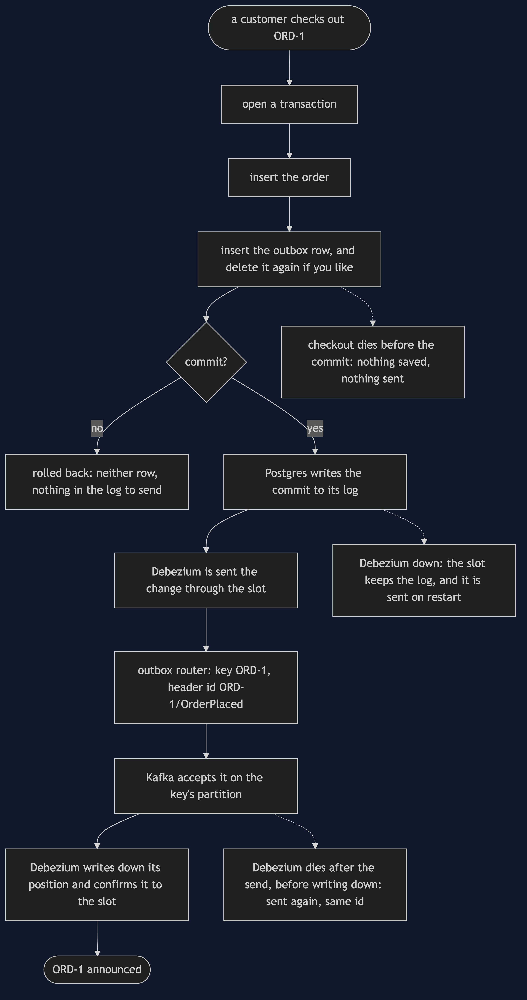
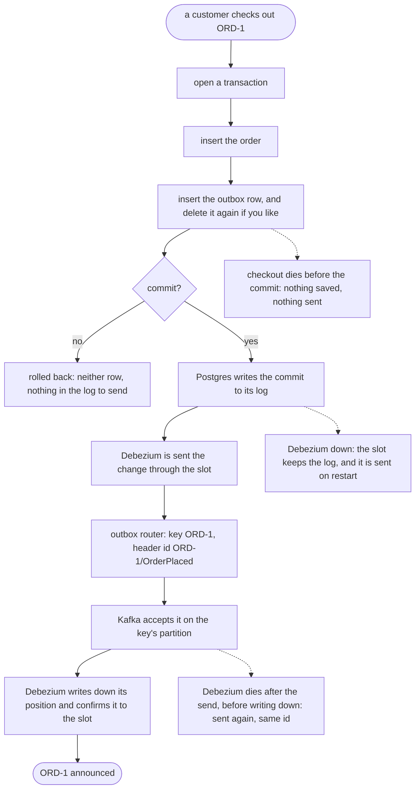

# Transactional Outbox with Debezium Pattern — Data Flow Diagram

One order from checkout to Kafka, and the three places a crash can land. Only the crash in the last gap costs anything, and what it costs is a duplicate, never a loss.

Mermaid source

