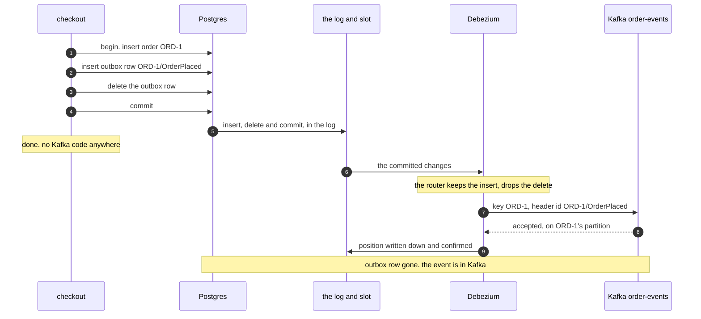

# Transactional Outbox with Debezium Pattern — Sequence Diagram

Written for a listener with the screen off.

Say it in words. A customer checks out order ORD-1. The checkout opens one Postgres transaction. It inserts the order into the orders table. It inserts a row into the outbox table saying OrderPlaced for ORD-1, and then deletes that row again, in the same transaction. It commits. The checkout is finished, and it never spoke to Kafka. Postgres had already written the order, the outbox insert and the delete into its write-ahead log, and the commit makes them count. Debezium, holding the replication slot, is sent the committed change. It ignores the delete, and its outbox router turns the insert into one event, with ORD-1 as the key and the row's id as a header. Debezium sends it to Kafka, and Kafka stores it on the partition that ORD-1's key picks. Only after Kafka has accepted it does Debezium write down how far it has read, and tell Postgres, so that the slot can let that part of the log go. The outbox table is empty, and Kafka holds the event.

Mermaid source

The load-bearing sentence: **the checkout commits to one system only, and Debezium reads what was committed from the database's own log — so an order and its event cannot part, the row does not even need to stay in the table, and the only price is that the event may be sent twice.**

For the dual write, Debezium being down, and the crash between sending and writing down, see [`uml-diagram.md`](uml-diagram.md).
