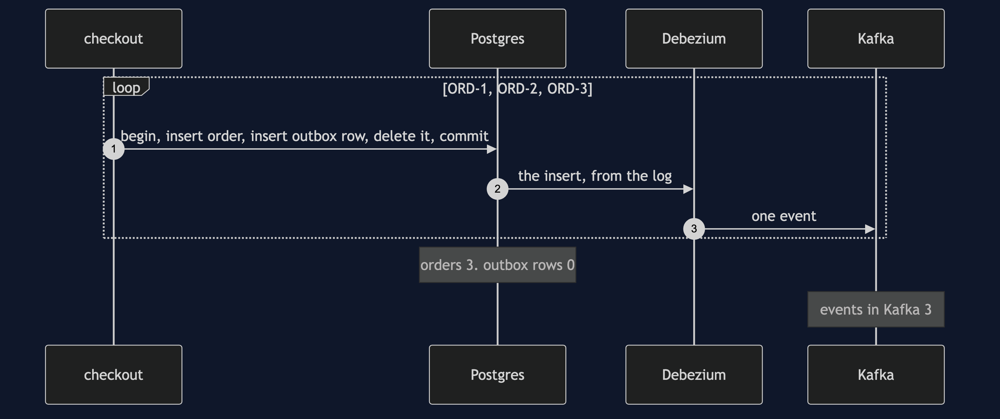
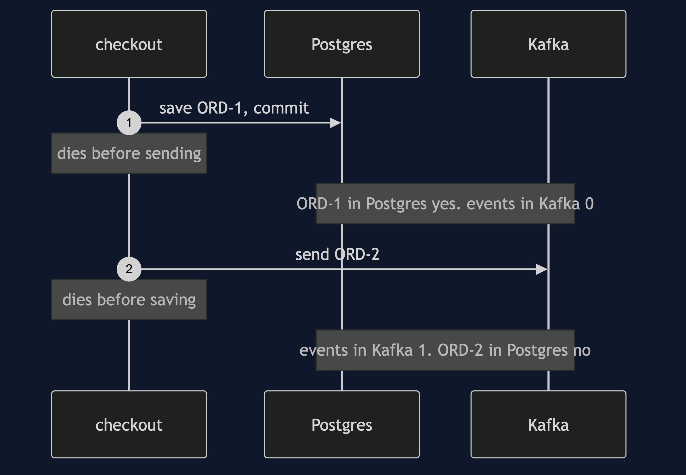
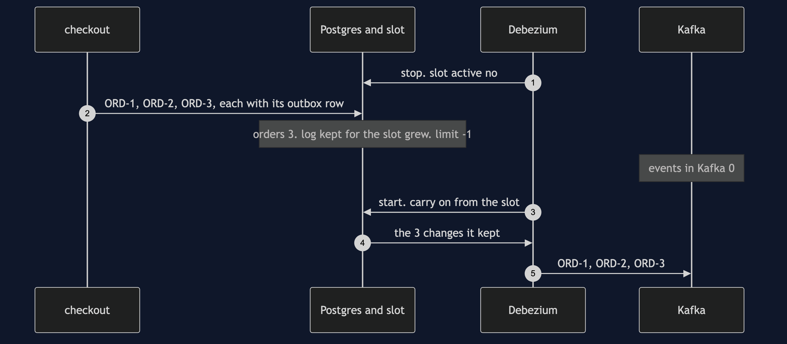
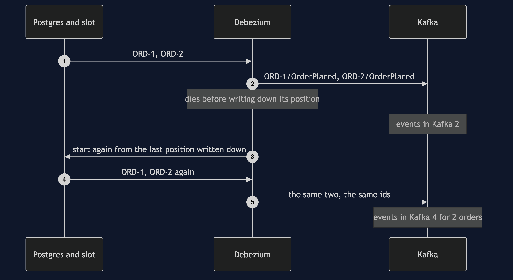

# Transactional Outbox with Debezium Pattern — UML Sequence Diagrams

Four sequences. The log, not the table, comes first, because it is the one thing the plain-Java version, whose relay read a table, could never show.

## 1. The Log, Not The Table

Each transaction writes the order, writes the outbox row, and deletes the row before committing. The table ends empty. Debezium reads the inserts from the log and sends all three.

## 2. Two Writes, One Crash

With no outbox, the checkout talks to both systems itself. Saving first and dying leaves an order nobody hears about. Sending first and dying announces an order that does not exist.

## 3. Debezium Is Down

Debezium stops and lets go of the slot. The checkout takes three orders anyway. Postgres keeps the log for the slot, with no limit. Debezium starts again and is sent all three.

## 4. Sent, But Not Written Down

Debezium sends ORD-1 and ORD-2 and dies before writing down its position. It starts again from the last position it wrote down, and is sent both again.

