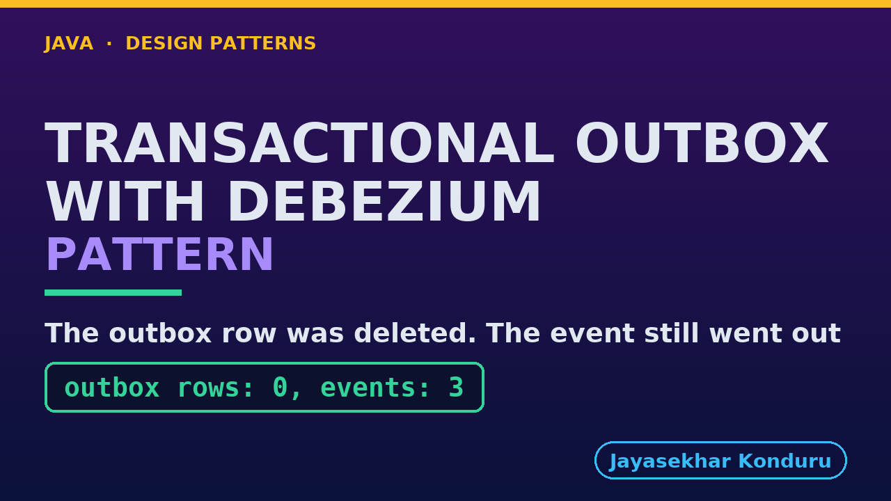

# YouTube — Transactional Outbox With Debezium Pattern

Everything needed to publish `video/transactional-outbox-with-debezium-pattern-explained.mp4`. Copy the fields straight out of this file.

Chapter timings are generated from the video's `.srt`. Re-run `python3 docs/make_youtube_docs.py transactional-outbox-with-debezium` after any change to the narration, or they will be wrong.

## Title

```
Transactional Outbox with Debezium
```

34 characters — under the 60 YouTube shows before truncating in search results.

## Description

The first two lines are what a viewer sees above the fold, so they carry the hook rather than the boilerplate.

```
Transactional Outbox pattern in Java, explained with a real PostgreSQL database, a real Kafka broker, and Debezium in between. When you must save something and also tell others about it, save the message beside the record in the same single transaction, and let something else send it later. In our online store the Orders service saves the order and an order-placed message together, and Debezium reads the database log and sends it on. We watch two writes half happen in a crash, hear an event sent for a row already deleted, a database keep its log for a reader that is switched off, and a message sent but not written down. We finish with ordering per key and the bill.

CHAPTERS
00:00 Introduction
01:01 The Scenario
01:31 Two Writes, One Crash
02:10 Postgres's Words
02:56 Debezium's Words
03:41 One Transaction, And Debezium Sends
04:29 The Log, Not The Table
05:04 Where Each Piece Lives
05:34 Debezium Is Down
06:16 The Pattern In One Transaction
06:52 Sent, But Not Written Down
07:33 Order Per Key, And The Bill
08:21 What The Simulation Left Out
08:59 The Verdict
09:28 What Is Real Here
10:16 Thanks for Watching

SOURCE CODE, WRITTEN NOTES AND AN INTERACTIVE ANIMATION
https://github.com/jk-boot-up/java-design-patterns/tree/main/gradle-java/micro-services-design-patterns/transactional-outbox-with-debezium-pattern

WHAT YOU NEED FIRST
Java 21 and a working knowledge of classes and interfaces. No prior design-pattern knowledge is assumed. The full prerequisites are in docs/prerequisites.md in the repository.
```

## Chapters

YouTube renders these as chapters only if there are at least three and the first is at `00:00`.

```
00:00 Introduction
01:01 The Scenario
01:31 Two Writes, One Crash
02:10 Postgres's Words
02:56 Debezium's Words
03:41 One Transaction, And Debezium Sends
04:29 The Log, Not The Table
05:04 Where Each Piece Lives
05:34 Debezium Is Down
06:16 The Pattern In One Transaction
06:52 Sent, But Not Written Down
07:33 Order Per Key, And The Bill
08:21 What The Simulation Left Out
08:59 The Verdict
09:28 What Is Real Here
10:16 Thanks for Watching
```

## Tags

```
transactional outbox, debezium, change data capture, kafka, design patterns, java design patterns, gang of four, java 21, software design, clean code, object oriented design, java tutorial, ecommerce, programming tutorial
```

221 characters, under YouTube's 500 limit.

## Thumbnail



**Upload `docs/thumbnail.png`** — 1280×720, the size YouTube recommends, generated by `docs/make_thumbnails.py`. It is deliberately not the same image as the video's opening frame: a thumbnail is judged at about 360 pixels wide in a search result, so this one carries only the pattern name, one line of promise and one short piece of code, each set large enough to survive the shrink.

`video/poster.png` is the 1920×1080 opening frame, produced by the video build. It stays in the repository as the title card; it is not what gets uploaded.

YouTube will not pick the thumbnail up on its own — upload it under **Details → Thumbnail → Upload file**. A custom thumbnail requires a verified channel.

## Upload checklist

- [ ] Upload `video/transactional-outbox-with-debezium-pattern-explained.mp4` (1080p, H.264, 30 fps, AAC 48 kHz — already YouTube's recommended settings, no re-encode needed)
- [ ] Set the video language to **English** first, or the subtitle option may not appear
- [ ] Add subtitles: *Video elements → Add subtitles → Upload file → With timing* → `video/transactional-outbox-with-debezium-pattern-explained.srt`
- [ ] Upload `docs/thumbnail.png` as the thumbnail — do not let YouTube auto-pick a frame
- [ ] Paste the title, description and tags from above
- [ ] Add to the **Java Design Patterns** playlist, in learning order
- [ ] Wait for 1080p processing before sharing the link — code slides are unreadable at 360p

## Cards and end screen

End screen links to whichever pattern video goes up next — set it at upload time rather than assuming an order.

Add a card partway through pointing at the playlist, so a viewer who arrives at this pattern from search can find the rest of the series.

## Runtime

Approximately 10:58, narrated at 145 words per minute.
