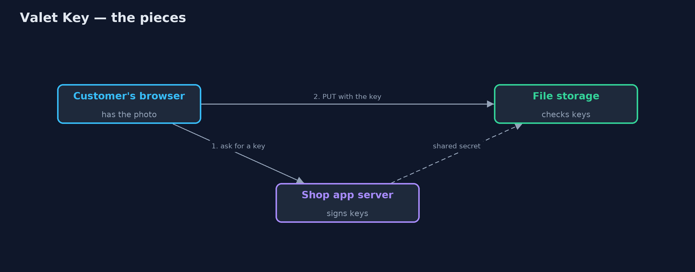

# Valet Key Pattern

```
src/main/java/com/jk/explore/valetkey/
├── Customer.java      The customer's browser, talking straight to storage with a key it was given
├── Shop.java          The shop's app server
├── Signer.java        Signs and checks what a key allows: which method, which path, until when, and how many bytes
├── Storage.java       The file storage service
└── ValetKeyDemo.java  The five acts: uploads carried by the app, a valet key, what the key does not allow, expiry, and the bill
```

**Instead of carrying every upload yourself, give the client a signed key that lets it do one specific thing directly with the storage service, for a few minutes.**

Valet Key is a cloud design pattern. When clients need to upload or download
large files, sending them through your application server wastes its
bandwidth and threads. Instead, the application gives the client a valet key:
a token, usually a signed URL, that allows exactly one kind of access to one
file in the storage service, up to a size limit, for a short time. The client
then talks to the storage service directly.

The storage service checks the signature, the path, the method, the size and
the expiry. The key cannot be used for anything else, and it stops working on
its own.

## The idea in everyday terms

Think of the valet key some cars come with. You hand it to the car park
attendant. It opens the door and starts the engine, but it will not open the
boot or the glovebox. The attendant parks the car without you carrying it
there yourself, and the key is only good for that job.

## The scenario

The online store lets customers add photos to their product reviews. Every
photo was uploaded to the shop's app server, which then sent it on to the file
storage service. Ten 2 MB photos meant 40 MB passing through the app server:
20 in from customers, 20 out to storage.

## Run

```bash
./gradlew run
```

The demo tells the story in 5 acts, each printing exact numbers that the tests check:

| Act | What it shows |
| --- | --- |
| 1. Carried by the app | 10 customers upload a 2 MB photo each through the app server: it carries 40.0 MB. |
| 2. A valet key | The shop signs a key for PUT /reviews/R-11/photo.jpg, 5 minutes, up to 5 MB; the browser uploads directly: 201 stored. |
| 3. Only what it allows | The key cannot read the photo (403), cannot write R-3 (403), cannot upload 6 MB (413); no key at all is 401. |
| 4. Expiry | A key valid for 0.2 s used after 0.4 s: 403 key expired. |
| 5. The bill | A key copied into a public chat works for a stranger (201) until it expires; keep keys short, narrow and out of logs. |

## Test

```bash
./gradlew test
```

5 tests in `DemoRunsTest`, `ValetKeyTest`. Every number the demo prints is asserted, and nothing depends on the clock, so every run gives the same result.

## Technologies and versions

| Technology | Version | Used for |
| --- | --- | --- |
| Java | 21 | the code (toolchain set in `build.gradle`) |
| Gradle | 9.2.1 (wrapper) | build and run, nothing to install |
| JUnit | 5.10.2 | the tests |
| videokit | repository tool | the narrated video and animation: Piper `en_US-amy-medium`, speed 0.8, longer pauses (the approved `amy-slow` voice) |

## Learning Material

| Document | What it is for |
| --- | --- |
| [Problem statement](docs/problem-statement.md) | the situation and what the project must show |
| [Prerequisites](docs/prerequisites.md) | what you need to know first |
| [Valet Key, explained](docs/valet-key-pattern-explained.md) | the acts in prose |
| [Session guide](docs/session.md) | a one-hour lesson with exercises |
| [Animated walkthrough](docs/animation.html) | the acts step by step, narrated |
| [Spec](docs/spec.md) | what this project must be true of |

### The pattern in one picture

The app hands out keys; the bytes go straight to storage.



### Where each piece sits

Both sides share one signer.


### How the data moves

Change any part and the signature no longer matches.


### Who calls whom, in order

The app only issues the key.


### Video

`video/valet-key-pattern-explained.mp4` (with `.m4a` audio and `.srt` subtitles) is built by `video/build_video.sh`. Rendered media is not committed.

## What it costs

- **Whoever holds the key can use it.** A key pasted into a public chat worked for a stranger until it expired.
- **No easy take-backs.** A signed key cannot normally be revoked before it expires; keep them short-lived.
- **The storage must check keys.** Signatures, paths, sizes and expiry all have to be validated there.
- **Keys leak into logs.** URLs with signatures must be kept out of logs and analytics.

## When this is too much

For small files, or when the application must inspect every byte (virus
scanning, resizing) before storing it, uploading through the app is simpler.
Valet keys pay off for large or numerous files that the app does not need to
touch.

## Where you have already met this

- Amazon S3 presigned URLs.
- Azure Storage shared access signatures (SAS).
- Google Cloud Storage signed URLs.
- Expiring download links in emails.

## Where this sits

This project is in [micro-services-design-patterns](..), next to
[Gateway Offloading](../gateway-offloading-pattern), another way to take work
off application servers.
