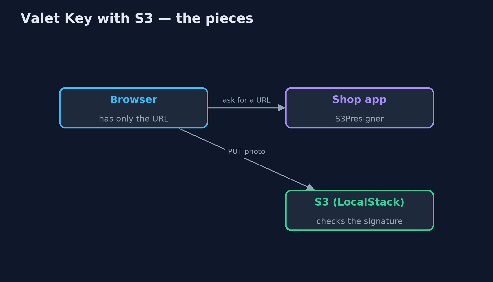
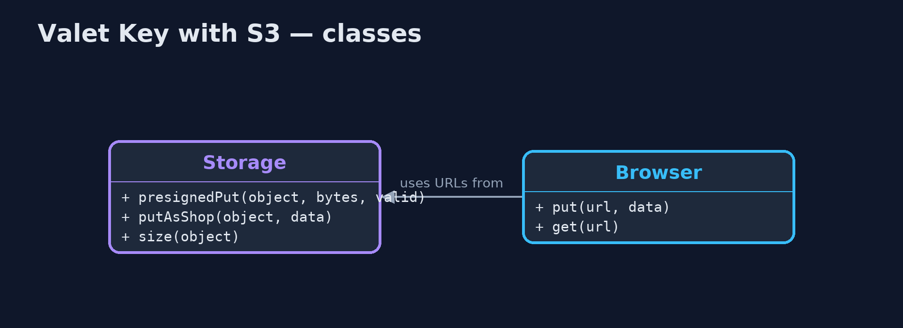
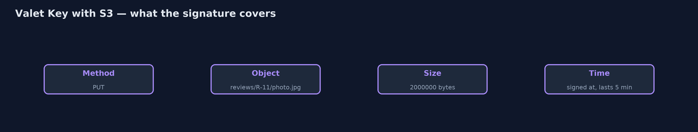
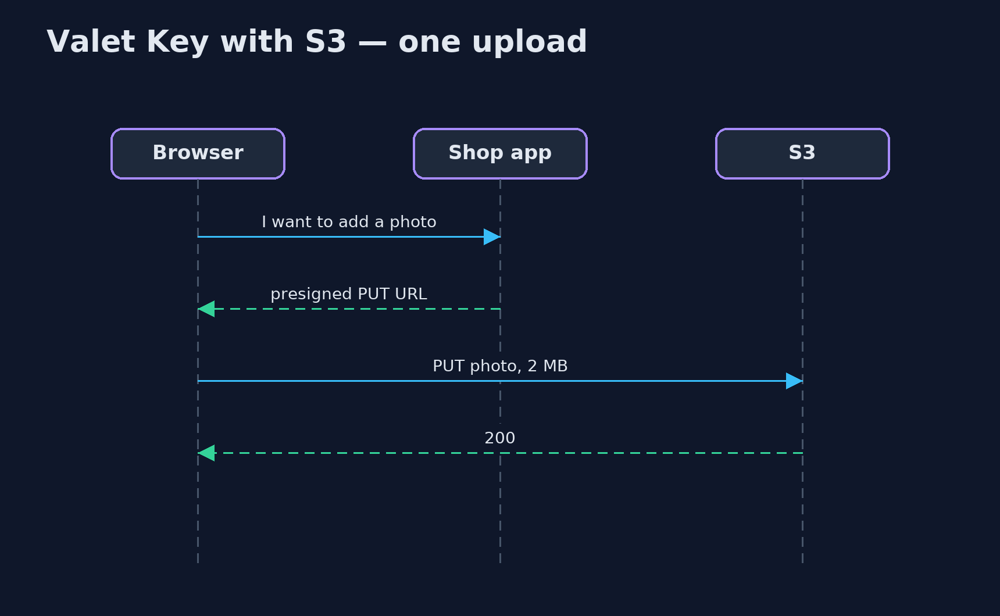

# Valet Key with Amazon S3 Pattern

```
src/main/java/com/jk/explore/valets3/
├── Browser.java         The customer's browser: it talks to the storage directly over HTTP, holding nothing but the key
├── S3ValetKeyDemo.java  The five acts, against the S3 API, played by LocalStack, started and stopped by this program
└── Storage.java         Object storage with the Amazon S3 API, played by LocalStack in a container that this demo starts and stops itself
```

**Let customers upload review photos straight to object storage with S3 presigned URLs, signed by the shop with the AWS SDK: one object, an exact size, a few minutes, and nothing else.**

This is the real-infrastructure version of the Valet Key pattern. The plain
Java version, a separate project in this category, signs keys with its own
HMAC and runs its own storage server. Here the storage speaks the Amazon S3
API, played by LocalStack in a container started by the demo, and the keys are
real S3 presigned URLs, signed by the AWS SDK's presigner exactly as they
would be for Amazon S3.

A presigned URL carries the method, the object, the time it was signed, how
long it lasts, and a signature made with the shop's secret key. The customer's
browser uses it to upload straight to storage; the shop's servers carry only
the URL. The storage checks the signature, so the URL cannot be bent to do
anything else.

## The idea in everyday terms

Think of a hotel valet key: it starts the car and opens the driver's door, but
not the boot or the glove box, and the valet has it only for the evening.
Here the key is a web address that lets a customer put one photo in one place,
for five minutes.

## The scenario

The online store lets customers add photos to their reviews. Every photo was
sent to the shop's app server, which passed it on to storage, so ten 2 MB
photos meant forty megabytes through a server that only wanted to say where
the photo should go.

## Run

This project needs a running container runtime, such as Docker Desktop: the
demo starts LocalStack 4.14.0, which plays Amazon S3, in a container and
removes it again. Without one, it prints a sentence saying what to start,
rather than failing.

```bash
./gradlew run
```

The demo tells the story in 5 acts, each printing exact numbers that the tests check:

| Act | What it shows |
| --- | --- |
| 1. Through the app server | 10 customers upload a 2 MB photo each through the app server, which carries 40 MB in and out. |
| 2. A presigned URL | The shop signs a PUT URL for reviews/R-11/photo.jpg, exactly 2,000,000 bytes, 5 minutes; the browser uploads straight to S3: 200. |
| 3. That, and nothing else | The same URL used to read, or edited to R-3, or with a 6 MB body: all 403; an unsigned upload gets through only because LocalStack does not enforce permissions. |
| 4. The key runs out | A URL valid for 1 second, used after 2 seconds: 403. |
| 5. The bill | A URL pasted into a public chat is used by a stranger: 200, and the file is stored. |

## Test

```bash
./gradlew test
```

2 tests in `DemoRunsTest`. Every result the demo prints is asserted against LocalStack's S3, with signature checking turned on. Without a container runtime, the test is skipped rather than failed.

## What the simulation got right, and what it left out

The plain Java version got the idea right: sign a narrow, short-lived
permission, let the client talk to storage directly, refuse anything the key
does not allow, and accept that a leaked key works until it expires. What it
left out is that this is a standard: S3 presigned URLs, signed by the AWS SDK
with AWS Signature Version 4, and checked by the storage service, not by the
shop. It also shows the limits of a local emulator: LocalStack checks
signatures and expiry, but does not enforce bucket permissions, so an unsigned
upload got through here that real S3 would refuse with 403.

## Technologies and versions

| Technology | Version | Used for |
| --- | --- | --- |
| Java | 21 | the code (toolchain set in `build.gradle`) |
| Gradle | 9.2.1 (wrapper) | build and run, nothing to install |
| JUnit | 5.10.2 | the tests |
| AWS SDK for Java | 2.55.7 | the S3 client and the S3 presigner |
| LocalStack | 4.14.0 (container image) | plays Amazon S3 locally, with signature checking on |
| Testcontainers | 2.0.5 | starts and stops LocalStack from the demo |
| Docker | 24 or later | runs the container |
| videokit | repository tool | the narrated video and animation: Piper `en_US-amy-medium`, speed 0.8, longer pauses (the approved `amy-slow` voice) |

## Learning Material

| Document | What it is for |
| --- | --- |
| [Dependencies](docs/dependencies.md) | what the framework and infrastructure are, and why they are here |
| [Problem statement](docs/problem-statement.md) | the situation and what the project must show |
| [Prerequisites](docs/prerequisites.md) | what you need to know first |
| [Valet Key with Amazon S3, explained](docs/valet-key-with-s3-pattern-explained.md) | the acts in prose |
| [Session guide](docs/session.md) | a one-hour lesson with exercises |
| [Animated walkthrough](docs/animation.html) | the acts step by step, narrated |
| [Spec](docs/spec.md) | what this project must be true of |

### The pattern in one picture

The app signs; the photo goes straight to storage.



### Where each piece sits

Signing is local; checking is S3's.



### How the data moves

Change any of these and S3 refuses.



### Who calls whom, in order

The app never sees the photo.



### Video

`video/valet-key-with-s3-pattern-explained.mp4` (with `.m4a` audio and `.srt` subtitles) is built by `video/build_video.sh`. Rendered media is not committed.

## What it costs

- **A leaked key works until it expires.** A stranger with the pasted URL stored a file.
- **Narrow on purpose.** The URL here pins method, object and exact size; a size range needs S3's presigned POST policies.
- **An emulator is not the service.** LocalStack let an unsigned upload through that real S3 would refuse; test permissions against the real thing.

## When this is too much

For small files, or when the server must inspect every upload before it is
stored, passing it through the app is simpler. Valet keys pay off for large
files and many uploads that the app never needs to see.

## Where you have already met this

- Amazon S3 presigned URLs and presigned POST policies.
- Google Cloud Storage signed URLs and Azure Blob Storage SAS tokens.
- Download links in emails that stop working after a day.

## Where this sits

This project is in [micro-services-design-patterns](..). It is the
real-infrastructure version of the plain Java Valet Key project in the same
category, which is left unchanged.
