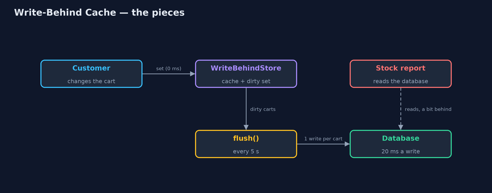
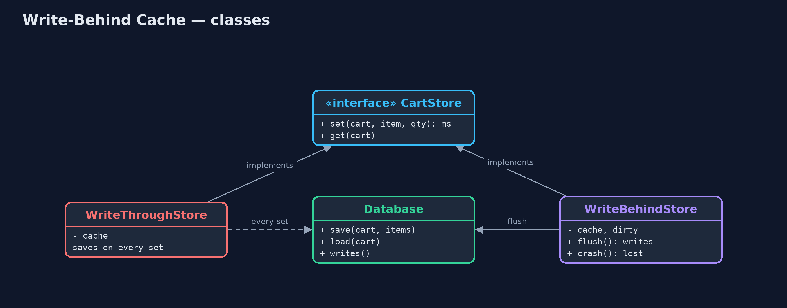
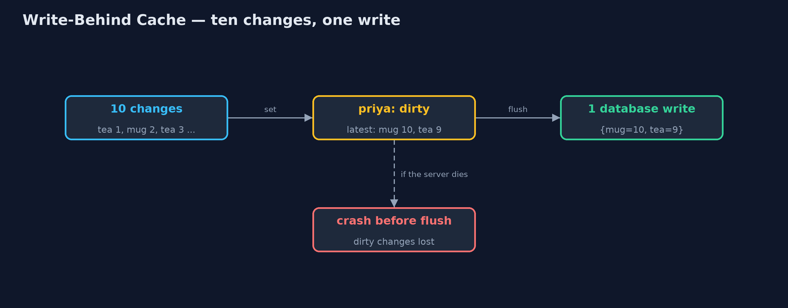
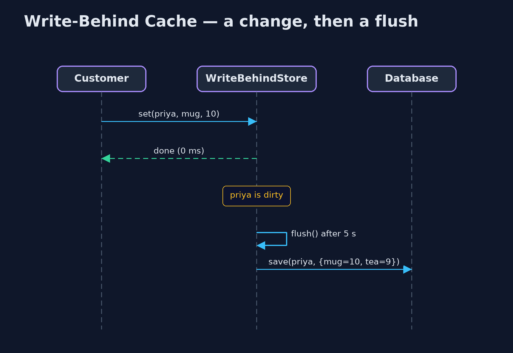

# Write-Behind Cache Pattern

```
src/main/java/com/jk/explore/writebehind/
├── CartStore.java          Where checkout keeps shopping carts: change a quantity, and read a cart back
├── Database.java           The slow, safe store: every write takes 20 ms and survives a crash
├── WriteBehindDemo.java    The five acts: writing every change, writing behind, the database down, a crash, and the bill
├── WriteBehindStore.java   The pattern: changes go to memory at once and are written to the database later, in one batch
└── WriteThroughStore.java  Without the pattern: every change is written to the database before the customer gets an answer
```

**Keep changes in memory and answer at once, then save them to the database in batches, and only for data you can afford to lose if the server dies in between.**

Write-Behind, also called write-back, is a caching pattern. A cache is a copy
of data kept in fast memory. With write-behind, a change is made in the cache
and the caller gets an answer straight away. The change is saved to the
database later, by a background step that runs every few seconds and writes
each changed record once, however many times it changed.

It makes frequent writes fast and cheap. The price is a window of time in which
the change exists only in memory: if the server dies in that window, the change
is lost.

## The idea in everyday terms

Think of writing a long document on a computer. Every letter you type appears
at once; the computer does not save the file to disk after every key press. It
saves every few minutes, and saving a page you changed a hundred times is still
one save.

And everyone has lost a paragraph to a power cut just before the save. That is
the deal: fast typing, in return for a few minutes you could lose.

## The scenario

Customers in the online store change their shopping carts constantly: add a
mug, make it two, remove the tea, add it back. Every change was written to the
database before the page answered, taking 20 milliseconds each time, and the
database spent most of its day saving carts that would change again a second
later.

## Run

```bash
./gradlew run
```

The demo tells the story in 5 acts, each printing exact numbers that the tests check:

| Act | What it shows |
| --- | --- |
| 1. Write every change | 3 customers change their carts 10 times each: 30 database writes, 20 ms on every click, 600 ms in total. |
| 2. Write behind | The same 30 changes: customers wait 0 ms; one flush makes 3 writes, one per cart, with the latest contents. |
| 3. The database goes down | Customers keep shopping; the flush fails and 2 carts stay waiting; when the database returns, the next flush writes them. |
| 4. A crash before the flush | 3 changes are made, then the server crashes before the flush: all 3 are lost. |
| 5. The bill | Checkout sees 3 kettles; a stock report reading the database sees 1. Never write behind orders, payments or stock. |

## Test

```bash
./gradlew test
```

11 tests in `DemoRunsTest`, `WriteBehindStoreTest`. Every number the demo prints is asserted, and nothing depends on the clock, so every run gives the same result.

## Technologies and versions

| Technology | Version | Used for |
| --- | --- | --- |
| Java | 21 | the code (toolchain set in `build.gradle`) |
| Gradle | 9.2.1 (wrapper) | build and run, nothing to install |
| JUnit | 5.10.2 | the tests |
| videokit | repository tool | the narrated video and animation: Piper `en_US-amy-medium`, speed 0.8, longer pauses (the approved `amy-slow` voice) |

## Learning Material

| Document | What it is for |
| --- | --- |
| [Problem statement](docs/problem-statement.md) | the situation and what the project must show |
| [Prerequisites](docs/prerequisites.md) | what you need to know first |
| [Write-Behind Cache, explained](docs/write-behind-cache-pattern-explained.md) | the acts in prose |
| [Session guide](docs/session.md) | a one-hour lesson with exercises |
| [Animated walkthrough](docs/animation.html) | the acts step by step, narrated |
| [Spec](docs/spec.md) | what this project must be true of |

### The pattern in one picture

Customers only talk to memory; the flush is the only thing that talks to the database.



### Where each piece sits

Two stores behind one interface; only one of them waits for the database.



### How the data moves

Many changes to one cart become one write of its final state.



### Who calls whom, in order

The customer's answer does not wait for the database.



### Video

`video/write-behind-cache-pattern-explained.mp4` (with `.m4a` audio and `.srt` subtitles) is built by `video/build_video.sh`. Rendered media is not committed.

## What it costs

- **Changes can be lost.** Anything changed since the last flush is gone if the server crashes: three changes in the demo.
- **The database is behind.** Anything that reads the database directly, such as a report, sees old data.
- **More machinery.** A timer, a list of changed records, retries when the database is down, and a flush on a clean shutdown.
- **Not for money.** Orders, payments and stock must never sit only in memory.

## When this is too much

When writes are rare, or every write must be safe the moment the customer is
told it worked, write straight to the database. Write-behind is for data that
changes often and can be rebuilt or shrugged off if lost: carts, view counts,
"last seen" times, draft text.

## Where you have already met this

- Operating systems keep file writes in memory and flush them to disk a little later.
- Redis, Hazelcast and Ehcache offer write-behind to a backing database.
- Autosave in editors and web forms.
- Counters such as page views, collected in memory and saved in batches.

## Where this sits

This project is in [micro-services-design-patterns](..), next to
[Cache-Aside](../cache-aside-pattern), which is about reading through a cache.
Write-behind is about writing through one, later.
