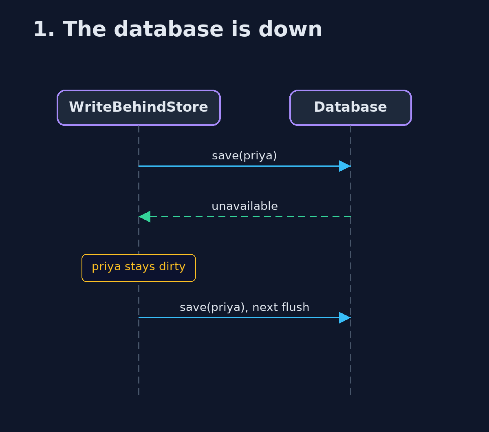
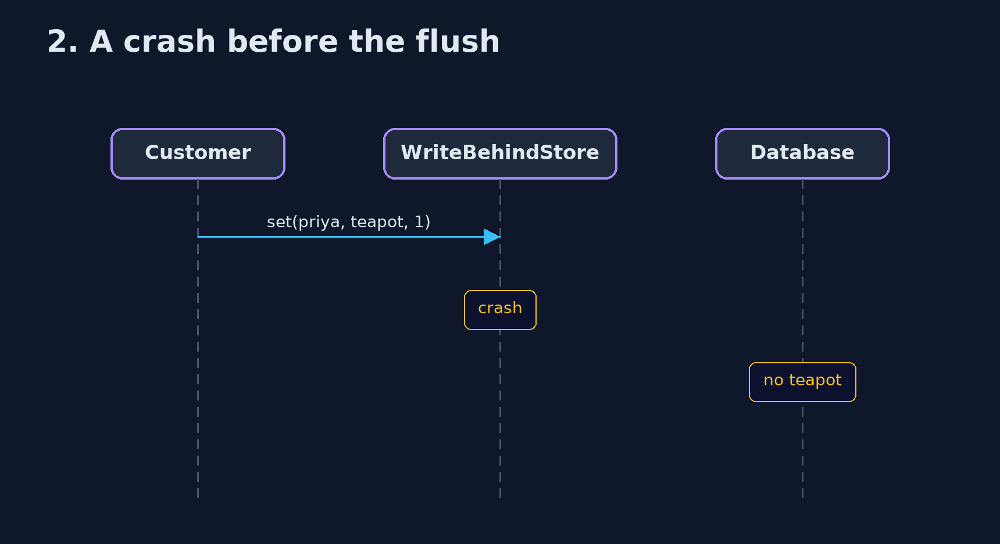

# Write-Behind Cache Pattern — UML Sequence Diagrams

## 1. 1. The database is down

The flush fails; the cart stays dirty and is written next time.

## 2. 2. A crash before the flush

Whatever is only in memory is gone.

