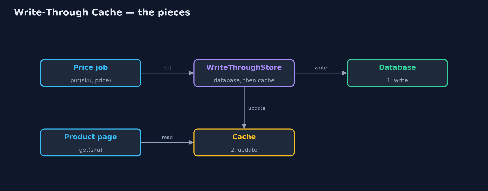
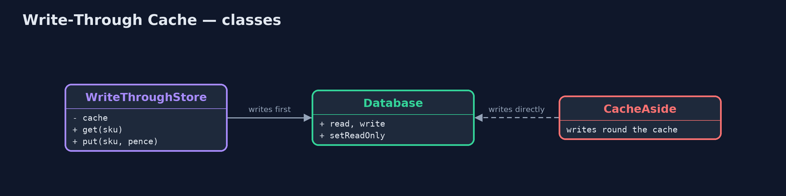
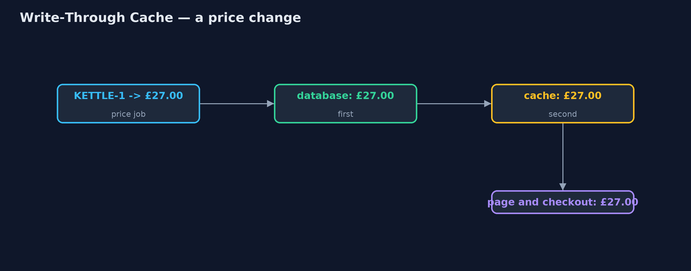

# Write-Through Cache Pattern

```
src/main/java/com/jk/explore/writethrough/
├── CacheAside.java         Without the pattern: the product page reads through a cache, but price changes are written straight to the database
├── Database.java           The prices table: the source of truth
├── WriteThroughDemo.java   The five acts: a write that goes round the cache, write-through, fast reads, a refused write, and the bill
└── WriteThroughStore.java  The pattern: every write goes through the cache, which writes the database first and then updates itself, before returning
```

**Send every write through the cache, which writes the database first and then itself before returning, so reads from the cache always match the database.**

Write-Through is a caching pattern. Reads are served from a fast cache, and
every write goes through that same cache: it writes the database, and as soon
as the database accepts, it updates its own copy, before telling the caller
the write is done. Nothing writes to the database around the cache.

Because the cache and the database always change together, a read from the
cache is never out of date. The price is that every write waits for the
database, and the cache fills with everything that was ever written.

## The idea in everyday terms

Think of a supermarket where the price on the till and the label on the shelf
must match. Under write-through, the person who changes a price in the till
system also changes the shelf label, straight away, before moving on to the
next product. Nobody changes the till price and leaves the label for later,
so a customer never sees one price and pays another.

## The scenario

The online store's product page reads prices from a cache, and checkout
reads them from the database. A nightly job updates prices by writing
straight to the database. One night it cut the kettle to £27.00 and forgot to
clear the cache: the page kept showing £30.00 while checkout charged £27.00.

## Run

```bash
./gradlew run
```

The demo tells the story in 5 acts, each printing exact numbers that the tests check:

| Act | What it shows |
| --- | --- |
| 1. A write round the cache | The price job writes £27.00 straight to the database; the page (cache) shows £30.00 while checkout charges £27.00. |
| 2. Write-through | The job calls store.put: the database, then the cache, before returning; page and checkout both show £27.00. |
| 3. Fast reads | 100 page views: 0 database reads; all served from the cache. |
| 4. A refused write | The database is read-only; the £25.00 write fails and the cache is untouched: both still say £27.00. |
| 5. The bill | 1000 nightly price updates spend 20 s waiting for the database, and all 1000 sit in the cache. |

## Test

```bash
./gradlew test
```

7 tests in `DemoRunsTest`, `WriteThroughStoreTest`. Every number the demo prints is asserted, and nothing depends on the clock, so every run gives the same result.

## Technologies and versions

| Technology | Version | Used for |
| --- | --- | --- |
| Java | 21 | the code (toolchain set in `build.gradle`) |
| Gradle | 9.2.1 (wrapper) | build and run, nothing to install |
| JUnit | 5.10.2 | the tests |
| videokit | repository tool | the narrated video and animation: Piper `en_US-amy-medium`, speed 0.8, longer pauses (the approved `amy-slow` voice) |

## Learning Material

| Document | What it is for |
| --- | --- |
| [Problem statement](docs/problem-statement.md) | the situation and what the project must show |
| [Prerequisites](docs/prerequisites.md) | what you need to know first |
| [Write-Through Cache, explained](docs/write-through-cache-pattern-explained.md) | the acts in prose |
| [Session guide](docs/session.md) | a one-hour lesson with exercises |
| [Animated walkthrough](docs/animation.html) | the acts step by step, narrated |
| [Spec](docs/spec.md) | what this project must be true of |

### The pattern in one picture

Writes go through the store; reads come from its cache.



### Where each piece sits

One store in front of the database.



### How the data moves

Both copies change before the job carries on.



### Who calls whom, in order

The caller waits for both.


### Video

`video/write-through-cache-pattern-explained.mp4` (with `.m4a` audio and `.srt` subtitles) is built by `video/build_video.sh`. Rendered media is not committed.

## What it costs

- **Every write waits.** 1000 nightly price updates spend 20 seconds waiting for the database.
- **The cache fills.** Everything written goes into the cache, even products nobody will look at.
- **All writes must go through it.** A single job that writes around the cache brings back stale reads.

## When this is too much

When writes are frequent and speed matters more than immediate safety,
write-behind is faster. When most written data is rarely read, cache-aside
(load on first read) keeps the cache smaller. Write-through suits data that is
read often and must never be seen out of date, such as prices.

## Where you have already met this

- Hazelcast and Ehcache `write-through` configuration with a `CacheWriter`.
- Spring's `@CachePut`, which updates the cache when a method writes.
- CPU caches, which can be configured write-through to main memory.

## Where this sits

This project is in [micro-services-design-patterns](..), next to
[Write-Behind Cache](../write-behind-cache-pattern), which writes the database
later, and [Cache-Aside](../cache-aside-pattern), which loads the cache on
reads.
