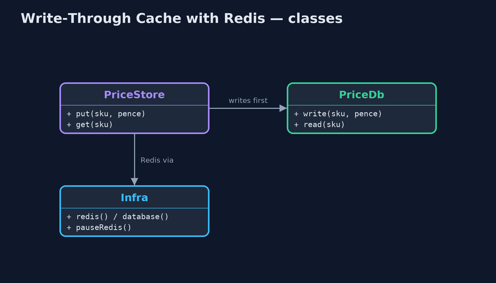
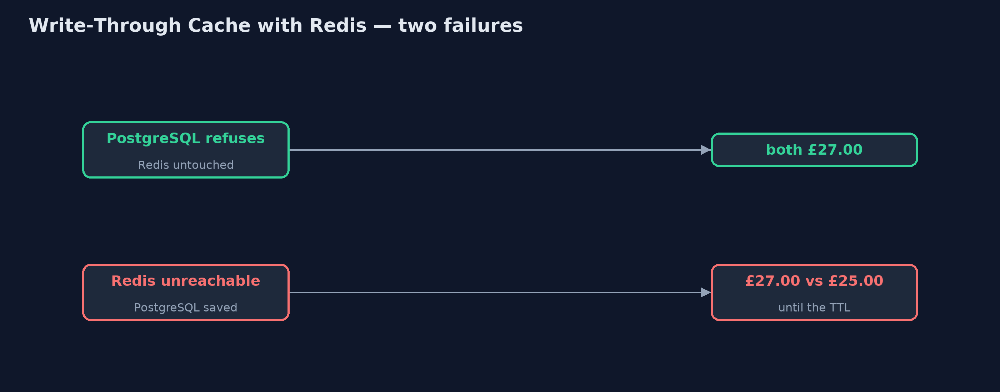
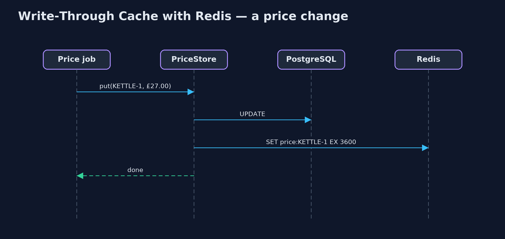

# Write-Through Cache with Redis Pattern

```
src/main/java/com/jk/explore/writethroughredis/
├── Infra.java                  A real Redis and a real PostgreSQL, each in a container that this demo starts and stops itself
├── PriceDb.java                The prices table in PostgreSQL: the record of truth
├── PriceStore.java             The pattern: every price write goes to the database, then to Redis, before it returns
└── RedisWriteThroughDemo.java  The five acts, against a real Redis and a real PostgreSQL started and stopped by this program
```

**Write every price to PostgreSQL and then to a real, shared Redis cache before the write returns, read pages from Redis, and see the one thing the plain version could not: two systems that no transaction spans.**

This is the real-infrastructure version of the Write-Through Cache pattern.
The plain Java version, a separate project in this category, keeps the
database and the cache as maps in one program. Here the database is a real
PostgreSQL and the cache a real Redis, each started in a container by the
demo itself.

Every price write goes through one store: PostgreSQL first, then Redis, before
the write returns, so product pages, which read Redis, never show a price the
database does not have. Because Redis is a separate server, every instance of
the shop sees the same cache. But because they are two separate systems, no
transaction covers both, and the last acts show what that costs.

## The idea in everyday terms

Think of a shop with a price list in the back office and price tags on the
shelves. The rule is that whoever changes a price updates the back-office list
first and then walks out and changes the tag, before doing anything else. The
tags are what customers read. But if the shop floor is locked when someone
tries to change a tag, the list and the tag disagree until someone notices.

## The scenario

The online store shows prices on product pages from a cache and charges at
checkout from the database. A nightly job wrote new prices straight into the
database and forgot the cache, so customers saw one price and paid another.

## Run

This project needs a running container runtime, such as Docker Desktop: the
demo starts real Redis 8.10.2 and PostgreSQL 18.6 containers and removes them
again. Without one, it prints a sentence saying what to start, rather than
failing.

```bash
./gradlew run
```

The demo tells the story in 5 acts, each printing exact numbers that the tests check:

| Act | What it shows |
| --- | --- |
| 1. Round the cache | The nightly job writes £27.00 straight into PostgreSQL: the page, from Redis, says £30.00 and checkout, from PostgreSQL, charges £27.00. |
| 2. Write through | PriceStore writes PostgreSQL, then Redis, before returning: page, checkout and a second app instance all show £27.00. |
| 3. Reads from Redis | 100 page views: 0 database reads, and Redis's own counter shows 100 cache hits. |
| 4. When one of the two refuses | A refused PostgreSQL write leaves both at £27.00; but with Redis unreachable, PostgreSQL saves £25.00 while Redis keeps £27.00. |
| 5. The bill | 1,000 price updates mean 1,000 PostgreSQL writes and 1,000 Redis writes, and 1,000 more prices sit in Redis though most are never viewed. |

## Test

```bash
./gradlew test
```

2 tests in `DemoRunsTest`. Every number the demo prints is asserted against real Redis and PostgreSQL. Without a container runtime, the test is skipped rather than failed.

## What the simulation got right, and what it left out

The plain Java version got the idea right: every write goes through the
cache, the database first, so a refused database write leaves both unchanged,
and reads come from the cache. What it left out is what changes when the
cache is a real server. Two app instances now share one cache, and Redis
counts its own hits. And the two stores are separate systems: when Redis was
unreachable during a write, PostgreSQL kept the new price and Redis the old
one, because no transaction spans both. A time-to-live on each cached price
bounds how long they can disagree.

## Technologies and versions

| Technology | Version | Used for |
| --- | --- | --- |
| Java | 21 | the code (toolchain set in `build.gradle`) |
| Gradle | 9.2.1 (wrapper) | build and run, nothing to install |
| JUnit | 5.10.2 | the tests |
| Redis | 8.10.2 (container image) | the shared cache |
| PostgreSQL | 18.6 (container image) | the record of truth |
| Jedis | 8.0.1 | the Redis client |
| PostgreSQL JDBC driver | 42.7.13 | talking to PostgreSQL |
| Testcontainers | 2.0.5 | starts, pauses and stops the containers |
| Docker | 24 or later | runs the containers |
| videokit | repository tool | the narrated video and animation: Piper `en_US-amy-medium`, speed 0.8, longer pauses (the approved `amy-slow` voice) |

## Learning Material

| Document | What it is for |
| --- | --- |
| [Dependencies](docs/dependencies.md) | what the framework and infrastructure are, and why they are here |
| [Problem statement](docs/problem-statement.md) | the situation and what the project must show |
| [Prerequisites](docs/prerequisites.md) | what you need to know first |
| [Write-Through Cache with Redis, explained](docs/write-through-cache-with-redis-pattern-explained.md) | the acts in prose |
| [Session guide](docs/session.md) | a one-hour lesson with exercises |
| [Animated walkthrough](docs/animation.html) | the acts step by step, narrated |
| [Spec](docs/spec.md) | what this project must be true of |

### The pattern in one picture

Writes go through; reads come from Redis.


### Where each piece sits

One store in front of two servers.



### How the data moves

Only one of them is safe.



### Who calls whom, in order

Both written before the call returns.



### Video

`video/write-through-cache-with-redis-pattern-explained.mp4` (with `.m4a` audio and `.srt` subtitles) is built by `video/build_video.sh`. Rendered media is not committed.

## What it costs

- **No shared transaction.** With Redis unreachable mid-write, the database said £25.00 and the cache £27.00.
- **Every write waits twice.** A thousand price updates meant a thousand PostgreSQL writes and a thousand Redis writes.
- **The cache fills.** All thousand prices sat in Redis, though most will never be viewed; set a time-to-live.

## When this is too much

If prices are read rarely, reading the database directly is simpler. A
write-through cache pays off for data read far more often than written, where
showing a stale value is costly.

## Where you have already met this

- Application-level write-through with Redis or Memcached in front of a database.
- Hazelcast and Apache Ignite, whose map stores can write through for you.
- CPU caches with a write-through policy.

## Where this sits

This project is in [micro-services-design-patterns](..). It is the
real-infrastructure version of the plain Java Write-Through Cache project in
the same category, which is left unchanged.
