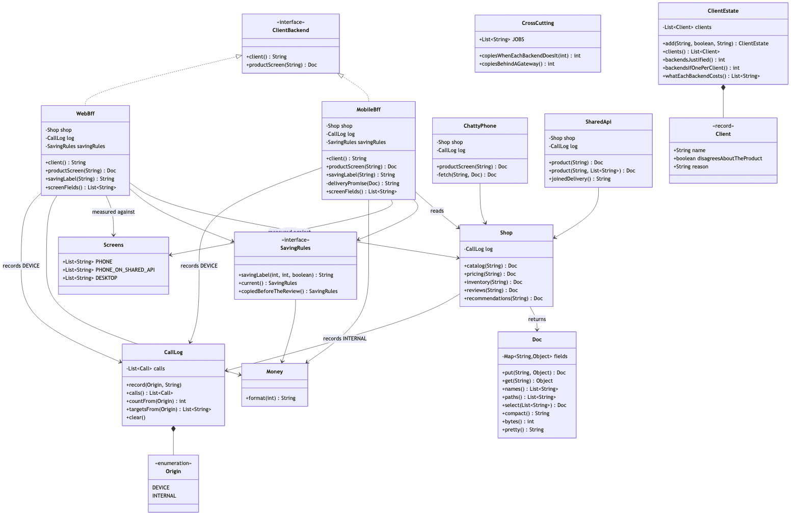
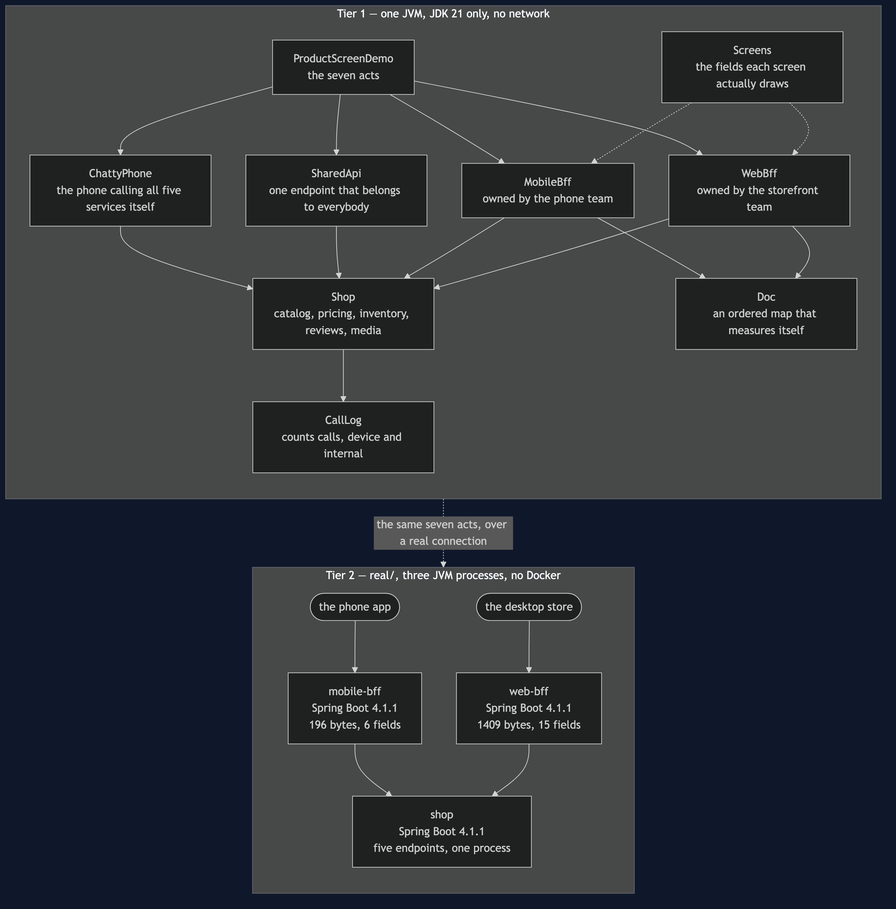
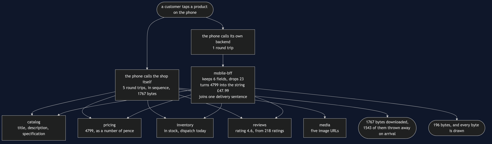
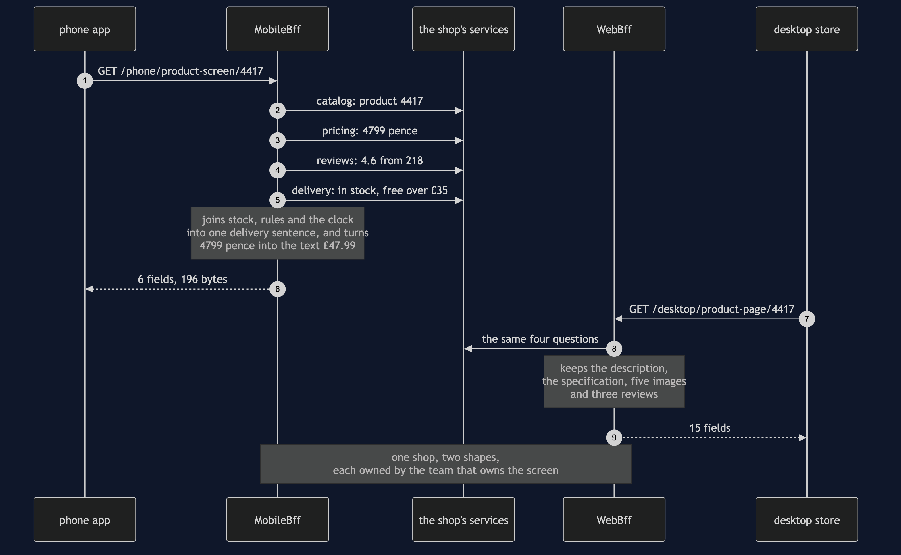
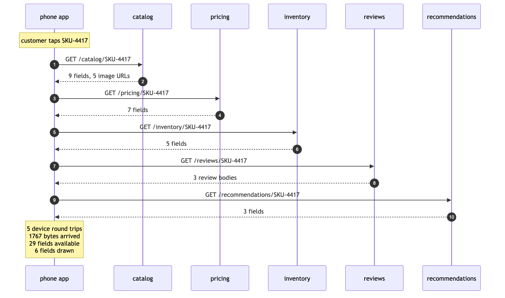
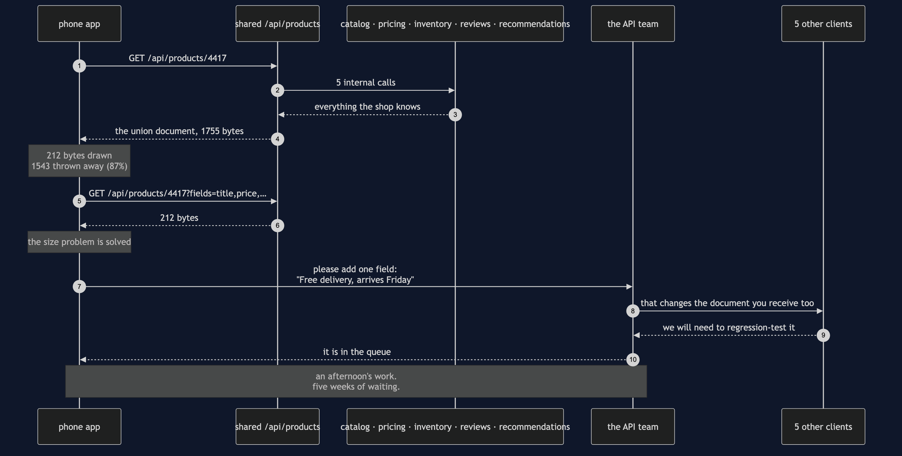
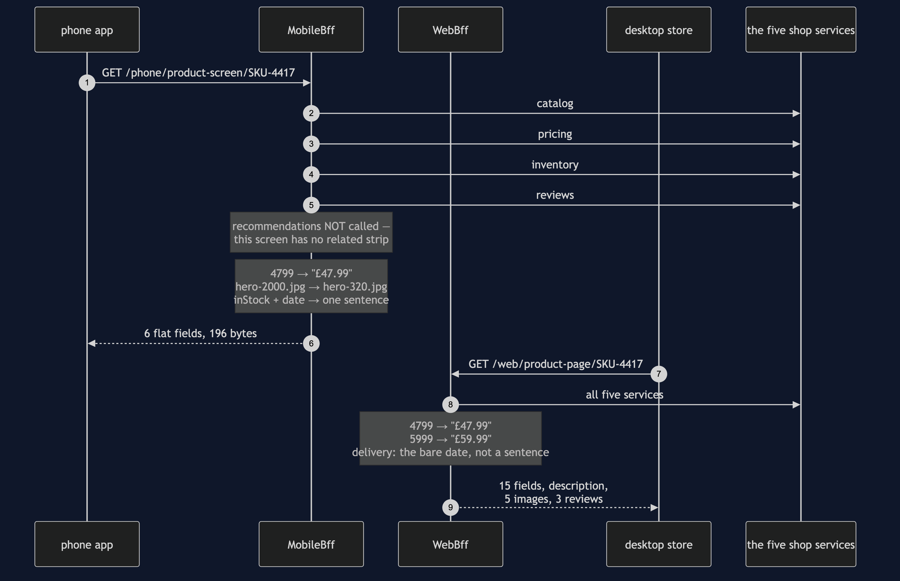
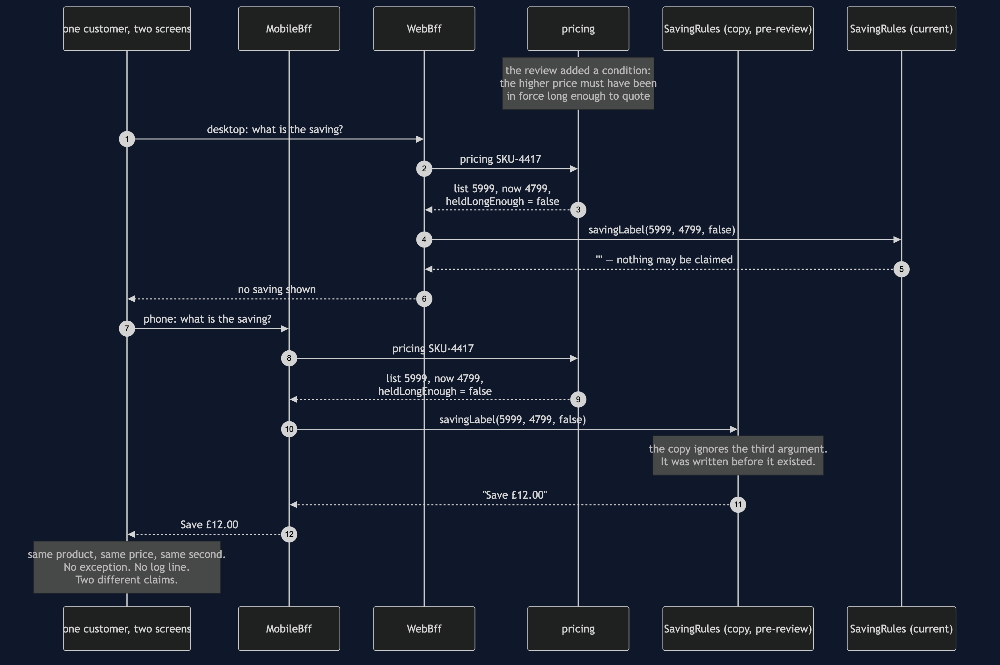
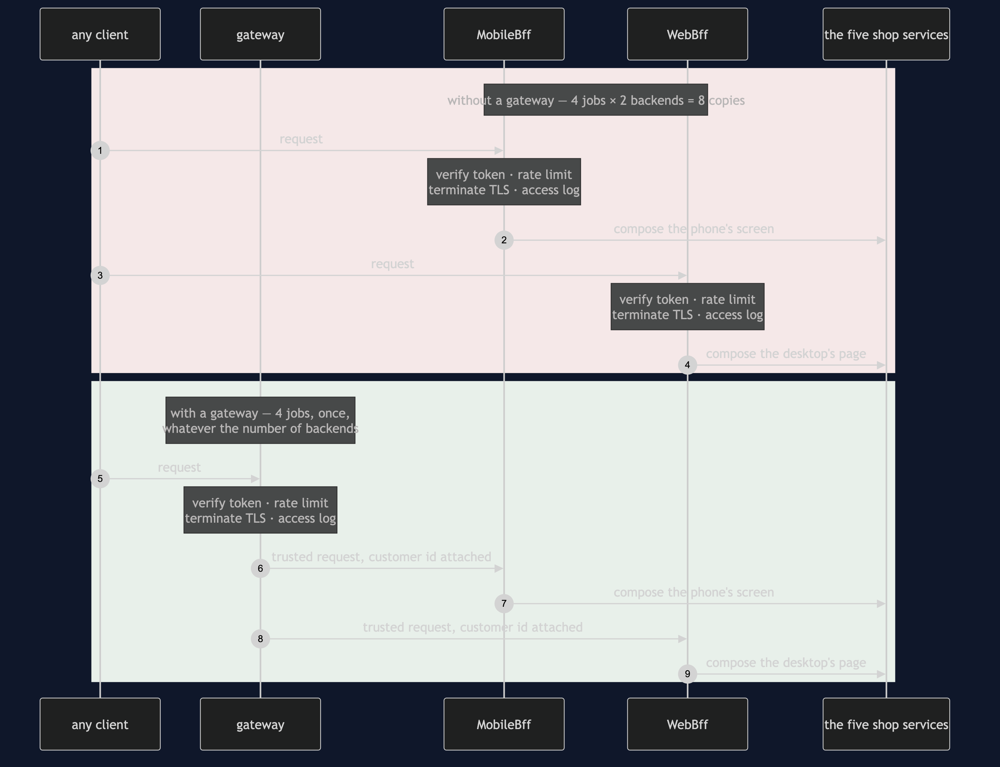

# Backends for Frontends Pattern

**Give each frontend its own backend, owned by the team that owns the screen, whose only
job is to turn what the shop knows into the exact shape that one screen draws — and then
accept that you now have two places for a business rule to live, and that they will
disagree without telling you.**

Think of a restaurant with one kitchen and two rooms: a dining room where couples settle
in for two hours, and a counter by the window for people who have twenty minutes before a
train. Give both rooms the same waiter working from one script and his script becomes the
union of what either room might want — the full wine list, the provenance of the lamb,
the dessert menu — recited to everybody. The couple enjoy it. The commuter misses their
train. The fix is not a second kitchen, because the food is the same food and a second
kitchen is two places for a recipe to live. The fix is a second waiter who works the
counter and is allowed to change his own script tomorrow morning.

The shop sells one copper coffee maker. The phone's product screen draws six things; the
desktop page draws fifteen. Five services between them hold all of it. Both screens are
correct, both teams are being reasonable, and they disagree about what a product *is*.

## Run

```bash
./gradlew run
```

Seven acts. The first four are the problem and the pattern; the last three are the bill.

Act 1 is the design shops arrive at by accident — the phone calls all five services
itself:

```
  calls from the phone:   5
  downloaded:             1767 bytes
  fields available:       29
  fields drawn on screen: 6
```

Five round trips before a single pixel, in sequence, because the later calls need the
earlier answers. On office wifi nobody notices. On a train each one is a wait of its own.

Act 2 is the obvious fix — one shared endpoint in front of the five — and it works:

```
  calls from the phone:   1
  downloaded:             1755 bytes
  of that, actually drawn: 212 bytes
  thrown away on arrival:  1543 bytes (87%)

  Now the obvious fix — ask for only the fields you want:
    GET /api/products/4417?fields=… → 212 bytes
```

Two hundred and twelve bytes. **If this pattern were about payload size, the story would
end there**, with a query parameter and no new processes to run. It does not end there,
because of the next request the phone team makes:

```
    delivery sentence: not available -- a field like this belongs to one client,
                       and this endpoint belongs to all of them
```

One line of text — "Free delivery, arrives Friday" — joined from stock, the delivery
rules and the clock. Half an hour of work. But a new field on a shared endpoint changes a
document that five other clients also receive, so it joins a queue behind work that has
nothing to do with the phone. The phone team could have written it in an afternoon and
waits five weeks. **That is an organisational failure with a technical cause, and it is
the one this pattern removes.**

Act 3 gives each screen its own backend:

```
  phone app asks its own backend, and is sent:
    {
      "title": "Copper Filter Coffee Maker, 1 Litre",
      "price": "£47.99",
      "image": "https://img.shop.example/4417/hero-320.jpg",
      "rating": 4.6,
      "ratingCount": 218,
      "delivery": "Free delivery, arrives 2026-09-18"
    }

  desktop store asks its own backend, and is sent 15 fields including the
  description, the specification, five images and three reviews.
```

The price is the string `"£47.99"`; the pricing service returned `4799`. That conversion
now happens in a process that can be corrected this afternoon, rather than in an app
customers will still be running in two years.

Act 4 puts the three designs side by side, and the two right-hand columns are the point:

```
  design                          bytes   device internal
  five calls from the phone        1767        5        5
  one shared endpoint              1755        1        5
  a backend for the phone           196        1        4
```

Device calls fall from five to one. Internal calls barely move. **The work did not go
away — it moved onto a network that costs nothing.**

## And then the bill

Act 5 is the failure that makes this pattern expensive. The pricing team adds a condition
to the discount rule: a higher price may only be advertised as a saving if it was
genuinely in force long enough. For this product it went up eleven days ago, and both
backends are told so.

```
  desktop store says:  (nothing — no saving may be claimed for this price)
  phone app says:      Save £12.00
```

Same product, same price, same second, and one of those screens is making a claim the
shop is not allowed to make. The phone's backend holds a copy of the rule taken before
the review. Nothing throws, nothing is logged, and nothing about that copy is careless —
it was correct when written, it is well named, and its tests pass. It is wrong only in
relation to a decision made months later by people with no reason to know it existed.

The rule that prevents it: **a backend for a frontend may hold the shape. Anything the
shop would still believe with every client switched off belongs behind it.**

Act 6 is the neighbouring pattern. Four jobs — token, rate limit, TLS, access log — that
every request needs whoever sent it:

```
  each backend doing it itself: 8 copies across 2 backends
  a gateway in front:           4 copies, whatever the number of backends
```

`copiesBehindAGateway()` takes no argument, and that absence is the answer. The line is
one question: *"what does this screen need?"* belongs in a backend for that frontend;
*"is this request allowed in at all?"* belongs in front of all of them. **A gateway is
about entry. A backend for a frontend is about shape.**

Act 7 is how many. Six clients, and the test is not the device and not the team:

```
  one per client:            6 backends
  one per genuine disagreement: 3 backends
```

The tablet shows the phone's fields in a wider column, so it is the same backend and a
different stylesheet. Each extra backend costs a pipeline, a place in the on-call rota, a
dependency upgrade every time a shop service changes, and one more process to look at
during an incident. **Two backends is a pattern. Nine is a department.**

## Test

```bash
./gradlew test
```

46 tests, in about a second, with nothing random and no sleeping. The shop's data is
fixed so that every byte count is identical on every machine, and `DemoRunsTest` asserts
that the numbers quoted in these documents are the numbers the program actually prints.

Two tests are worth reading before the rest. `MobileBffTest.sendsOnlyWhatIsDrawn` asserts
`assertEquals(Screens.PHONE, screen.paths())` — equality, not containment, so a seventh
field fails the build. That is the only reason a backend stays the size of its screen for
longer than a year. And `WebBffTest.disagreesWithThePhonesBackend` asserts the two
backends return **different** field lists: if they ever converged, the shop would be
paying twice for one job, and the pattern should be withdrawn rather than admired.

## One JVM, no infrastructure

This project starts nothing. No network, no HTTP, no JSON library, no Docker, no
framework. `Doc` is an ordered map that can print and measure itself, and `Shop` returns
fixed data in microseconds.

That is a deliberate trade. What you get is the pattern's shape: what each backend
decides, which calls it does not make, where a presentation decision belongs, and what
each of the three costs looks like from the outside. None of that changes when the
backends become real services. What you do not get is a real network — every claim about
round trips here is made by *counting* them, not timing them — concurrency, failure
handling, gzip, schemas, or versioning. The four internal calls are sequential where a
real backend would fan them out, which means this project **understates** the pattern's
benefit rather than overstating it.

For the version where the two backends are two independently deployable HTTP services —
three Spring Boot applications, the shop and a backend in front of it for each screen, so
you can watch two differently shaped JSON documents of visibly different sizes come back
from two addresses — see [`real/`](real/README.md). It measures 196 bytes against 1409
over a real connection, and counts the phone's four internal calls from the *shop's* end
rather than the caller's. It is optional and additive: it is a separate Gradle build, so
`./gradlew test` here never resolves Spring and still passes offline.

## Technologies and versions

Two tiers, two very different dependency lists. Nothing here is a range and nothing is
`latest`: a course that worked last year and does not work today is worse than one that
never took the dependency. The Java versions are pinned in
[`../gradle/libs.versions.toml`](../gradle/libs.versions.toml) because Gradle can read
that file, and the rest in [`../docs/pinned-versions.md`](../docs/pinned-versions.md).

**Tier 1 — this project.** Clone it, run `./gradlew test`, and it passes with no network
and no Docker.

| What | Version | Why it is here |
| --- | --- | --- |
| Java | 21 | The repository standard, requested through the Gradle toolchain block |
| Gradle | 9.2.1 | The wrapper in this directory; no separate install needed |
| JUnit 5 | 5.10.2 | The 46 tests. The only Tier 1 dependency in the whole category |

There is deliberately no JSON library. `Doc` is an ordered map that can print and measure
itself, which is what makes every byte count in the demo identical on every machine — and a
byte count that changes with the weather could not be quoted in a document or a video.

**Tier 2 — [`real/`](real/README.md), a separate Gradle build.** Three JVM processes, no
containers.

| What | Version | Why it is here |
| --- | --- | --- |
| Spring Boot | 4.1.1 | All three applications: the shop, the backend for the phone and the backend for the desktop. Newest generally available release; a milestone is not a release |
| `spring-boot-starter-web` | with Boot 4.1.1 | The endpoints each of the three exposes |
| `spring-boot-starter-restclient` | with Boot 4.1.1 | The calls each backend makes into the shop. In Boot 4 this is a separate starter from `web`, which is a change from Boot 3 and costs one wasted run to discover |
| `spring-boot-starter-actuator` | with Boot 4.1.1 | Health, so the demo script can wait for a service rather than sleeping and hoping |
| Spring dependency-management plugin | 1.1.7 | Applies the Boot BOM so no starter carries a version of its own |

No Docker, no database and no message broker, because none of them would add a claim. The
thing Tier 2 exists to show is two differently shaped JSON documents of visibly different
sizes coming back from two addresses over a real connection — 196 bytes against 1409 — and
three processes on a laptop show that as well as thirty containers would.

## Learning Material

| Document | What it covers |
| --- | --- |
| [`docs/problem-statement.md`](docs/problem-statement.md) | Five calls from a train, and the field a shared endpoint could not give anybody |
| [`docs/backends-for-frontends-pattern-explained.md`](docs/backends-for-frontends-pattern-explained.md) | Two waiters, one kitchen — the pattern, the code, and the bill |
| [`docs/class-diagram.md`](docs/class-diagram.md) | The types — and why two arrowheads into one interface *is* the pattern |
| [`docs/architecture-diagram.md`](docs/architecture-diagram.md) | What runs where, in both tiers, and why the shop is not duplicated |
| [`docs/data-flow-diagram.md`](docs/data-flow-diagram.md) | One screen, both designs, and the bytes at every hop |
| [`docs/sequence-diagram.md`](docs/sequence-diagram.md) | One call from each device, four behind each backend, two different documents back |
| [`docs/uml-diagram.md`](docs/uml-diagram.md) | Five sequences: the two rejected designs, the pattern, and two failures |
| [`docs/animation.html`](docs/animation.html) | Twelve steps in a browser: one document shrinking, then the three costs |
| [`docs/prerequisites.md`](docs/prerequisites.md) | What you need to know, and what you explicitly do not |
| [`docs/session.md`](docs/session.md) | A one-hour taught session with four exercises |
| [`docs/spec.md`](docs/spec.md) | The generated specification, with measured test counts and timings |
| [`docs/youtube.md`](docs/youtube.md) | Title, description and chapters for the video |

### The pattern in one picture

The class diagram, and the two arrowheads into one interface are the pattern: a backend for
the phone and a backend for the desktop, both answering the same contract, each free to
return a completely different document. One shop sits underneath both of them, and the
field lists each screen draws are written down as data so a test can assert equality rather
than containment.



### What runs where

Both tiers on one page. One shop at the bottom, two backends above it, one client above
each backend. The shop appears once — the fix for two screens wanting different data is a
second waiter, not a second kitchen.



### How the data moves

The left branch is the design shops arrive at by accident; the right branch is the pattern.
Watch the number on the last arrow: seventeen hundred bytes of internal answers become
under two hundred bytes of screen.



### Who calls whom, in order

The same screen drawn twice. Each device makes one call, to a backend that belongs to it;
each backend then makes four calls inside the shop's network, where a round trip costs
nothing. The phone gets six fields back and the desktop gets fifteen, from one shop, in the
same second.



### All five sequences

The full set from [`docs/uml-diagram.md`](docs/uml-diagram.md): the two designs this pattern
replaces, the pattern itself, and the two things it costs.

**One. The chatty phone.** Five calls across a mobile network, in sequence, before a single
pixel is drawn.



**Two. One shared endpoint — better, and still wrong.** One call and almost the same number
of bytes, most of them discarded on arrival; and the field the phone team wanted could not
be added, because the endpoint belongs to five other clients.



**Three. A backend per frontend.** One call in, four inside the shop, and a document shaped
like the screen that asked for it.



**Four. The bill, part one: two backends, one rule, two answers.** A pricing rule copied
into one backend goes quietly out of date, and the two screens make different claims about
the same price in the same second. Nothing throws and no test in either backend notices.



**Five. The bill, part two: where the shared jobs go.** Tokens, rate limits, TLS and access
logging are needed by every request whoever sent it, so they belong in front of all the
backends rather than being copied into each. A gateway is about entry; a backend for a
frontend is about shape.



### Video

The narrated walkthrough is built from [`video/scenes.py`](video/scenes.py) by
[`video/build_video.sh`](video/build_video.sh). The rendered file is not committed — see
the repository README for why.

## Where this sits

This is pattern 40, the third of the [`platform-design-patterns`](..) as the category
lists them. It depends on none of the others; the listed order is a dependency order for
the material, not a difficulty order. If you have ever shipped a mobile app that had to
make four calls to draw one screen, you already understand the problem.

The distinguishing question, if you only remember one thing: **is the endpoint named
after a resource, or after a screen?** `/api/products/4417` belongs to everybody and
therefore to nobody in particular. `/phone/product-screen/4417` belongs to one team, and
that team can add a field to it this week.

Then ask the second question, which is the one that gets skipped: **what is inside your
backend that the shop would still believe with every client switched off?** Tax,
discounts, stock allocation, what a price means. Every one of those found inside a
client-specific backend is a copy waiting to disagree with another copy, and no test you
can write in either backend will ever notice.
