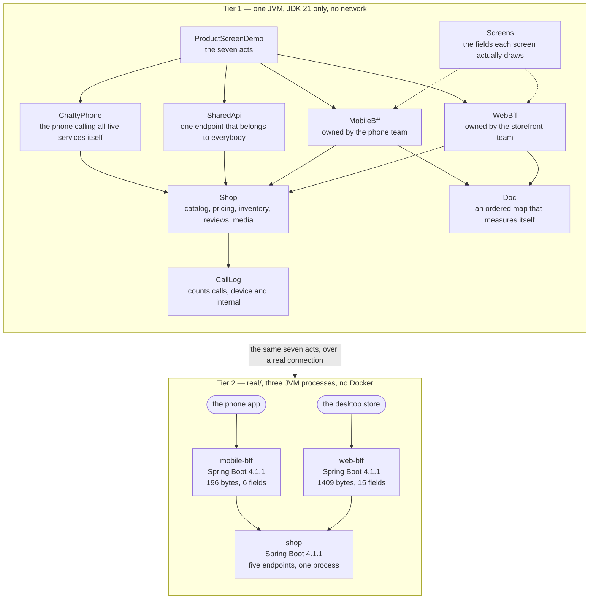

# Backends for Frontends Pattern — Architecture Diagram

Where each piece runs, in both tiers, and which technology it is written in. The class
diagram shows the types and the sequence diagrams show the order of events; this one
answers the question those two cannot, which is **what would I have to start**.

Read it as two boxes stacked. The upper box is Tier 1: one Java program, one process, no
network and no JSON library — `Doc` is an ordered map that can print and measure itself, and
the shop returns fixed data in microseconds. The lower box is Tier 2, under `real/`: three
Spring Boot applications, so you can watch two differently shaped documents of visibly
different sizes come back from two addresses.

The shape to notice is the **fan**. One shop at the bottom, two backends above it, one
client above each backend. The shop is not duplicated, and that is the part people get
wrong when they first meet this pattern: the fix for two screens wanting different data is
not a second kitchen. The food is the same food. It is a second waiter, who works one room
and is allowed to change his own script tomorrow morning.

The second thing to notice is who owns each box. Each backend belongs to the team that owns
the screen above it, which is why a field the phone team wants is an afternoon's work rather
than five weeks in somebody else's queue. That ownership is the point of the pattern and it
is the one thing a diagram genuinely cannot draw, so it is written on the boxes.

Mermaid source

## What the diagram is telling you to count

**One shop, two backends, and no duplicated service boxes.** The five things the shop knows
— catalog, pricing, inventory, reviews, media — appear once. If applying this pattern ever
makes you draw a second copy of a shop service, you have built two kitchens and you will be
maintaining one recipe in two places.

**Two backends, and they are different sizes on purpose.** Six fields against fifteen. If
those two boxes ever converged, the shop would be paying twice for one job, and the pattern
should be withdrawn rather than admired. There is a test that asserts exactly that: the two
backends must return **different** field lists.

**The client boxes each have one arrow.** That is the benefit the customer feels — one round
trip before a single pixel instead of five, in sequence, each a wait of its own on a train.
The work did not go away; it moved onto a network that costs nothing.

## The neighbouring box that is not on this diagram

A gateway would sit above both backends, not beside them, and it would do the four jobs
every request needs whoever sent it: check the token, apply the rate limit, terminate TLS,
write the access log. It is left off because the line between the two patterns is one
question and keeping them on separate diagrams is how that question stays clear:

> *What does this screen need?* belongs in a backend for that frontend.
> *Is this request allowed in at all?* belongs in front of all of them.

**A gateway is about entry. A backend for a frontend is about shape.**

## What it deliberately leaves out

There is no caching, no gzip, no schema, no versioning, no fan-out and no failure handling.
The four internal calls are made one after another, where a real backend would issue them
together — which means this project **understates** the pattern's benefit rather than
overstating it, and that is the right direction for a teaching example to be wrong in.

The count of backends is also deliberately small. The demo's last act is about how many you
should have, and the test is neither the device nor the team: it is the number of genuine
disagreements about what a product is. Six clients came out as three backends, because the
tablet shows the phone's fields in a wider column and that is a stylesheet rather than a
service. **Two backends is a pattern. Nine is a department.**
