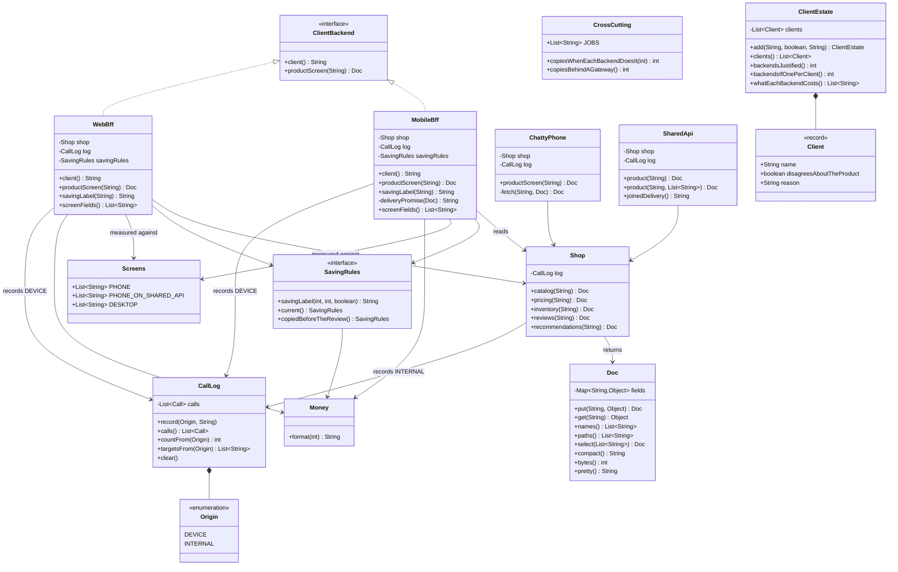

# Backends for Frontends Pattern — Class Diagram

Shows the static structure: the one-method contract, the two backends that implement
it differently, the five shop services all of them read from, the two rejected
designs, the business rule that must not be copied, and the three classes that each
demonstrate one item on the bill.

The single most important thing on this diagram is that **two classes implement one
interface**. `MobileBff` and `WebBff` both realise `ClientBackend`, and neither is
the "real" one. Collapse them into a single implementation and the diagram still
compiles, still runs, and is no longer this pattern — it is an API composition
behind one endpoint. The plurality *is* the pattern.

The second most important thing is what the two backends **share**. They both point
at `Shop` and they both point at `SavingRules`, and those two arrows mean different
things. Pointing at `Shop` is the pattern working: same data, different shape.
Pointing at `SavingRules` is the pattern's discipline: the rule has one definition
that both backends read, rather than a copy inside each. Act 5 is what happens when
one of them holds a copy instead.

And the third: `ChattyPhone` and `SharedApi` sit on the diagram with no arrow from
any backend. They are not participants. They are the two designs the pattern
replaces, kept in the code so the comparison can be run rather than asserted.


<details>
<summary>Mermaid source</summary>



</details>

---

## Reading The Diagram For The Argument

### Two arrowheads into `ClientBackend`, and why that is the pattern

```
    ClientBackend <|.. MobileBff
    ClientBackend <|.. WebBff
```

`ClientBackend` is one method. It could be deleted tomorrow and nothing would break,
because nobody in this project holds a `ClientBackend` reference and dispatches
through it polymorphically — the demo holds a `MobileBff` and a `WebBff` by their
own types.

So why is it there? Because the interface is where the *claim* lives. It says: this
shop has more than one idea of what a product screen is, and both are legitimate. A
codebase with one implementation of this interface has not applied the pattern,
however carefully the interface is named.

This is also the diagram's answer to the most common confusion. If you are looking
at an architecture diagram and there is one box between the clients and the
services, it is a gateway or a composition, not this. The distinguishing feature is
visible from across the room: **count the boxes.**

### `MobileBff --> Shop` and `WebBff --> Shop`, converging

Both backends point at the same `Shop`, and `Shop` has no idea either of them
exists. That is what makes this a *view* pattern rather than a *data* pattern.

Read what it rules out. Neither backend has privileged access. Neither can see a
field the other cannot. Neither owns a database. If a backend grew a table of its
own, that arrow would need a second head and the backend would have quietly become
a service — with its own data to keep consistent, its own migrations, and its own
claim to be the truth about something.

The rule that keeps the arrow one-directional: **a backend for a frontend holds no
state.** It is a function from what the shop knows to what one screen draws.

### `MobileBff --> SavingRules` and `WebBff --> SavingRules`, also converging

This pair of arrows looks like the pair above and means something quite different.

`Shop` is data the backends read. `SavingRules` is a *decision* the shop makes, and
the diagram deliberately puts it outside both backends so that there is exactly one
definition of it. Both arrows land on the same interface; the implementation is
supplied to each backend rather than written inside it.

That is not decoration, it is the guard. The demo's Act 5 works precisely by
violating it — the phone is handed `SavingRules.copiedBeforeTheReview()` while the
desktop is handed `SavingRules.current()`, and the two screens then tell a customer
different things about the same price. On the diagram that failure is invisible,
because both arrows still point at `SavingRules`. **The structure cannot protect
you here; only the discipline can.** Anything the shop would still believe with
every client switched off belongs at the far end of an arrow like this one, with one
implementation behind it.

### `Screens`, pointed at by both backends and owned by neither

```
    MobileBff --> Screens : measured against
    WebBff --> Screens : measured against
```

`Screens` holds two lists of field names and no behaviour. It exists so that "the
phone draws six fields" is a fact written in one file rather than a claim implied by
whichever method happens to be building a response.

The arrows are labelled *measured against* rather than *uses* because that is what
the tests do with it: `assertEquals(Screens.PHONE, screen.paths())`. Equality, not
containment. A seventh field in `MobileBff` fails a test, which is the only reason
a backend stays the size of its screen for longer than a year.

### `CallLog *-- Origin`, the composition that keeps the claim honest

`CallLog` owns an enum with two values, `DEVICE` and `INTERNAL`, and every arrow
into `CallLog` on this diagram is labelled with which one it records. `Shop` records
`INTERNAL`. The backends record `DEVICE`.

That split is the project refusing to make the easy version of its own argument. A
single counter would let the demo print "five calls became one" and stop. Two
counters make it print five-and-five against one-and-four, which is the true
statement: **the work did not go away, it moved onto a network that costs nothing.**

### `ChattyPhone` and `SharedApi`, with nothing pointing at them

Two classes on this diagram are reached by no backend and no test fixture other
than their own. They are the rejected designs.

`ChattyPhone --> Shop` and `SharedApi --> Shop` are the only arrows they have, and
both classes are structurally *simpler* than the pattern. That is worth noticing
rather than glossing over: the pattern is not the tidiest of the three designs, and
it is not the smallest. It has more processes, more deployments and more code than
either rejected design, and it is chosen anyway because of something that does not
appear on a class diagram at all — which team is allowed to change which file.

`SharedApi` is the interesting one. It carries `product(String, List<String>)`, the
`?fields=` version, which genuinely solves the size problem. The diagram cannot show
why that is not enough. Only `joinedDelivery()` can, and it does it by returning a
sentence instead of data.

### `CrossCutting`, attached to nothing at all

`CrossCutting` has no arrows. It is four strings and two integer methods, and it is
a whole act of the demo.

It has no arrows because the thing it describes belongs *in front of* everything
else on this diagram, in a box that this project does not implement. The two methods
are the argument: one takes a backend count and multiplies, the other takes no
argument. A method signature with no parameter is the strongest way to say "this
number does not depend on how many backends there are".

If you were to draw the box, it would go above both backends with one arrow into
each, and the rule for what goes inside it is a single question: does this code
answer *"what does this screen need?"* or *"is this request allowed in at all?"*

### `ClientEstate *-- Client`, and the boolean that decides everything

`Client` is a record with a name, a reason, and one boolean:
`disagreesAboutTheProduct`. `backendsJustified()` is a filter on that boolean.

There is no field for the device type, no field for the owning team, and no field
for traffic volume, because none of those is the rule. The diagram is making a
design claim by omission: the only thing that justifies another backend is another
opinion about what a product is. A tablet rendering the phone's six fields in a
wider column sets that boolean to `false` and gets a stylesheet.
