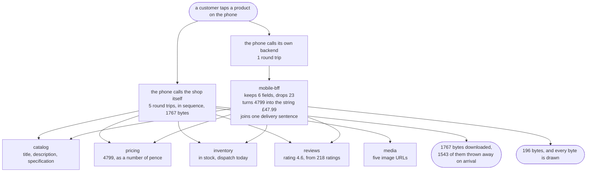

# Backends for Frontends Pattern — Data Flow Diagram

One product screen, followed from the tap to the pixels, with the size of the data written
at every hop. The architecture diagram says what is running; this one says what moves
between the boxes, how much of it there is, and where it shrinks.

Follow the left branch first, which is the design shops arrive at by accident: the phone
calls five services itself, one after another because the later calls need the earlier
answers, and assembles the screen on the device. Then follow the right branch, which is the
pattern: one call from the phone, four calls inside the building, and a document shaped like
the screen that asked for it.

The number to watch as you go down the right branch is the one on the last arrow. Four
internal answers add up to about seventeen hundred bytes; what goes back to the phone is
under two hundred. The reduction does not happen on the device and it does not happen in the
shop. It happens in a box owned by the team that owns the screen, and that ownership is why
a new field takes an afternoon instead of five weeks.

**If this pattern were only about bytes, a query parameter would be the end of the story.**
The shared endpoint can be asked for fewer fields and it will oblige. The reason the story
continues is on the diagram as the joined-together sentence at the bottom right: one line of
text — "Free delivery, arrives Friday" — assembled from stock, the delivery rules and the
clock, which no endpoint belonging to everybody will ever be allowed to add for one client.

Mermaid source

## The three things this flow proves

**Round trips moved rather than disappeared.** Device calls fall from five to one; internal
calls barely move, from five to four. The phone's five waits happened over a mobile
connection on a train, and the backend's four happen between two processes in the same data
centre. The work is the same work, on a network that costs nothing.

**Presentation decisions happen in a process you can correct this afternoon.** The pricing
service returns `4799`. The string `"£47.99"` is made in the backend, not in the app, and
that matters because the app will still be running on somebody's phone in two years and the
backend will not. Every formatting rule, rounding choice and currency symbol that lives in a
client is a decision you cannot take back.

**The screen's field list is the contract, and it is asserted.** A test compares the
backend's fields to the screen's fields with equality rather than containment, so a seventh
field fails the build. That is the only reason a backend stays the size of its screen for
longer than a year: without it, fields accumulate one reasonable request at a time until the
backend is a shared endpoint again with a different name.

## Where this flow goes wrong

The dangerous arrow is the one that is easiest to add and hardest to see: a business rule
copied into a backend. In the demo, the pricing team tightens the rule about when a higher
price may be advertised as a saving. Both backends are told. One of them holds its own copy
of the rule, taken before the review, and the result is the same product, the same price, the
same second — with the desktop claiming nothing and the phone claiming **Save £12.00**.

Nothing throws. Nothing is logged. The copy was correct when it was written, it is well
named, and its tests pass. It is wrong only in relation to a decision made months later by
people with no reason to know it existed.

The rule that prevents it is a sentence, and it is worth memorising:

> **A backend for a frontend may hold the shape. Anything the shop would still believe with
> every client switched off belongs behind it.**

Tax, discounts, stock allocation, what a price means — every one of those found inside a
client-specific backend is a copy waiting to disagree with another copy, and no test you can
write in either backend will ever notice.
